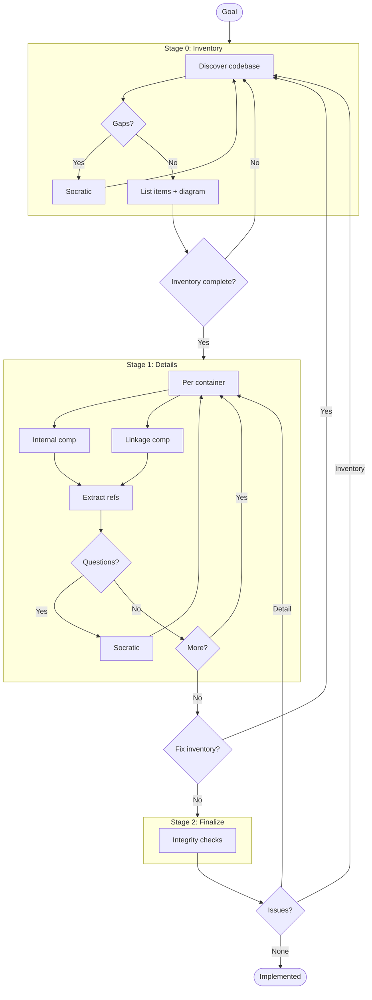

# C3 Architecture Documentation Adoption
## Goal

Adopt C3 methodology for c3-design.

## Workflow


## Stage 0: Inventory
### Context Discovery

| Arg | Value |
| --- | --- |
| PROJECT |  |
| GOAL |  |
| SUMMARY |  |
### Abstract Constraints

| Constraint | Rationale | Affected Containers |
| --- | --- | --- |
|  |  |  |
### Container Discovery

| N | CONTAINER_NAME | BOUNDARY | GOAL | SUMMARY |
| --- | --- | --- | --- | --- |
| 1 |  |  |  |  |
| 2 |  |  |  |  |
### Component Discovery (Brief)

| N | NN | COMPONENT_NAME | CATEGORY | GOAL | SUMMARY |
| --- | --- | --- | --- | --- | --- |
|  |  |  | foundation (01-09) |  |  |
|  |  |  | feature (10+) |  |  |
### Ref Discovery

| SLUG | TITLE | GOAL | Scope | Applies To |
| --- | --- | --- | --- | --- |
|  |  |  |  |  |
### Overview Diagram

```mermaid
graph TD
    %% Fill after discovery
```
### Gate 0

- [ ] Context args filled
- [ ] Abstract Constraints identified
- [ ] All containers identified with args (including BOUNDARY)
- [ ] All components identified (brief) with args and category
- [ ] Cross-cutting refs identified
- [ ] Overview diagram generated
## Stage 1: Details
### Container: c3-1

**Created:** [ ] `.c3/c3-1-{slug}/README.md`

| Type | Component ID | Name | Category | Doc Created |
| --- | --- | --- | --- | --- |
| Internal |  |  |  | [ ] |
| Linkage |  |  |  | [ ] |
### Container: c3-N

_(repeat per container from Stage 0)_

### Refs Created

| Ref ID | Pattern | Doc Created |
| --- | --- | --- |
|  |  | [ ] |
### Gate 1

- [ ] All container README.md created
- [ ] All component docs created
- [ ] All refs documented
- [ ] No new items discovered (else -> Gate 0)
## Stage 2: Finalize
### Integrity Checks

| Check | Status |
| --- | --- |
| Context <-> Container (all containers listed in c3-0) | [ ] |
| Container <-> Component (all components listed in container README) | [ ] |
| Component <-> Component (linkages documented) | [ ] |
| * <-> Refs (refs cited correctly, Cited By updated) | [ ] |
### Gate 2

- [ ] All integrity checks pass
- [ ] Run audit
## Conflict Resolution

If later stage reveals earlier errors:

| Conflict | Found In | Affects | Resolution |
| --- | --- | --- | --- |
|  |  |  |  |
## Exit

When Gate 2 complete -> change frontmatter status to `implemented`

## Audit Record

| Phase | Date | Notes |
| --- | --- | --- |
| Adopted | 20260227 | Initial C3 structure created |
