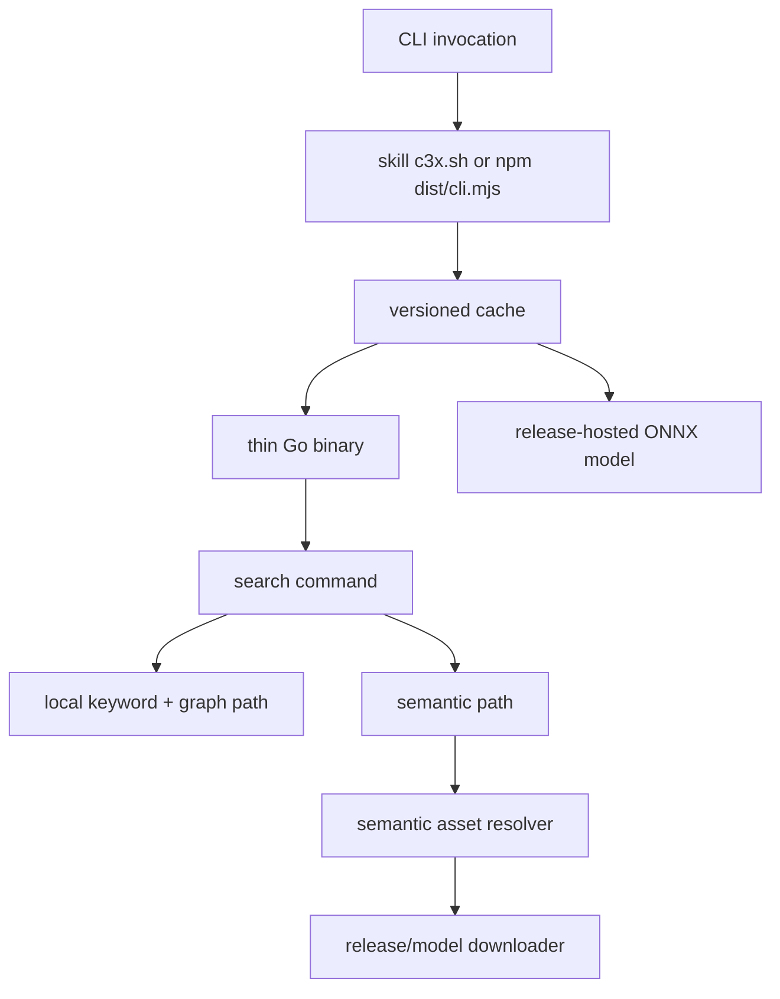

## Goal

**Traced-TDD block.**

| Layer | Declared errors | Origin |
| --- | --- | --- |
| Go semantic assets | cache-dir, model-missing, checksum-failed, download-failed, embedded-model-unavailable | own |
| Go search | semantic-disabled, semantic-unavailable, keyword-graph-ok | store/search |
| npm manager | unsupported-platform, version-missing, checksum-missing, download-failed, integrity-failed, exec-failed | own |
| skill launcher | unsupported-platform, missing-local-fat, manager-failed | own/npm |
| CI release | missing-artifact, missing-checksum, oversized-npm-blob | workflow |

| Consumer | Error | Acknowledgment | Test owner |
| --- | --- | --- | --- |
| Go semantic assets | cache-dir | Transform to semantic asset error | cli/internal/store |
| Go semantic assets | model-missing | Resolve by download in thin, resolve by embed in fat | cli/internal/store |
| Go semantic assets | checksum-failed | Propagate clear integrity failure | cli/internal/store |
| Go search | semantic-unavailable | Transform while keyword+graph remains usable | cli/cmd search tests |
| npm manager | unsupported-platform | Resolve with clear platform error | packages/cli tests |
| npm manager | integrity-failed | Propagate with checksum detail and fat-build hint | packages/cli tests |
| skill launcher | manager-failed | Transform to reinstall/cache/fat hint | shell launcher smoke |
| CI release | missing-artifact | Resolve by workflow artifact matrix/checksum step | workflow inspection |

| Test | Owns failure |
| --- | --- |
| go test ./... with default tags | thin binary compiles and keyword+graph works without model |
| go test -tags embedmodel ./internal/store | embedded model path materializes from embed before network |
| semantic asset unit tests with local test server | download/cache/checksum behavior without real network |
| package CLI unit tests with stub downloader | os/arch, cache path, version pin, checksum, GC, and exec target |
| workflow diff inspection plus build script smoke | release assets are thin binaries, fat skill archive, model, checksums, npm excludes model |

Split C3 distribution into fat and thin variants so normal shipped artifacts do not include the ONNX model or four large Go binaries, while preserving an offline fat channel for air-gapped installs and keeping keyword plus graph search usable without semantic assets.

## Context

Phase C added local ONNX semantic search using all-MiniLM-L6-v2. Embedding that model into every artifact makes the skill and npm package too large. The current Claude Code skill resolves one of four committed platform binaries from `skills/c3/bin/`, and the npm `@c3x/cli` package is only a thin JavaScript shim that does not download or cache the Go binary. Distribution must move large blobs to GitHub Releases while the repo keeps a verifiable local wrapper and release workflow.

## Decision

Use a Go build tag named `embedmodel` for the fat channel. Default builds are thin: they do not embed the ONNX model, they use keyword and graph search offline, and they fetch the model into a versioned cache only when semantic search first needs it. Fat builds use `go build -tags embedmodel` and load the embedded model before any downloader. The npm package becomes the normal thin manager: it resolves platform and version, downloads the thin Go binary plus model from GitHub Release assets into the user cache, verifies checksums, prunes old versions, and execs the cached binary. The skill launcher supports thin manager mode by default and a fat/local mode for offline skill artifacts.

## Affected Topology

| Entity | Type | Why affected | Evidence | Governance review |
| --- | --- | --- | --- | --- |
| c3-1 | container | Go CLI build tags, semantic asset loading, search behavior, and release build contract change inside this container. | c3-1#n1450@v1:sha256:1f10b60594a91ba79c9f39e43539257e287197fb4d527506c35b42a09cf7bb95 "Compile to a self-contained binary for all supported platforms" | Review Go CLI refs and runtime support components before implementation. |
| c3-107 | component | Semantic model asset resolution and search indexing live in store internals. | c3-107#n1747@v1:sha256:b4745317e94e8953c629e7c21068db0444d6b010b45ee305639f581f6047c9ef "Provide persistent entity, relationship, changelog, codemap, hash, node, and version storage operations for the CLI." | Ensure asset tests own download/embed/cache errors. |
| c3-108 | component | Runtime version/build metadata and CLI command behavior are part of runtime support. | c3-108#n1791@v1:sha256:ae80704ae7172ccccc82f6ba7b67f4fe434e41a8e3571e164a7b2165e4e4f06b "Provide CLI bootstrap, option parsing, output shaping, config resolution, and human/agent presentation helpers." | Ensure errors use dispatcher hint patterns and output helpers. |
| c3-109 | component | The npm wrapper changes from a shim to a bootstrapping manager. | c3-109#n5432@v5:sha256:0a83b9a8acb0b670c3a4deeb6a99f64cedb3ac13ee92ee737c18cc0f4f3fc385 "It does not parse or mutate C3 architecture docs" | Ensure resolver/cache unit tests own manager errors. |
| c3-2 | container | Skill distribution changes from committed platform binaries to thin launcher plus fat artifact. | c3-2#n2427@v1:sha256:859ab1aa2a8e03cd63cea0fc2c735b4e29551d6f18aeb59ecb1729f0e440d7ea "Call c3x commands for enforcement, schemas, help, hints, repair steps, and verification." | Review cross-compiled binary distribution ref and skill launcher behavior. |
| c3-201 | component | skills/c3/bin/c3x.sh must select thin or fat/local paths. | c3-201#n2447@v1:sha256:d5b50d2fbc74f525d0aacfaabe555f4f4e1070069201e113fd469be7c3c14eb0 "Classify user intent into a supported C3 operation and dispatch to the matching workflow component." | Smoke launcher behavior and document env selection. |

## Compliance Refs

| Ref | Why required | Evidence | Action |
| --- | --- | --- | --- |
| ref-cross-compiled-binary | Governs platform-specific CLI binary packaging and wrapper resolution. | ref-cross-compiled-binary#n3116@v2:sha256:90bdc1dce31722c7d28535fa7aaf8b4ae1ea7ebb6955aaa1c7a44d15305b9e1c "Standardize how C3 distributes platform-specific Go executables and semantic model assets without forcing every install channel to carry every large binary blob" | update-ref |
| ref-embedded-templates | Build-tag embedding must stay scoped to semantic model assets, not doc templates. | ref-embedded-templates#n2920@v1:sha256:db227a0598059041ce49f2746f25fc8501e6ae86b9c9f688f593279ecde35ff8 "Doc templates are bundled in the CLI binary so scaffolding works without external files at any install path." | review |
| ref-frontmatter-docs | ADR and C3 docs remain canonical markdown with frontmatter/seals managed by c3x. | ref-frontmatter-docs#n2941@v1:sha256:27959709c9aa210a07dabf189c66e2aae5c1376d69c62343c583a0f8e2ee7d9a "tables and diagrams" | comply |

## Compliance Rules

| Rule | Why required | Evidence | Action |
| --- | --- | --- | --- |
| rule-output-via-helpers | Any agent-facing command output introduced or touched must stay on shared helpers. | rule-output-via-helpers#n2969@v1:sha256:4c8f10ca43e5ccb0607defedf34c5c672702e512f4fed9259f8a5fa19ef866e3 "All command results serialize through one output layer so agent mode always yields TOON and human/JSON formats stay consistent across commands." | comply |
| rule-dispatcher-error-hint | Download/cache/integrity failures must include clear next repair steps. | rule-dispatcher-error-hint#n2949@v1:sha256:c88ba0daf18b558254516480e305ec64cacb996ef674a8540d5b99e103488cb4 "User-facing CLI errors from the top-level dispatcher guide the user to a next step, so a failure is actionable rather than a bare message." | comply |
| rule-wrap-error-cause | Go errors added around asset download/cache must wrap causes. | rule-wrap-error-cause#n2989@v1:sha256:20a5bd788231e5b7b7403d387c6414f0d5b8b31303d720d83369abbe18c9ab26 "Every returned error in the Go CLI preserves its cause and context so failures stay traceable across the dispatcher, store, and command layers." | comply |

## Work Breakdown

| Area | Detail | Evidence |
| --- | --- | --- |
| Go semantic assets | Split embedded model behind embedmodel; default loader downloads/caches release model on semantic use only. | go build ./..., go build -tags embedmodel ./..., semantic asset tests. |
| Search behavior | Keep keyword+graph search independent from model presence in both variants. | Search tests with empty model cache and default tag. |
| npm manager | Replace JS shim with resolver/downloader/cache/checksum/GC/exec manager. | npm test and package build. |
| Release workflows | Upload thin binaries, fat skill artifact, model, and checksums to GitHub Releases; npm publishes only manager. | Workflow file inspection and build script smoke. |
| Skill launcher | Default to thin managed cache; allow env-selected fat/local binary path. | Launcher smoke and documented env vars. |
| C3 docs | Add this ADR and update governing distribution ref. | c3x check --include-adr. |

## Underlay C3 Changes

| Underlay area | Exact C3 change | Verification evidence |
| --- | --- | --- |
| CLI semantic asset loader | Build-tag-specific asset source files plus downloader/cache integrity code. | Go build both variants and Go tests. |
| CLI search command | Preserve non-semantic search path when model is absent. | Search tests for keyword+graph without model. |
| npm wrapper component | TypeScript manager modules and unit tests for platform/cache/download/checksum. | npm build/test. |
| Skill bin wrapper | c3x.sh env selection for thin manager versus fat/local executable. | Shell smoke and final diff. |
| CI release workflows | distribute.yml uploads thin binaries, fat skill archive, model, and checksums; npm-publish.yml publishes only npm manager. | Workflow diff and checksum artifact names. |

## Enforcement Surfaces

| Surface | Behavior | Evidence |
| --- | --- | --- |
| Go build tags | Default excludes embedded model; embedmodel includes embedded model path. | go build ./... and go build -tags embedmodel ./.... |
| Semantic asset tests | Thin cache download and fat embedded resolution are owned below search. | Go tests with stub downloader/local assets. |
| npm manager tests | Resolver/cache/checksum/GC behavior is unit-tested without network. | package test command. |
| GitHub Release workflow | Large model is a release asset, not npm payload or committed blob. | workflow diff and git status. |
| Skill launcher | Normal mode uses managed cache; fat/local mode is explicit by env. | launcher script diff and smoke. |
| C3 check | ADR remains valid and governance refs are represented. | c3x check --include-adr. |

## Alternatives Considered

| Alternative | Rejected because |
| --- | --- |
| Keep embedding the ONNX model in every artifact | This keeps npm and skill installs oversized and duplicates the same 80MB model across channels. |
| Publish the model inside npm | npm becomes a large binary distribution channel, slowing installs and violating the user decision to host the model on GitHub Releases. |
| Make semantic search always require network | Air-gapped users lose the current offline capability; the fat variant preserves that channel. |
| Keep committing all four skill binaries | Git remains bloated and every skill install carries irrelevant platforms. |

## Risks

| Risk | Mitigation | Verification |
| --- | --- | --- |
| Thin users are offline on first semantic use | Clear error says model could not be fetched and points to fat build/offline artifact. | Asset error test and search smoke. |
| Release checksum mismatch executes a bad binary or model | Verify SHA256 before chmod/exec and fail closed. | npm manager checksum tests and Go model checksum tests. |
| Build tags accidentally break default build | Default build owns thin behavior with no embedded model reference. | go build ./... and go test ./.... |
| Fat build silently downloads instead of using embed | Embedded source returns model bytes before downloader. | go build -tags embedmodel ./... and fat asset unit test. |
| Workflow uploads incomplete assets | Matrix produces thin binaries, fat artifact, model, and checksums under deterministic names. | Workflow inspection and checksum step. |

## Verification

| Check | Result |
| --- | --- |
| cd cli && go build ./... | Required before implemented. |
| cd cli && go build -tags embedmodel ./... | Required before implemented. |
| cd cli && go test ./... | Required before implemented. |
| Thin keyword+graph search with empty model cache | Required before implemented. |
| Thin semantic model fetch through stub/local URL | Required before implemented. |
| Fat semantic model loads from embed with no download | Required before implemented. |
| cd packages/cli && npm test | Required before implemented. |
| cd packages/cli && npm run build | Required before implemented. |
| git diff --check | Required before implemented. |
| C3X_MODE=agent bash skills/c3/bin/c3x.sh check --include-adr | Required before implemented. |
