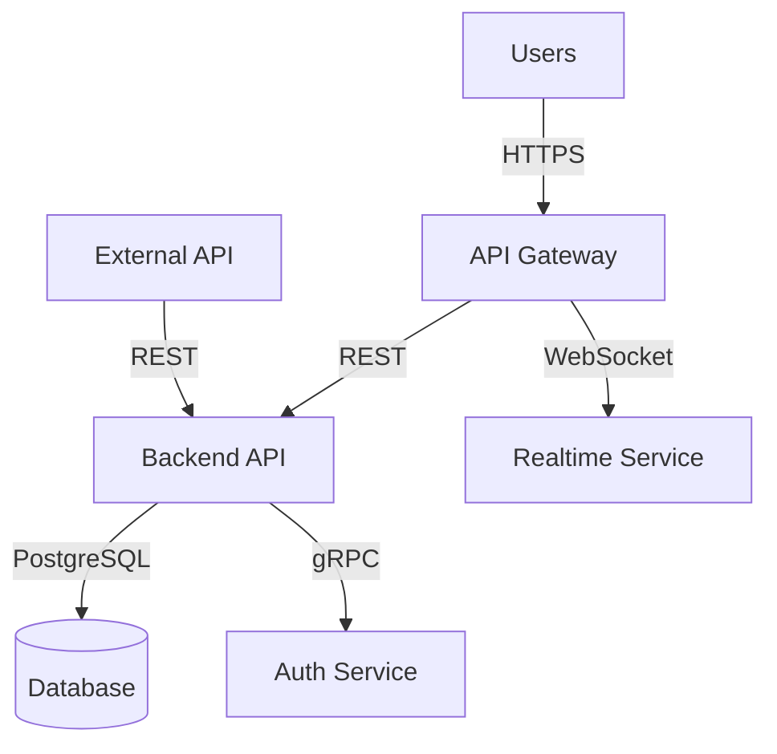
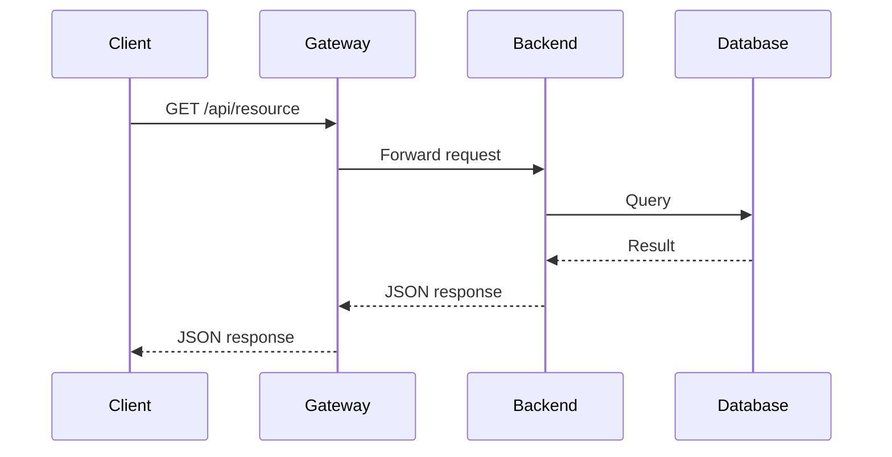
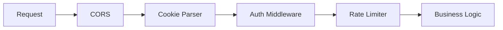
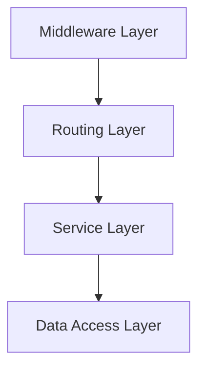
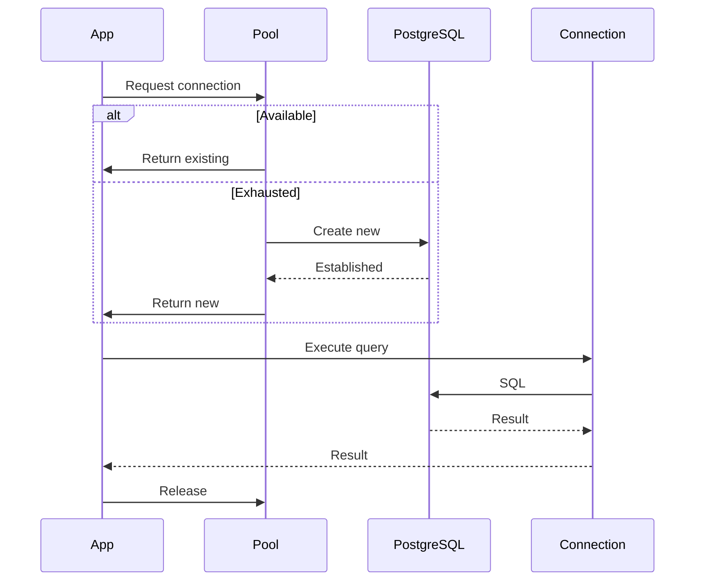
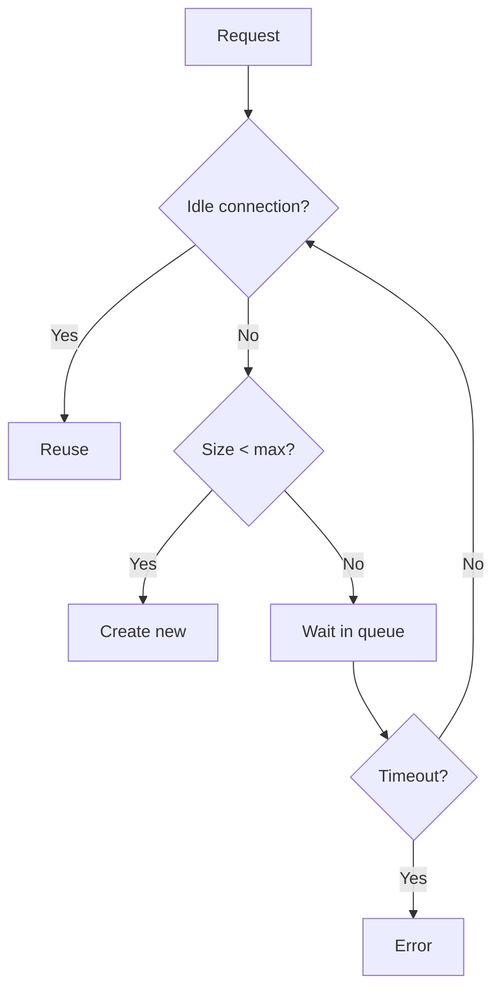
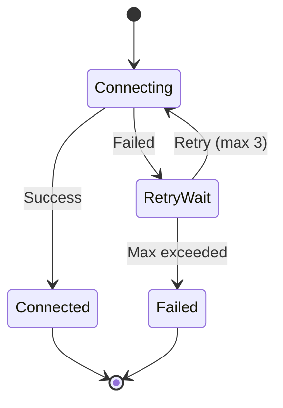

# C3-Skill Plugin Implementation Plan

> **For Claude:** REQUIRED SUB-SKILL: Use superpowers:executing-plans to implement this plan task-by-task.

**Goal:** Build a Claude Code plugin that provides C3 (Context-Container-Component) architecture design methodology with intelligent state detection, phased workflows, and auto-generated documentation.

**Architecture:** Hybrid progressive elaboration with main orchestrator skill (c3-design) that detects intention from existing docs and progressively invokes sub-skills (context/container/component) via SlashCommand. Documentation uses unique IDs, simplified frontmatter, and auto-generated TOC from summaries.

**Tech Stack:** Claude Code Skills (SKILL.md), Bash scripts (awk/grep), VitePress, Mermaid diagrams

---

## Task 1: Initialize Plugin Structure

**Files:**
- Create: `skills/c3-design/SKILL.md`
- Create: `skills/c3-design/intentions/from-scratch.md`
- Create: `skills/c3-design/intentions/update-existing.md`
- Create: `skills/c3-design/intentions/migrate-system.md`
- Create: `skills/c3-design/intentions/audit-current.md`
- Create: `skills/c3-context-design/SKILL.md`
- Create: `skills/c3-container-design/SKILL.md`
- Create: `skills/c3-component-design/SKILL.md`
- Create: `.claude-plugin/plugin.json`
- Create: `.claude-plugin/marketplace.json`
- Create: `README.md`
- Create: `LICENSE`
- Create: `.gitignore`

**Step 1: Create directory structure**

```bash
mkdir -p skills/c3-design/intentions
mkdir -p skills/c3-context-design
mkdir -p skills/c3-container-design
mkdir -p skills/c3-component-design
mkdir -p .claude-plugin
```

**Step 2: Create plugin.json**

File: `.claude-plugin/plugin.json`

```json
{
  "name": "c3-skill",
  "description": "C3 (Context-Container-Component) architecture design methodology with structured top-down documentation, mermaid diagrams, and intention-based workflows",
  "version": "1.0.0",
  "author": {
    "name": "Lagz0ne",
    "email": "lagz0ne@users.noreply.github.com"
  },
  "homepage": "https://github.com/Lagz0ne/c3-skill",
  "repository": "https://github.com/Lagz0ne/c3-skill",
  "license": "MIT",
  "keywords": ["architecture", "design", "c3", "documentation", "mermaid", "system-design"]
}
```

**Step 3: Create marketplace.json**

File: `.claude-plugin/marketplace.json`

```json
{
  "name": "c3-skill-marketplace",
  "description": "C3 architecture design methodology plugin marketplace",
  "owner": {
    "name": "Lagz0ne",
    "email": "lagz0ne@users.noreply.github.com"
  },
  "plugins": [
    {
      "name": "c3-skill",
      "description": "C3 (Context-Container-Component) architecture design methodology with structured top-down documentation, mermaid diagrams, and intention-based workflows",
      "version": "1.0.0",
      "source": "./",
      "author": {
        "name": "Lagz0ne",
        "email": "lagz0ne@users.noreply.github.com"
      }
    }
  ]
}
```

**Step 4: Create .gitignore**

File: `.gitignore`

```
node_modules/
.DS_Store
*.log
.vitepress/cache
.vitepress/dist
```

**Step 5: Create LICENSE**

File: `LICENSE`

```
MIT License

Copyright (c) 2025 Lagz0ne

Permission is hereby granted, free of charge, to any person obtaining a copy
of this software and associated documentation files (the "Software"), to deal
in the Software without restriction, including without limitation the rights
to use, copy, modify, merge, publish, distribute, sublicense, and/or sell
copies of the Software, and to permit persons to whom the Software is
furnished to do so, subject to the following conditions:

The above copyright notice and this permission notice shall be included in all
copies or substantial portions of the Software.

THE SOFTWARE IS PROVIDED "AS IS", WITHOUT WARRANTY OF ANY KIND, EXPRESS OR
IMPLIED, INCLUDING BUT NOT LIMITED TO THE WARRANTIES OF MERCHANTABILITY,
FITNESS FOR A PARTICULAR PURPOSE AND NONINFRINGEMENT. IN NO EVENT SHALL THE
AUTHORS OR COPYRIGHT HOLDERS BE LIABLE FOR ANY CLAIM, DAMAGES OR OTHER
LIABILITY, WHETHER IN AN ACTION OF CONTRACT, TORT OR OTHERWISE, ARISING FROM,
OUT OF OR IN CONNECTION WITH THE SOFTWARE OR THE USE OR OTHER DEALINGS IN THE
SOFTWARE.
```

**Step 6: Commit initial structure**

```bash
git add .claude-plugin/ LICENSE .gitignore
git commit -m "feat: initialize c3-skill plugin structure"
```

---

## Task 2: Main Orchestrator Skill (c3-design)

**Files:**
- Create: `skills/c3-design/SKILL.md`

**Step 1: Create main orchestrator skill**

File: `skills/c3-design/SKILL.md`

```markdown
---
name: c3-design
description: Use when designing system architecture from scratch, updating existing designs, migrating systems, or auditing current architecture - guides through Context→Container→Component methodology with mermaid diagrams and structured documentation
---

# C3 Architecture Design

## Overview

Transform system requirements into structured C3 (Context-Container-Component) architecture documentation through intelligent state detection and phased workflows.

**Core principle:** Detect current state, understand intention through Socratic questioning, scope changes precisely, document decisions via ADR.

**Announce at start:** "I'm using the c3-design skill to guide you through architecture design."

## Quick Reference

| Phase | Key Activities | Socratic? | Output |
|-------|---------------|-----------|--------|
| **1. Understand** | Read `.c3/`, analyze request, infer affected levels | Only if ambiguous | Current state picture |
| **2. Confirm** | Map to C3 structure, present understanding | REQUIRED | Validated intention |
| **3. Scope** | Cross-cutting concerns, boundaries | If uncertain | Change scope |
| **4. ADR** | Document decision with progressive detail | No | ADR in `.c3/adr/` |

## Prerequisites

**Required Location:** `.c3/` directory must exist in project root.

If `.c3/` doesn't exist AND user didn't force mode via `/c3-from-scratch`:
- Stop and inform user to initialize structure first
- Suggest: "Create `.c3/` directory to start, or use `/c3-from-scratch` to initialize"

## The Process

### Phase 1: Understand Current Situation

**Goal:** Build clear picture of what exists and what user wants

**Actions:**

1. **Check for `.c3/` directory**
   ```bash
   if [ ! -d ".c3" ]; then
     echo "Error: .c3/ directory not found. Initialize with /c3-from-scratch or create manually."
     exit 1
   fi
   ```

2. **Read existing documents**
   - List all files: `find .c3 -name "*.md" -type f`
   - Parse document IDs from frontmatter:
     ```bash
     awk '/^---$/,/^---$/ {if (/^id:/) print $2}' .c3/CTX-*.md
     ```
   - Extract status and summaries to understand current state

3. **Analyze user request**
   - Which C3 level does this touch?
     - Context: Cross-component, protocols, deployment, system boundaries
     - Container: Individual container tech/structure/middleware
     - Component: Implementation details, config, dependencies
   - May span multiple levels (e.g., "add authentication" → all three)

4. **Use Socratic questions ONLY if:**
   - Request is ambiguous
   - Scope is unclear
   - Conflicting signals detected

**Output:** Clear understanding of current state + user's goal

### Phase 2: Analyze & Confirm Intention (⚠️ Socratic Required)

**Goal:** Validate understanding before proceeding

**Actions:**

1. **Map request to C3 structure**
   - Determine impacted levels
   - Identify affected containers/components
   - Recognize intention pattern:
     - No docs + "design system" = from-scratch
     - Docs exist + "add X" = update-existing
     - Different structure + "convert" = migrate-system
     - Docs exist + "review" = audit-current

2. **Present understanding concisely**
   ```
   "I see you have [current state]. You want to [goal].
   This will affect:
   - Context level: [impact or none]
   - Container level: [which containers]
   - Component level: [which components]

   Is this understanding correct?"
   ```

3. **Ask targeted Socratic questions**
   - Use AskUserQuestion tool for structured choices
   - Be surgical - don't ask everything
   - Example: If adding auth, ask "Cookie-based or token-based?"

4. **Iterate until aligned**

**Output:** Validated, mutual understanding of what needs to change

### Phase 3: Scoping the Change

**Goal:** Define precise boundaries of impact

**Actions:**

1. **Identify cross-cutting concerns**
   - What touches multiple levels?
   - Examples: Auth spans Context (protocol) → Container (middleware) → Component (JWT handler)

2. **Define boundaries**
   - What will NOT change?
   - Be explicit about out-of-scope items

3. **If scope uncertain:**
   - Use Socratic clarification
   - Present options with AskUserQuestion

**Output:** Clear boundaries - what changes and what doesn't

### Phase 4: Suggest Changes via ADR

**Goal:** Document the architectural decision as planning artifact

**Actions:**

1. **Determine ADR number**
   ```bash
   # Find next ADR number
   last_adr=$(find .c3/adr -name "ADR-*.md" | sed 's/.*ADR-\([0-9]*\).*/\1/' | sort -n | tail -1)
   next_num=$(printf "%03d" $((10#$last_adr + 1)))
   ```

2. **Create ADR with progressive detail**

   File: `.c3/adr/ADR-{NNN}-{slug}.md`

   Template:
   ```markdown
   ---
   id: ADR-{NNN}-{slug}
   title: [Decision Title]
   summary: >
     Documents the decision to [what]. Read this to understand [why],
     what alternatives were considered, and the trade-offs involved.
   status: proposed
   date: YYYY-MM-DD
   related-components: [CON-XXX, COM-YYY]
   ---

   # [ADR-{NNN}] [Decision Title]

   ## Status {#adr-{nnn}-status}
   **Proposed** - YYYY-MM-DD

   ## Context {#adr-{nnn}-context}
   Current situation and why change is needed.

   ## Decision {#adr-{nnn}-decision}

   ### High-Level Approach (Context Level)
   System-wide implications with diagram.

   ### Container Level Details
   Affected containers: [CON-001-backend](../containers/CON-001-backend.md)
   Technology choices and architecture.

   ### Component Level Impact
   New/modified components: [COM-010-new-component](../components/backend/COM-010-new-component.md)

   ## Alternatives Considered {#adr-{nnn}-alternatives}
   What else was considered and why rejected.

   ## Consequences {#adr-{nnn}-consequences}
   Positive, negative, and mitigation strategies.

   ## Cross-Cutting Concerns {#adr-{nnn}-cross-cutting}
   Impacts that span multiple levels.

   ## Implementation Notes {#adr-{nnn}-implementation}
   Ordered steps for implementation.

   ## Related {#adr-{nnn}-related}
   - [Other ADRs]
   - [Affected containers/components]
   ```

3. **Invoke sub-skills as needed**

   Based on ADR scope:
   ```bash
   # If Context level affected
   /c3-context-design

   # If Container level affected
   /c3-container-design

   # If Component level affected
   /c3-component-design
   ```

4. **Regenerate TOC**
   ```bash
   .c3/scripts/build-toc.sh
   ```

**Output:** ADR document + updated/new C3 docs + regenerated TOC

## Iteration & Back-tracking

**You can go backward at any phase:**
- Phase 2 reveals new constraint → Return to Phase 1
- Phase 3 shows fundamental gap → Return to Phase 1
- Phase 4 questions approach → Return to Phase 2

**Don't force forward** when going backward clarifies better.

## Sub-Skill Invocation

Use SlashCommand tool to invoke sub-skills:

```
Use SlashCommand tool with command: "/c3-context-design"
Use SlashCommand tool with command: "/c3-container-design"
Use SlashCommand tool with command: "/c3-component-design"
```

Each sub-skill focuses on its level with appropriate abstraction.

## Key Principles

| Principle | Application |
|-----------|-------------|
| **Detect before ask** | Read `.c3/` first, infer intention, ask only if unclear |
| **Socratic when mandatory** | Phase 2 always, others only if ambiguous |
| **Progressive detail** | ADR starts Context→Container→Component |
| **Unique IDs** | Every document/heading has ID |
| **Regenerate TOC** | After any document changes |
| **Iterate freely** | Go backward when needed |

## Common Patterns

### From Scratch
No `.c3/` exists → Initialize structure → Create Context → Containers → Components

### Update Existing
Docs exist → Detect change scope → Update affected levels → New ADR

### Migrate System
Different structure exists → Map to C3 → Create migration ADR → Progressive conversion

### Audit Current
Docs exist → Review for completeness/accuracy → Identify gaps → Suggest improvements

## Announce Usage

At start of session: "I'm using the c3-design skill to guide you through architecture design."
```

**Step 2: Commit main skill**

```bash
git add skills/c3-design/SKILL.md
git commit -m "feat: add main c3-design orchestrator skill"
```

---

## Task 3: Context Sub-Skill

**Files:**
- Create: `skills/c3-context-design/SKILL.md`

**Step 1: Create context-level skill**

File: `skills/c3-context-design/SKILL.md`

```markdown
---
name: c3-context-design
description: Design Context level - bird's-eye view of system boundaries, user interactions, and system-to-system relationships with appropriate mermaid diagrams
---

# C3 Context Level Design

## Purpose

Define the system landscape: what containers/users/systems exist, how they interact cross-component, and high-level cross-cutting concerns.

**Abstraction Level:** Bird's-eye view. Focus on WHAT exists and HOW they relate, not implementation details.

## Context Defines

- **Components underneath**: All containers, users, external systems
- **Cross-component interactions**: Communication patterns across the system
- **High-level concerns**:
  - Protocols (HTTP/REST, gRPC, WebSocket, message queues)
  - Interfaces/APIs (gateway patterns, versioning)
  - Gateway/Load balancer architecture
  - Deployment model (cloud, on-prem, hybrid - very high level)
  - Authentication/Authorization strategy
  - Data flow patterns

## When Invoked

- ADR identifies Context-level changes
- User explicitly calls `/c3-context-design`
- New system design from scratch
- Cross-cutting changes affecting system boundaries

## Workflow

### Step 1: Read Existing Context

```bash
# Check for existing context documents
find .c3 -maxdepth 1 -name "CTX-*.md"

# Read frontmatter and content
awk '/^---$/,/^---$/ {print}' .c3/CTX-001-*.md
```

If exists: Understand current architecture, containers, protocols
If not exists: Starting fresh

### Step 2: Identify Scope

From ADR or user request:
- What's changing at Context level?
- New containers being added?
- Protocol changes?
- Deployment architecture shifts?
- New external systems integrating?

### Step 3: Gather Details (Targeted Socratic)

Ask ONLY if needed:
- What containers exist in the system?
- What users/actors interact?
- What external systems integrate?
- What protocols for cross-component communication?
- Any gateway/interface patterns?
- High-level deployment architecture?
- Cross-cutting concerns (auth, logging, monitoring)?

Use AskUserQuestion for structured choices.

### Step 4: Generate/Update Diagrams

**MUST HAVE:**
- Architecture diagram or flowchart showing landscape

**SHOULD HAVE:**
- Sequence diagrams for key protocols/flows
- Flow diagrams for special concepts
- Deployment diagram (high-level)
- Protocol-specific diagrams

Use mermaid syntax embedded in markdown.

### Step 5: Write/Update Context Document

**Determine file path:**
```bash
# If updating existing
file_path=".c3/CTX-001-system-overview.md"

# If new context aspect
last_ctx=$(find .c3 -maxdepth 1 -name "CTX-*.md" | sed 's/.*CTX-\([0-9]*\).*/\1/' | sort -n | tail -1)
next_num=$(printf "%03d" $((10#$last_ctx + 1)))
file_path=".c3/CTX-${next_num}-${slug}.md"
```

**Document structure:**

```markdown
---
id: CTX-001-system-overview
title: System Architecture Overview
summary: >
  Explains the overall system landscape, how users interact with the system,
  and how different containers communicate. Read this to understand the
  bird's-eye view before diving into individual containers.
---

# [CTX-001-system-overview] System Architecture Overview

## Overview {#ctx-001-overview}
<!--
Describes the system at the highest level - what it does, who uses it,
and what the major components are. Read to understand the big picture.
-->

High-level prose description of the system.

## Architecture {#ctx-001-architecture}
<!--
Shows the complete system diagram with all containers, external systems,
and their relationships. Read to understand how pieces fit together.
-->



Description of architecture and key relationships.

## Containers {#ctx-001-containers}
<!--
Lists all containers with brief descriptions and links. Read to navigate
to specific container details.
-->

- [CON-001-backend: Backend API](./containers/CON-001-backend.md) - Core business logic
- [CON-002-frontend: Web Frontend](./containers/CON-002-frontend.md) - User interface
- [CON-003-database: PostgreSQL DB](./containers/CON-003-database.md) - Data storage

## Protocols & Communication {#ctx-001-protocols}
<!--
Explains communication protocols used across the system and why chosen.
Read to understand integration patterns.
-->

### REST API
Primary protocol for client-server communication.



### WebSocket
For real-time updates.

## Cross-Cutting Concerns {#ctx-001-cross-cutting}
<!--
Describes concerns that span multiple containers like authentication,
logging, and monitoring. Read to understand system-wide patterns.
-->

- **Authentication**: OAuth2 with JWT tokens via Auth Service
- **Rate Limiting**: Gateway-level throttling
- **Monitoring**: Prometheus + Grafana stack

## Deployment {#ctx-001-deployment}
<!--
High-level deployment architecture - cloud vs on-prem, scaling approach,
infrastructure patterns. Read to understand operational context.
-->

Kubernetes-based deployment in AWS:
- Multi-AZ for high availability
- Horizontal auto-scaling
- Blue-green deployments

## Related {#ctx-001-related}

- [ADR-001: REST API Choice](./adr/ADR-001-rest-api.md)
```

### Step 6: Update VitePress Config

If new context document, add to `.c3/.vitepress/config.ts` sidebar.

### Step 7: Regenerate TOC

```bash
.c3/scripts/build-toc.sh
```

## Document Conventions

### Frontmatter
```yaml
---
id: CTX-NNN-slug
title: Title
summary: >
  Concise explanation of what this context document covers and why
  someone should read it. Focus on helping navigation.
---
```

### Heading IDs
Pattern: `{#ctx-nnn-heading-slug}`

### Heading Summaries (Optional)
```markdown
## Section Name {#ctx-001-section}
<!--
Summary of what this section explains and why to read it.
-->
```

### Links
- Down to containers: `[CON-001-backend](./containers/CON-001-backend.md)`
- To specific sections: `[Backend Middleware](./containers/CON-001-backend.md#con-001-middleware)`
- Related ADRs: `[ADR-001](./adr/ADR-001-rest-api.md)`

## Key Principles

- **Focus on landscape**: What exists and how it relates
- **Don't dive into implementation**: That's Container/Component level
- **Use diagrams liberally**: Visual communication of architecture
- **Link to everything**: Context is navigation hub
- **Keep abstraction high**: Characteristics and patterns, not code
```

**Step 2: Commit context skill**

```bash
git add skills/c3-context-design/SKILL.md
git commit -m "feat: add c3-context-design sub-skill"
```

---

## Task 4: Container Sub-Skill

**Files:**
- Create: `skills/c3-container-design/SKILL.md`

**Step 1: Create container-level skill**

File: `skills/c3-container-design/SKILL.md`

```markdown
---
name: c3-container-design
description: Design Container level - individual container characteristics, technology choices, component organization, and inter-container communication
---

# C3 Container Level Design

## Purpose

Define individual containers: their characteristics, technology stack, internal component organization, and communication patterns.

**Abstraction Level:** WHAT and WHY, not HOW. Focus on characteristics, properties, architectural decisions - not implementation code.

## Container Defines

- **Container identity**: Name, purpose, responsibility
- **Technology stack**: Language, framework, runtime, platform
- **Component organization**: What components exist inside, how structured
- **Middleware/Proxy layer**: Auth, cookies, rate limiting, request pipeline
- **Dependencies**: Other containers it communicates with
- **Interfaces**: APIs exposed, APIs consumed
- **Data responsibilities**: What data it owns/manages
- **Deployment specifics**: Container-level deployment details

## When Invoked

- ADR identifies Container-level changes
- User explicitly calls `/c3-container-design`
- Context references a container needing elaboration
- Adding/modifying containers in system

## Workflow

### Step 1: Read Existing Container Doc

```bash
# Find container document
find .c3/containers -name "CON-*.md"

# Read specific container
awk '/^---$/,/^---$/ {print}' .c3/containers/CON-001-backend.md
```

### Step 2: Read Parent Context

```bash
# Understand container's role in system
grep -l "CON-001-backend" .c3/CTX-*.md
```

### Step 3: Identify Scope

From ADR:
- New container or updating existing?
- What's changing: tech stack, middleware, components?
- Which other containers affected?

### Step 4: Gather Details (Targeted Socratic)

Ask ONLY if needed:
- Container's responsibility?
- Technology stack? (language, framework, libraries)
- Middleware/proxy layer? (auth interceptors, cookie handlers)
- Component organization?
- Communication with other containers?
- APIs/interfaces exposed?
- Data ownership?

### Step 5: Generate/Update Diagrams

**MUST HAVE:**
- C4 Container diagram OR Internal component structure diagram

**SHOULD HAVE:**
- Component organization diagram
- Middleware/proxy flow diagram
- Data flow diagram
- Sequence diagram for key interactions
- Deployment diagram (container-specific)

### Step 6: Write/Update Container Document

**Determine file path:**
```bash
# If updating
file_path=".c3/containers/CON-001-backend.md"

# If new
last_con=$(find .c3/containers -name "CON-*.md" | sed 's/.*CON-\([0-9]*\).*/\1/' | sort -n | tail -1)
next_num=$(printf "%03d" $((10#$last_con + 1)))
file_path=".c3/containers/CON-${next_num}-${slug}.md"
```

**Document structure:**

```markdown
---
id: CON-001-backend
title: Backend Container
summary: >
  Describes the backend API service architecture, middleware pipeline,
  and component organization. Read this to understand how the backend
  handles requests, manages authentication, and structures its components.
---

# [CON-001-backend] Backend Container

::: info Context
This container is part of [CTX-001: System Context](../CTX-001-system-overview.md).
:::

## Overview {#con-001-overview}
<!--
High-level description of container purpose and responsibilities.
-->

REST API service handling business logic, authentication, and data management.

## Technology Stack {#con-001-technology-stack}
<!--
Lists languages, frameworks, and key libraries used. Read to understand
technical foundation.
-->

- **Language**: TypeScript 5.3
- **Framework**: Express.js 4.18
- **Runtime**: Node.js 20 LTS
- **ORM**: Prisma 5

## Middleware Pipeline {#con-001-middleware}
<!--
Describes the request processing pipeline through authentication, cookie
handling, and rate limiting layers. Read this to understand how requests
flow through the backend before reaching business logic.
-->



### Authentication Middleware {#con-001-auth-middleware}
**Component**: [COM-003-auth-middleware](../components/backend/COM-003-auth-middleware.md)

JWT token validation via cookies:
- Token validation and expiry
- Session state management
- User context injection

### Cookie Handler {#con-001-cookie-handler}
**Component**: [COM-004-cookie-handler](../components/backend/COM-004-cookie-handler.md)

Cookie management with security characteristics:

**Properties**:
- `HttpOnly`: true (XSS prevention)
- `Secure`: true in production, false in dev
- `SameSite`: Strict for auth, Lax for tracking
- `Path`: `/api` for API cookies

**Environment Differences**:
- Development: localhost, relaxed security
- Production: secure flags, short expiry, production domain

### Rate Limiter {#con-001-rate-limiter}
**Component**: [COM-005-rate-limiter](../components/backend/COM-005-rate-limiter.md)

Request throttling:
- IP-based: 100 req/min
- User-based: 1000 req/min
- Redis-backed sliding window

## Component Organization {#con-001-components}
<!--
Shows how components are structured inside the container.
-->



Layers:
- **Middleware**: Cross-cutting concerns
- **Routing**: HTTP endpoints
- **Service**: Business logic
- **Data Access**: Database queries

### Key Components
- [COM-001-db-pool](../components/backend/COM-001-db-pool.md) - Database connection management
- [COM-002-user-service](../components/backend/COM-002-user-service.md) - User operations

## Communication Patterns {#con-001-communication}
<!--
Explains how this container talks to other containers.
-->

### To Database Container {#con-001-to-database}
**Container**: [CON-003-database](./CON-003-database.md)

- Protocol: PostgreSQL wire protocol
- Connection: Pooled (10-50 connections)
- Security: SSL/TLS in production

### To Auth Service {#con-001-to-auth-service}
**Container**: [CON-004-auth-service](./CON-004-auth-service.md)

- Protocol: gRPC
- Pattern: Synchronous request/response
- Fallback: Cached public keys

## Data Responsibilities {#con-001-data}
<!--
What data this container owns and manages.
-->

- **Owns**: User business data, application state
- **Manages**: Session tokens (cookies), rate limit counters (Redis)
- **Transient**: Request/response data, in-memory caches

## Deployment {#con-001-deployment}
<!--
Container-specific deployment characteristics.
-->

- **Scaling**: Horizontal (stateless)
- **Health checks**: `/health` with DB check
- **Graceful shutdown**: 30s drain period

## Related {#con-001-related}

- [CTX-001: System Context](../CTX-001-system-overview.md)
- [ADR-003: Cookie-based sessions](../adr/ADR-003-cookie-sessions.md)
```

### Step 7: Update VitePress Config

Add to sidebar if new container.

### Step 8: Regenerate TOC

```bash
.c3/scripts/build-toc.sh
```

## Document Conventions

### Frontmatter
```yaml
---
id: CON-NNN-slug
title: Container Name
summary: >
  What this container does and why you should read this doc.
---
```

### Heading IDs
Pattern: `{#con-nnn-heading-slug}`

### Heading Summaries
```markdown
## Section {#con-001-section}
<!--
What this section explains.
-->
```

### Links
- Up to context: `[CTX-001](../CTX-001-system-overview.md)`
- Down to components: `[COM-001](../components/backend/COM-001-db-pool.md)`
- Across containers: `[CON-002](./CON-002-frontend.md)`
- To specific sections: `[Middleware](./CON-001-backend.md#con-001-middleware)`

## Key Principles

- **Characteristics, not code**: Properties and patterns, not implementation
- **Middleware is key**: Document request pipeline and cross-cutting concerns
- **Environment differences**: Call out dev vs prod configurations
- **Link everything**: Up to context, down to components, across to peers
```

**Step 2: Commit container skill**

```bash
git add skills/c3-container-design/SKILL.md
git commit -m "feat: add c3-container-design sub-skill"
```

---

## Task 5: Component Sub-Skill

**Files:**
- Create: `skills/c3-component-design/SKILL.md`

**Step 1: Create component-level skill**

File: `skills/c3-component-design/SKILL.md`

```markdown
---
name: c3-component-design
description: Design Component level - detailed component specifications including implementation details, configuration, dependencies, and technical specifics
---

# C3 Component Level Design

## Purpose

Define individual components with implementation-level detail: configuration, dependencies, technical specifics, and actual behavior.

**Abstraction Level:** Implementation details. Code examples, configuration snippets, specific library usage are appropriate here.

## Component Defines

- **Component identity**: Name, purpose, responsibility within container
- **Technical implementation**: Libraries, patterns, algorithms
- **Configuration**: Environment variables, config files, initialization
- **Dependencies**: External libraries, other components
- **Interfaces**: Methods/APIs exposed, data structures
- **Data handling**: What data processed, validation, transformations
- **Error handling**: Failures, retry logic, fallback strategies
- **Performance**: Caching, optimization, resource usage

## When Invoked

- ADR identifies Component-level changes
- User explicitly calls `/c3-component-design`
- Container references a component needing detailed spec
- Implementation-level changes required

## Workflow

### Step 1: Read Existing Component Doc

```bash
# Find component
find .c3/components -name "COM-*.md"

# Read specific
awk '/^---$/,/^---$/ {print}' .c3/components/backend/COM-001-db-pool.md
```

### Step 2: Read Parent Container

```bash
# Understand component's role in container
grep -l "COM-001-db-pool" .c3/containers/CON-*.md
```

### Step 3: Identify Scope

From ADR:
- New component or updating?
- What's changing: config, dependencies, behavior?
- Related components affected?

### Step 4: Gather Details (Targeted Socratic)

Ask ONLY if needed:
- Component's specific responsibility?
- Libraries/packages used?
- Configuration? (env vars, files, init)
- Dependencies?
- Interfaces exposed?
- Error handling approach?
- Performance considerations?
- Data processing/transformation?

### Step 5: Generate/Update Diagrams

**Component-specific diagrams:**
- Class diagram (if OOP)
- Sequence diagram (key operations)
- State diagram (if stateful)
- Flow diagram (algorithms/logic)
- Data structure diagram

### Step 6: Write/Update Component Document

**Determine file path:**
```bash
# Determine container directory
container_dir=".c3/components/backend"
mkdir -p "$container_dir"

# If new component
last_com=$(find .c3/components -name "COM-*.md" | sed 's/.*COM-\([0-9]*\).*/\1/' | sort -n | tail -1)
next_num=$(printf "%03d" $((10#$last_com + 1)))
file_path="$container_dir/COM-${next_num}-${slug}.md"
```

**Document structure:**

```markdown
---
id: COM-001-db-pool
title: Database Connection Pool Component
summary: >
  Explains PostgreSQL connection pooling strategy, configuration, and
  retry behavior. Read this to understand how the backend manages database
  connections efficiently and handles connection failures.
---

# [COM-001-db-pool] Database Connection Pool Component

::: info Container
Belongs to [CON-001-backend: Backend Container](../../containers/CON-001-backend.md#con-001-db-pool)
:::

## Overview {#com-001-overview}
<!--
What this component does and why it exists.
-->

Manages PostgreSQL connections using pool pattern for efficient resource usage and resilient access.

## Purpose {#com-001-purpose}
<!--
Specific responsibilities and goals.
-->

- Maintain reusable connections
- Prevent connection exhaustion
- Handle failures with retry
- Provide health checks

## Technical Implementation {#com-001-implementation}
<!--
How it's built - libraries, patterns, architecture.
-->

### Libraries {#com-001-libraries}
- **pg** (v8.11.0): PostgreSQL client
- **pg-pool**: Connection pooling

### Architecture {#com-001-architecture}



## Configuration {#com-001-configuration}
<!--
Explains environment variables, configuration loading strategy, and
differences between development and production. Read this section to
understand how to configure the connection pool for different environments.
-->

### Environment Variables {#com-001-env-vars}

| Variable | Dev | Production | Description |
|----------|-----|------------|-------------|
| `DB_HOST` | `localhost` | `db.prod.example.com` | Database host |
| `DB_PORT` | `5432` | `5432` | Database port |
| `DB_POOL_MIN` | `2` | `10` | Min connections |
| `DB_POOL_MAX` | `10` | `50` | Max connections |
| `DB_IDLE_TIMEOUT` | `10000` | `30000` | Idle timeout (ms) |

### Configuration Loading {#com-001-config-loading}

Loaded from `.env` files:
- `.env.development`
- `.env.production`

**Example `.env`:**
```bash
DB_HOST=localhost
DB_PORT=5432
DB_POOL_MIN=2
DB_POOL_MAX=10
```

## Connection Pool Behavior {#com-001-pool-behavior}
<!--
How the pool manages connections, sizing strategy, lifecycle.
-->

### Pool Sizing {#com-001-pool-sizing}



**Sizing Guidelines:**
- Min: Keep warm connections (reduce latency)
- Max: `(available_memory / connection_overhead) * 0.8`
- Dev: Small pool (2-10)
- Prod: Larger pool (10-50) based on load

### Lifecycle {#com-001-lifecycle}

1. Acquisition: Request from pool
2. Usage: Execute queries
3. Release: Return to pool
4. Idle timeout: Close after timeout
5. Health check: Periodic validation

## Error Handling {#com-001-error-handling}
<!--
How errors are handled, retry strategy, error types.
-->

### Retry Strategy {#com-001-retry-strategy}



**Configuration:**
- Max attempts: 3
- Backoff: Exponential (1s, 2s, 4s)
- Retriable: Connection timeout, network errors
- Non-retriable: Auth failure, DB not found

### Error Types {#com-001-error-types}

| Error | Cause | Handling |
|-------|-------|----------|
| Connection timeout | DB unreachable | Retry with backoff |
| Pool exhausted | Too many requests | Queue or reject |
| Auth failure | Invalid credentials | Fail immediately |

## Performance {#com-001-performance}
<!--
Performance characteristics, benefits, monitoring.
-->

### Benefits {#com-001-pooling-benefits}
- Reduced latency: ~50ms saved per request
- Resource efficiency: Share connections
- Throughput: More concurrent requests

### Metrics {#com-001-metrics}
- Active connections (gauge)
- Idle connections (gauge)
- Wait queue length (gauge)
- Acquisition time (histogram)
- Query execution time (histogram)

## Health Checks {#com-001-health-checks}
<!--
Health check implementation and frequency.
-->

```sql
SELECT 1;  -- Simple validation

SELECT numbackends, max_connections
FROM pg_stat_database
WHERE datname = current_database();
```

Runs every 30 seconds.

## Related {#com-001-related}

- [CON-001-backend: Backend Container](../../containers/CON-001-backend.md#con-001-db-pool)
- [COM-002-user-service: User Service](./COM-002-user-service.md)
- [ADR-004: Connection pooling](../../adr/ADR-004-connection-pooling.md)
```

### Step 7: Update VitePress Config

Add to sidebar under appropriate container section.

### Step 8: Regenerate TOC

```bash
.c3/scripts/build-toc.sh
```

## Document Conventions

### Frontmatter
```yaml
---
id: COM-NNN-slug
title: Component Name
summary: >
  What this component does and why read this doc.
---
```

### Heading IDs
Pattern: `{#com-nnn-heading-slug}`

### Links
- Up to container: `[CON-001](../../containers/CON-001-backend.md)`
- To container section: `[Middleware](../../containers/CON-001-backend.md#con-001-middleware)`
- Across components: `[COM-002](./COM-002-user-service.md)`

## Key Principles

- **Implementation details welcome**: Code examples, configs, specifics
- **Environment differences**: Call out dev vs prod configs
- **Error handling explicit**: Document failure modes and retry logic
- **Performance metrics**: Include monitoring and optimization details
```

**Step 2: Commit component skill**

```bash
git add skills/c3-component-design/SKILL.md
git commit -m "feat: add c3-component-design sub-skill"
```

---

## Task 6: Build TOC Script

**Files:**
- Create: `.c3/scripts/build-toc.sh`

**Step 1: Create scripts directory structure**

```bash
mkdir -p .c3/scripts
chmod +x .c3/scripts/build-toc.sh
```

**Step 2: Create build-toc.sh script**

File: `.c3/scripts/build-toc.sh`

```bash
#!/bin/bash
# Build Table of Contents from C3 documentation
# Usage: .c3/scripts/build-toc.sh

set -e

C3_ROOT=".c3"
TOC_FILE="${C3_ROOT}/TOC.md"
TEMP_FILE=$(mktemp)

echo "Building C3 Table of Contents..."

# Header
cat > "$TEMP_FILE" << 'EOF'
# C3 Documentation Table of Contents

> **⚠️ AUTO-GENERATED** - Do not edit manually. Regenerate with: `.c3/scripts/build-toc.sh`
>
EOF

echo "> Last generated: $(date '+%Y-%m-%d %H:%M:%S')" >> "$TEMP_FILE"
echo "" >> "$TEMP_FILE"

# Extract frontmatter field
extract_frontmatter() {
    local file=$1
    local field=$2
    awk -v field="$field" '
        /^---$/ { in_fm = !in_fm; next }
        in_fm && $0 ~ "^" field ":" {
            sub("^" field ": *", "")
            print
            exit
        }
    ' "$file"
}

# Extract multi-line summary
extract_summary() {
    local file=$1
    awk '
        /^---$/ { in_fm = !in_fm; next }
        in_fm && /^summary:/ {
            in_summary = 1
            sub(/^summary: *>? */, "")
            if (length($0) > 0) print
            next
        }
        in_fm && in_summary {
            if (/^[a-zA-Z-]+:/) { exit }
            if (length($0) > 0) print
        }
    ' "$file" | sed 's/^  //'
}

# Extract heading summary
extract_heading_summary() {
    local file=$1
    local heading_id=$2
    awk -v hid="$heading_id" '
        $0 ~ "{#" hid "}" {
            getline
            if ($0 ~ /^<!--/) {
                in_comment = 1
                sub(/^<!-- */, "")
                if ($0 !~ /-->$/) {
                    print
                    next
                }
            }
        }
        in_comment {
            if ($0 ~ /-->$/) {
                sub(/ *-->$/, "")
                if (length($0) > 0) print
                exit
            }
            print
        }
    ' "$file"
}

# List headings with IDs
list_headings() {
    local file=$1
    awk '
        /^## .* \{#[a-z0-9-]+\}$/ {
            match($0, /\{#([^}]+)\}/, arr)
            heading_id = arr[1]
            sub(/ \{#[^}]+\}$/, "")
            sub(/^## /, "")
            print heading_id "|||" $0
        }
    ' "$file"
}

# Count documents
ctx_count=$(find "$C3_ROOT" -maxdepth 1 -name "CTX-*.md" 2>/dev/null | wc -l || echo 0)
con_count=$(find "$C3_ROOT/containers" -name "CON-*.md" 2>/dev/null | wc -l || echo 0)
com_count=$(find "$C3_ROOT/components" -name "COM-*.md" 2>/dev/null | wc -l || echo 0)
adr_count=$(find "$C3_ROOT/adr" -name "ADR-*.md" 2>/dev/null | wc -l || echo 0)

# Context Level
if [ "$ctx_count" -gt 0 ]; then
    echo "## Context Level" >> "$TEMP_FILE"
    echo "" >> "$TEMP_FILE"

    for file in $(find "$C3_ROOT" -maxdepth 1 -name "CTX-*.md" | sort); do
        id=$(extract_frontmatter "$file" "id")
        title=$(extract_frontmatter "$file" "title")
        summary=$(extract_summary "$file")

        echo "### [$id](./${id}.md) - $title" >> "$TEMP_FILE"
        echo "> $summary" >> "$TEMP_FILE"
        echo "" >> "$TEMP_FILE"

        echo "**Sections**:" >> "$TEMP_FILE"
        while IFS='|||' read -r heading_id heading_title; do
            heading_summary=$(extract_heading_summary "$file" "$heading_id")
            if [ -n "$heading_summary" ]; then
                echo "- [$heading_title](#$heading_id) - $heading_summary" >> "$TEMP_FILE"
            else
                echo "- [$heading_title](#$heading_id)" >> "$TEMP_FILE"
            fi
        done < <(list_headings "$file")
        echo "" >> "$TEMP_FILE"
        echo "---" >> "$TEMP_FILE"
        echo "" >> "$TEMP_FILE"
    done
fi

# Container Level
if [ "$con_count" -gt 0 ]; then
    echo "## Container Level" >> "$TEMP_FILE"
    echo "" >> "$TEMP_FILE"

    for file in $(find "$C3_ROOT/containers" -name "CON-*.md" 2>/dev/null | sort); do
        id=$(extract_frontmatter "$file" "id")
        title=$(extract_frontmatter "$file" "title")
        summary=$(extract_summary "$file")

        echo "### [$id](./containers/${id}.md) - $title" >> "$TEMP_FILE"
        echo "> $summary" >> "$TEMP_FILE"
        echo "" >> "$TEMP_FILE"

        echo "**Sections**:" >> "$TEMP_FILE"
        while IFS='|||' read -r heading_id heading_title; do
            heading_summary=$(extract_heading_summary "$file" "$heading_id")
            if [ -n "$heading_summary" ]; then
                echo "- [$heading_title](#$heading_id) - $heading_summary" >> "$TEMP_FILE"
            else
                echo "- [$heading_title](#$heading_id)" >> "$TEMP_FILE"
            fi
        done < <(list_headings "$file")
        echo "" >> "$TEMP_FILE"
        echo "---" >> "$TEMP_FILE"
        echo "" >> "$TEMP_FILE"
    done
fi

# Component Level
if [ "$com_count" -gt 0 ]; then
    echo "## Component Level" >> "$TEMP_FILE"
    echo "" >> "$TEMP_FILE"

    for container_dir in $(find "$C3_ROOT/components" -mindepth 1 -maxdepth 1 -type d 2>/dev/null | sort); do
        container_name=$(basename "$container_dir")

        echo "### ${container_name^} Components" >> "$TEMP_FILE"
        echo "" >> "$TEMP_FILE"

        for file in $(find "$container_dir" -name "COM-*.md" | sort); do
            id=$(extract_frontmatter "$file" "id")
            title=$(extract_frontmatter "$file" "title")
            summary=$(extract_summary "$file")

            echo "#### [$id](./components/$container_name/${id}.md) - $title" >> "$TEMP_FILE"
            echo "> $summary" >> "$TEMP_FILE"
            echo "" >> "$TEMP_FILE"

            echo "**Sections**:" >> "$TEMP_FILE"
            while IFS='|||' read -r heading_id heading_title; do
                heading_summary=$(extract_heading_summary "$file" "$heading_id")
                if [ -n "$heading_summary" ]; then
                    echo "- [$heading_title](#$heading_id) - $heading_summary" >> "$TEMP_FILE"
                else
                    echo "- [$heading_title](#$heading_id)" >> "$TEMP_FILE"
                fi
            done < <(list_headings "$file")
            echo "" >> "$TEMP_FILE"
            echo "---" >> "$TEMP_FILE"
            echo "" >> "$TEMP_FILE"
        done
    done
fi

# ADR Level
if [ "$adr_count" -gt 0 ]; then
    echo "## Architecture Decisions" >> "$TEMP_FILE"
    echo "" >> "$TEMP_FILE"

    for file in $(find "$C3_ROOT/adr" -name "ADR-*.md" 2>/dev/null | sort -r); do
        id=$(extract_frontmatter "$file" "id")
        title=$(extract_frontmatter "$file" "title")
        summary=$(extract_summary "$file")
        status=$(extract_frontmatter "$file" "status")

        echo "### [$id](./adr/${id}.md) - $title" >> "$TEMP_FILE"
        echo "> $summary" >> "$TEMP_FILE"
        echo "" >> "$TEMP_FILE"
        echo "**Status**: ${status^}" >> "$TEMP_FILE"
        echo "" >> "$TEMP_FILE"

        echo "**Sections**:" >> "$TEMP_FILE"
        while IFS='|||' read -r heading_id heading_title; do
            heading_summary=$(extract_heading_summary "$file" "$heading_id")
            if [ -n "$heading_summary" ]; then
                echo "- [$heading_title](#$heading_id) - $heading_summary" >> "$TEMP_FILE"
            else
                echo "- [$heading_title](#$heading_id)" >> "$TEMP_FILE"
            fi
        done < <(list_headings "$file")
        echo "" >> "$TEMP_FILE"
        echo "---" >> "$TEMP_FILE"
        echo "" >> "$TEMP_FILE"
    done
fi

# Quick Reference
total_docs=$((ctx_count + con_count + com_count + adr_count))
echo "## Quick Reference" >> "$TEMP_FILE"
echo "" >> "$TEMP_FILE"
echo "**Total Documents**: $total_docs" >> "$TEMP_FILE"
echo "**Contexts**: $ctx_count | **Containers**: $con_count | **Components**: $com_count | **ADRs**: $adr_count" >> "$TEMP_FILE"

# Move to final location
mv "$TEMP_FILE" "$TOC_FILE"

echo "✓ TOC generated: $TOC_FILE"
```

**Step 3: Commit script**

```bash
git add .c3/scripts/build-toc.sh
git commit -m "feat: add build-toc.sh script for auto-generating TOC"
```

---

## Task 7: Create README

**Files:**
- Create: `README.md`

**Step 1: Create README**

File: `README.md`

```markdown
# C3-Skill Plugin

Claude Code plugin for C3 (Context-Container-Component) architecture design methodology.

## Overview

C3-Skill provides a structured approach to documenting system architecture through three levels:

1. **Context**: Bird's-eye view of system landscape, actors, and cross-component interactions
2. **Container**: Individual container characteristics, technology, and component organization
3. **Component**: Implementation-level details, configuration, and technical specifics

## Features

- 🧠 **Intelligent State Detection**: Reads existing `.c3/` docs to understand current architecture
- 🎯 **Phased Workflow**: Guides through Understand → Confirm → Scope → Document phases
- 🔍 **Targeted Socratic Questioning**: Asks only when clarification needed
- 📝 **ADR Generation**: Documents decisions with progressive detail across C3 levels
- 🔗 **Unique IDs**: Every document and heading uniquely identified for precise navigation
- 📚 **Auto-Generated TOC**: Build table of contents from frontmatter summaries
- 🎨 **VitePress Integration**: Beautiful rendered documentation with search and navigation
- 📊 **Mermaid Diagrams**: Embedded diagrams at appropriate abstraction levels

## Installation

### From Marketplace

```bash
# Add the marketplace
/plugin marketplace add Lagz0ne/c3-skill

# Install the plugin
/plugin install c3-skill
```

### Manual Installation

1. Clone this repository to `~/.claude/plugins/c3-skill`
2. Restart Claude Code

## Usage

### Initialize C3 Documentation

Create `.c3/` directory in your project:

```bash
mkdir -p .c3/{containers,components,adr,scripts}
```

### Design Architecture

The main skill activates when you describe architecture work:

```
"I need to design the authentication system"
"Add a caching layer to the backend"
"Document the current microservices architecture"
```

Claude will:
1. Read your existing `.c3/` docs (if any)
2. Understand what level this affects (Context/Container/Component)
3. Confirm understanding via targeted questions
4. Create/update documentation with appropriate diagrams

### Force Specific Mode

Use slash commands to invoke specific sub-skills:

- `/c3-from-scratch` - Design new system from scratch
- `/c3-context-design` - Design Context level
- `/c3-container-design` - Design Container level
- `/c3-component-design` - Design Component level

## Documentation Structure

```
.c3/
├── index.md                      # Conventions and navigation
├── TOC.md                        # Auto-generated TOC
├── CTX-001-system-overview.md    # Context documents
├── containers/
│   └── CON-001-backend.md        # Container documents
├── components/
│   ├── backend/
│   │   └── COM-001-db-pool.md    # Component documents
├── adr/
│   └── ADR-001-rest-api.md       # Architecture decisions
└── scripts/
    └── build-toc.sh              # TOC generator
```

## Document Conventions

### Unique IDs

Every document has a unique ID:

- **CTX-NNN-slug**: Context level (e.g., `CTX-001-system-overview`)
- **CON-NNN-slug**: Container level (e.g., `CON-001-backend`)
- **COM-NNN-slug**: Component level (e.g., `COM-001-db-pool`)
- **ADR-NNN-slug**: Architecture decisions (e.g., `ADR-001-rest-api`)

### Simplified Frontmatter

Focus on summaries:

```yaml
---
id: COM-001-db-pool
title: Database Connection Pool Component
summary: >
  Explains PostgreSQL connection pooling strategy, configuration, and
  retry behavior. Read this to understand how the backend manages database
  connections efficiently and handles connection failures.
---
```

### Heading IDs

Every heading has a unique anchor:

```markdown
## Configuration {#com-001-configuration}
<!--
Explains environment variables and configuration loading. Read to understand
how to configure the pool for different environments.
-->
```

## Scripts

### Generate TOC

```bash
.c3/scripts/build-toc.sh
```

Regenerate after:
- Creating new documents
- Updating summaries
- Adding new sections

## VitePress Setup

To render documentation:

1. Install VitePress in `.c3/`:
   ```bash
   cd .c3
   npm init -y
   npm install -D vitepress
   ```

2. Add to `package.json`:
   ```json
   {
     "scripts": {
       "docs:dev": "vitepress dev",
       "docs:build": "vitepress build",
       "docs:preview": "vitepress preview"
     }
   }
   ```

3. Start dev server:
   ```bash
   npm run docs:dev
   ```

## Examples

See `examples/` directory for:
- Sample `.c3/` structure
- Example context/container/component documents
- Sample ADRs

## Contributing

Contributions welcome! Please:

1. Fork the repository
2. Create a feature branch
3. Make your changes
4. Submit a pull request

## License

MIT License - see LICENSE file for details

## Links

- [Repository](https://github.com/Lagz0ne/c3-skill)
- [Issues](https://github.com/Lagz0ne/c3-skill/issues)
- [C4 Model](https://c4model.com/)
- [ADR](https://adr.github.io/)
```

**Step 2: Commit README**

```bash
git add README.md
git commit -m "docs: add comprehensive README"
```

---

## Task 8: Create Example .c3 Structure

**Files:**
- Create: `examples/.c3/index.md`
- Create: `examples/.c3/CTX-001-system-overview.md`
- Create: `examples/.c3/containers/CON-001-backend.md`
- Create: `examples/.c3/components/backend/COM-001-db-pool.md`
- Create: `examples/.c3/adr/ADR-001-rest-api.md`

**Step 1: Create examples directory**

```bash
mkdir -p examples/.c3/{containers,components/backend,adr,scripts}
```

**Step 2: Copy build-toc.sh to examples**

```bash
cp .c3/scripts/build-toc.sh examples/.c3/scripts/
chmod +x examples/.c3/scripts/build-toc.sh
```

**Step 3: Create example index.md**

File: `examples/.c3/index.md`

```markdown
---
layout: home
title: C3 Architecture Documentation Example
---

# C3 Architecture Documentation Example

This is an example C3 documentation structure for a simple web application.

## Navigation

- 📋 [CTX-001: System Overview](./CTX-001-system-overview.md)
- 📦 [Containers](./containers/)
  - [CON-001: Backend](./containers/CON-001-backend.md)
- 🔧 [Components](./components/)
  - [COM-001: DB Connection Pool](./components/backend/COM-001-db-pool.md)
- 📝 [ADRs](./adr/)
  - [ADR-001: REST API Choice](./adr/ADR-001-rest-api.md)

## About

This example demonstrates:
- Unique ID conventions
- Simplified frontmatter with summaries
- Heading-level IDs and optional summaries
- Cross-references between levels
- Mermaid diagrams at appropriate abstraction
```

**Step 4: Create example context document**

File: `examples/.c3/CTX-001-system-overview.md`

Use the Context document structure from Task 3, with example content for a simple web app.

**Step 5: Create example container document**

File: `examples/.c3/containers/CON-001-backend.md`

Use the Container document structure from Task 4.

**Step 6: Create example component document**

File: `examples/.c3/components/backend/COM-001-db-pool.md`

Use the Component document structure from Task 5.

**Step 7: Create example ADR**

File: `examples/.c3/adr/ADR-001-rest-api.md`

Use the ADR structure from the design document.

**Step 8: Generate example TOC**

```bash
cd examples
.c3/scripts/build-toc.sh
cd ..
```

**Step 9: Commit examples**

```bash
git add examples/
git commit -m "docs: add example .c3 structure"
```

---

## Task 9: Initialize Git and Push to GitHub

**Step 1: Initialize git repository**

```bash
git init
```

**Step 2: Create first commit**

```bash
git add .
git commit -m "chore: initial commit with c3-skill plugin"
```

**Step 3: Create GitHub repository**

```bash
gh repo create Lagz0ne/c3-skill --public --source=. --description="C3 (Context-Container-Component) architecture design methodology plugin for Claude Code"
```

**Step 4: Push to GitHub**

```bash
git branch -M main
git push -u origin main
```

**Step 5: Verify**

```bash
gh repo view Lagz0ne/c3-skill --web
```

---

## Completion Checklist

- [ ] Plugin structure created
- [ ] Main c3-design skill implemented
- [ ] Context sub-skill implemented
- [ ] Container sub-skill implemented
- [ ] Component sub-skill implemented
- [ ] build-toc.sh script created
- [ ] README written
- [ ] Example .c3 structure created
- [ ] Git repository initialized
- [ ] Pushed to GitHub Lagz0ne/c3-skill

## Testing Plan

After implementation:

1. **Test skill activation**:
   - Say "I need to design authentication" → c3-design should activate

2. **Test state detection**:
   - Create `.c3/` with sample docs
   - Request changes → Should read existing state

3. **Test TOC generation**:
   - Run `examples/.c3/scripts/build-toc.sh`
   - Verify TOC.md generated correctly

4. **Test cross-references**:
   - Verify links between Context → Container → Component work

5. **Test with real project**:
   - Initialize `.c3/` in test project
   - Design a feature end-to-end
   - Verify all documents created correctly

---

**Plan saved to:** `docs/plans/2025-01-21-c3-skill-implementation.md`
