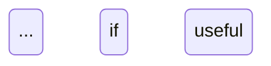

# C3 Derivation Model Design

> Concrete, ready-to-apply spec for how Context, Container, and Component docs derive from each other, including templates, checklists, and required skill updates.

## Intent
- Make derivation explicit: higher layers **constrain** lower layers; lower layers **implement** higher-layer contracts.
- Provide repeatable templates and checklists so authors can produce consistent CTX/CON/COM documents without re-deciding structure.
- Ensure traceability: every protocol, cross-cutting decision, and component has a clear downward link to its implementation.

---

## Core Rules
- **Reading order:** Context → Container → Component.
- **Reference direction:** Only downward links. Context → Container sections; Container → Component docs. No upward links.
- **Single source:** Define relationships once at the highest layer that owns the decision; lower layers only implement/link.
- **Infrastructure containers are leaf nodes:** they have no components; their features are consumed by code containers/components.

---

## Templates and Checklists

### Context Document (CTX-###)
**Purpose:** Bird’s-eye view of the system: what exists, boundaries, and protocols that must be implemented below.

**Template (copy/paste and fill):**
```markdown
# CTX-XXX <Name>

## System Boundary {#ctx-xxx-boundary}
- Inside: ...
- Outside: ...

## Actors {#ctx-xxx-actors}
| Actor | Role |
|-------|------|
| ...   | ...  |

## Containers {#ctx-xxx-containers}
| Container | Type (Code/Infra) | Description |
|-----------|-------------------|-------------|
| [CON-XXX-name](./containers/CON-XXX-name.md) | Code | ... |
| ... | ... | ... |

## Protocols {#ctx-xxx-protocols}
| From | To | Protocol | Implementations |
|------|----|----------|-----------------|
| Frontend | Backend | REST/HTTPS | [CON-002#api], [CON-001#rest] |
| ... | ... | ... | ... |

## Cross-Cutting {#ctx-xxx-cross-cutting}
- Auth: ... implemented in [CON-####auth]
- Logging: ... implemented in [CON-####logging]
- Error strategy: ... implemented in [CON-####errors]

## Deployment Topology {#ctx-xxx-deployment}
- Diagram or bullets for high-level infra layout
```

**Checklist (must be true to call CTX done):**
- System boundary and actors listed.
- Container inventory table includes every container with type (Code/Infra) and link.
- Protocols table lists every inter-container communication with links to implementing container sections.
- Cross-cutting decisions listed with downward links to container sections.
- Topology described (diagram or text).

### Code Container Document (CON-###, type=Code)
**Purpose:** What this container does and with what components; how it fulfills Context protocols and cross-cutting choices.

**Template:**
```markdown
# CON-XXX <Name> (Code)

## Technology Stack {#con-xxx-stack}
- Runtime, language, framework

## Protocol Implementations {#con-xxx-protocols}
| Protocol (from CTX) | Implemented In |
|---------------------|----------------|
| REST/HTTPS auth | [COM-002-auth] |
| ... | ... |

## Component Relationships {#con-xxx-relationships}
```mermaid
flowchart LR
    ... component flow ...
```

## Data Flow {#con-xxx-data-flow}
```mermaid
sequenceDiagram
    ... request/response path ...
```

## Container Cross-Cutting {#con-xxx-cross-cutting}
- Logging: implemented by [COM-0xx-logger]
- Error handling: implemented by [COM-0xx-errors]
- Validation/observability/etc.: links to components

## Components {#con-xxx-components}
| Component | Nature | Responsibility |
|-----------|--------|----------------|
| [COM-001-name](../components/COM-001-name.md) | Entrypoint | ... |
| ... | ... | ... |
```

**Checklist:**
- Stack recorded.
- Protocols table maps every CTX protocol to specific components/sections.
- Flowchart shows component relationships (must exist).
- Sequence diagram shows data flow (must exist).
- Cross-cutting choices mapped to components.
- Component inventory complete with nature + responsibility.

### Infrastructure Container Document (CON-###, type=Infra)
**Purpose:** Leaf node describing platform service features that code containers consume.

**Template:**
```markdown
# CON-XXX <Name> (Infrastructure)

## Engine {#con-xxx-engine}
- Version/edition, deployment mode

## Configuration {#con-xxx-config}
| Setting | Value | Why |
|---------|-------|-----|
| ... | ... | ... |

## Features Provided {#con-xxx-features}
| Feature | Consumed By |
|---------|-------------|
| WAL logical replication | [CON-001#components] → [COM-005-event-streaming] |
| ... | ... |
```

**Checklist:**
- Engine/version stated.
- Config table with rationale.
- Features table lists capabilities with links to consuming code containers/components.
- No component-level sections; this is a leaf.

### Component Document (COM-###)
**Purpose:** HOW the component works; implementation detail level.

**Template:**
```markdown
# COM-XXX <Name> (<Nature>)

## Overview {#com-xxx-overview}
- Responsibility and how it fits container protocols/cross-cutting.

## Stack {#com-xxx-stack}
- Library/version choices; why selected.

## Configuration {#com-xxx-config}
| Env Var | Dev | Prod | Why |
|---------|-----|------|-----|
| ... | ... | ... |

## Interfaces & Types {#com-xxx-interfaces}
- Signatures, DTOs, events; link to schemas.

## Behavior {#com-xxx-behavior}
- Narrative plus diagram where helpful.

- Alternative: flowchart/sequence/ERD depending on need.

## Error Handling {#com-xxx-errors}
| Error | Retriable | Action/Code |
|-------|-----------|-------------|
| ... | ... | ... |

## Usage {#com-xxx-usage}
```typescript
// exemplar usage
```

## Dependencies {#com-xxx-deps}
- Upstream/downstream components; infra features consumed.
```

**Checklist:**
- Nature chosen and informs focus (resource, business, cross-cutting, entrypoint, testing, deployment, contextual, etc.).
- Stack and configuration fully documented (with env differences).
- Interfaces/types specified.
- Behavior explained with at least one diagram if non-trivial.
- Error handling table present.
- Usage example shows intended invocation.
- Dependencies and consumed infra features listed.

---

## Derivation Enforcement
- **Context → Container:** Every protocol and cross-cutting item in CTX links to specific container sections describing implementation. Containers must not invent protocols absent from CTX without updating CTX.
- **Container → Component:** Every protocol or cross-cutting implementation in a code container maps to specific components/sections. Component inventory must cover all behavior shown in relationships/data-flow diagrams.
- **Infrastructure:** Features listed in infra containers must be cited by consuming components; infra docs are final leaves.
- **Anchors:** Use `{#ctx-xxx-...}`, `{#con-xxx-...}`, `{#com-xxx-...}` so downward links are stable.
- **No upward duplication:** lower layers do not redefine relationships; they implement and link back downwards only.

---

## Skill Updates (must implement)
1. `skills/c3-context-design/SKILL.md`
   - Add checklist enforcing container inventory, protocol table with downward links, cross-cutting with links, topology.
   - Include CTX template above; require anchor usage guidance and downward-only linking.
2. `skills/c3-container-design/SKILL.md`
   - Describe Code vs Infrastructure container types and the “infra is leaf” rule.
   - For Code containers, require protocol mapping table, flowchart, sequence diagram, cross-cutting mapping, and component inventory with nature/responsibility.
   - For Infra containers, require engine/config/features table with consuming links, and explicitly forbid components.
3. `skills/c3-component-design/SKILL.md`
   - Include nature taxonomy guidance (open-ended, examples above).
   - Require stack/config ownership, interfaces, behavior diagrams when non-trivial, error handling table, usage example, dependencies.
4. Examples
   - Update sample CTX/CON/COM docs to match the templates (or add new examples mirroring them).
5. `skills/c3-adopt/SKILL.md`
   - Ensure adoption flow instructs teams to create CTX → CON → COM following these templates and checklists, including anchor conventions and downward-link validation.

---

## Quick Reference: Derivation Chain
```
Context (WHAT exists, HOW they relate)
│  ├─ Protocols → CON#section
│  └─ Cross-cutting → CON#section
↓
Container (WHAT it does, WITH WHAT)
│  ├─ Code containers → components, relationships (flowchart), data flow (sequence)
│  ├─ Cross-cutting → COM links
│  └─ Infra containers → features consumed by Code
↓
Component (HOW it works)
   ├─ Nature-driven focus
   ├─ Stack, config, interfaces, behavior, errors, usage
   └─ Terminal leaf
```
