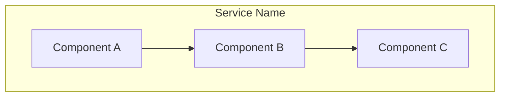
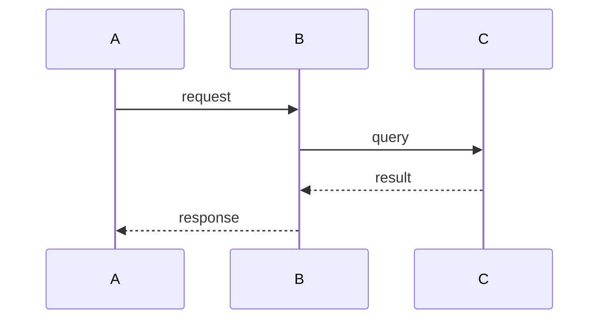
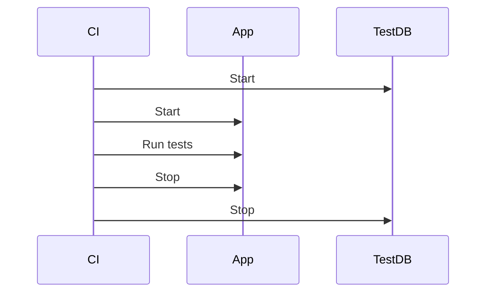
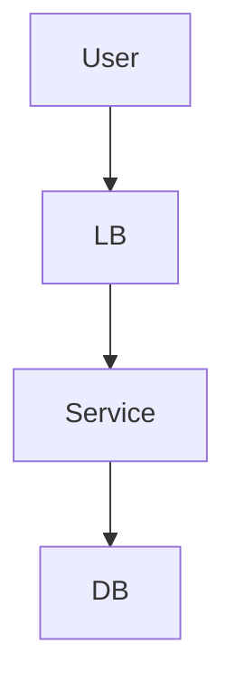

# Discovery-Driven Container Archetypes and Component Roles

**Date:** 2025-11-24
**Status:** Design
**Scope:** Enhance c3-container-design, c3-component-design, c3-adopt skills

## Problem Statement

Current C3 container/component skills are generic. Real-world containers follow recognizable patterns (backend, frontend, worker, infrastructure) with typical component structures. However:

1. Being too prescriptive creates template fatigue
2. Being too generic misses opportunities to guide discovery
3. Testing documentation lacks structure across levels
4. Meta-frameworks (Next.js, Nuxt) blur container boundaries

## Design Philosophy

**Discovery-driven, not template-enforcing.**

```
1. DISCOVER EXISTING     - Task Explore to understand what's there
2. UNDERSTAND FLOW       - Look upward, downward, adjacent
3. SOCRATIC QUESTIONING  - Ask to understand, not to enforce
4. DOCUMENT WHAT EXISTS  - Diagrams to clarify, not mandate
5. NO ENFORCING          - User decides what's worth documenting
```

Role patterns are **vocabulary for discussion**, not requirements to fill in.

## Role Pattern Taxonomy

Organize roles by concern, not as flat list. Use as discovery vocabulary.

### Communication Roles (how it connects)

| Role | Description | Discovery Cue |
|------|-------------|---------------|
| Request Handler | Receives sync requests (HTTP, gRPC, GraphQL) | Entry points, route files |
| Event Consumer | Receives async messages/events | Queue listeners, subscribers |
| Event Producer | Emits messages/events | Publish calls, event emitters |
| Scheduled Handler | Time-triggered execution | Cron config, schedulers |
| Gateway/Edge | External traffic ingress | Reverse proxy, load balancer |

### Processing Roles (what it does)

| Role | Description | Discovery Cue |
|------|-------------|---------------|
| Business Logic | Domain rules, workflows | Service classes, use cases |
| Transformer | Data mapping, conversion | Mappers, serializers |
| Aggregator | Combines data sources | BFF patterns, composite calls |
| Saga Coordinator | Multi-step workflows | State machines, orchestrators |
| Form Handler | Input capture, validation | Form components, validators |

### State Roles (how data lives)

| Role | Description | Discovery Cue |
|------|-------------|---------------|
| Database Access | ACID-compliant storage | ORM, repositories |
| Cache Access | Ephemeral storage | Redis clients, cache decorators |
| Object Storage | Blob storage | S3 clients, file handlers |
| State Container | App state (frontend) | Redux, Zustand, stores |
| Client Cache | API response caching | React Query, SWR |

### Presentation Roles (frontend-specific)

| Role | Description | Discovery Cue |
|------|-------------|---------------|
| View Layer | Renders UI from state | Components, templates |
| Router | URL-to-view mapping | Route config, pages/ |
| Hydration | SSR-to-client transfer | Hydration boundaries |

### Integration Roles (what it calls)

| Role | Description | Discovery Cue |
|------|-------------|---------------|
| Internal Client | Within trust boundary | Service clients, SDK calls |
| External Client | Third-party systems | API adapters, webhooks |

### Operational Roles (deployment concerns)

| Role | Description | Discovery Cue |
|------|-------------|---------------|
| Sidecar | Co-located helper | Envoy, log shippers |
| Init/Bootstrap | Pre-start setup | Migrations, secret fetch |
| Health/Readiness | Orchestrator signals | Health endpoints |

## Container Archetypes as Discovery Hints

Not templates to fill, but starting points for exploration.

| Archetype | Typical Roles | Discovery Approach |
|-----------|---------------|-------------------|
| Backend Service | Request Handler, Business Logic, Database Access | Look for routes, services, data layer |
| Frontend SPA | View Layer, State Container, Router, Integration | Look for components, stores, routing |
| Meta-Framework | *See Execution Context* | Identify server vs client code paths |
| Worker | Event Consumer, Business Logic | Look for queue listeners, job handlers |
| Gateway | Request Handler, Aggregator, Internal Client | Look for proxy config, route aggregation |
| Infrastructure | Configuration Surface only | Look for config, interfaces, operations |

### Execution Context (Meta-Frameworks)

For Next.js, Nuxt, SvelteKit - document by execution context, not as single container:

| Context | Available Roles |
|---------|-----------------|
| Server Build-time | Data Access, View Layer, Configuration |
| Server Runtime | Request Handler, Business Logic, Data Access |
| Client Runtime | View Layer, State Container, Router, Form Handler |

Ask: "What code runs where? Build time? Server? Client?"

## Infrastructure Containers

Not "leaf nodes with no components" - they have **configuration surfaces**:

```markdown
## Configuration Surface
| Parameter | Value | Rationale |

## Interfaces
- Inbound: [port, protocol, auth]
- Outbound: [connections, replication]

## Operational Characteristics
- Backup, Failover, Scaling

## Dependencies
- Requires: [VPC, IAM, etc.]
- Consumed by: [containers]
```

## Platform Layer (Context-Level)

Platform concerns are part of Context conceptually, split for manageability:

```
.c3/
├── README.md              # Context (c3-0) - links to platform/
├── platform/              # Context-level platform docs
│   ├── deployment.md      # c3-0-deployment
│   ├── networking.md      # c3-0-networking
│   ├── secrets.md         # c3-0-secrets
│   └── ci-cd.md           # c3-0-cicd
├── c3-1-backend/
└── c3-2-frontend/
```

Platform docs use `c3-0-*` IDs to indicate Context-level.

## Testing Documentation

**Not enforced, discovered via Socratic questioning.**

### Discovery Questions

- "How do you test this component/container/system?"
- "What runs in CI? What's manual?"
- "Any contract tests between services?"
- "How do you test failure scenarios?"

### Document What Exists

| Level | Test Types | Location |
|-------|-----------|----------|
| Component | Unit, component tests | Component doc (if they exist) |
| Container | Integration, contract tests | Container doc (if they exist) |
| Context | System, chaos tests | Context or platform/ (if they exist) |

Accept "we don't test this" as valid - document as TBD, don't force.

## Diagram Patterns

Offer diagrams that **help clarify**, not mandate structure.

### Component Relationships (Container-level)



### Data Flow (Sequence)



### Test Orchestration



### Platform Topology



Use appropriate diagram when it **aids understanding**. Don't generate diagrams for trivial relationships.

## Discovery Process

### Container Discovery Flow

```
1. Task Explore (thorough)
   - Package.json/go.mod/requirements.txt
   - Entry points, route files
   - Directory structure

2. Look Upward
   - "What calls this container?"
   - Check gateway configs, service mesh

3. Look Downward
   - "What does this call?"
   - Database connections, external APIs

4. Look Adjacent
   - "What runs alongside?"
   - Sidecars, init containers

5. Socratic Questions
   - Use role vocabulary: "This looks like Request Handler + Business Logic - accurate?"
   - "How is this tested?"
   - "What happens when X fails?"

6. Document
   - Capture reality
   - Suggest improvements as optional
   - Generate helpful diagrams
```

### Component Discovery Flow

```
1. Identify from Container inventory

2. Read the code (Task Explore)
   - What does this module do?
   - What does it depend on?
   - What depends on it?

3. Map to Roles (as vocabulary)
   - "This seems like Database Access - correct?"

4. Socratic Questions
   - "What configuration does this need?"
   - "How are errors handled?"
   - "Any environment differences?"

5. Document
   - Purpose and responsibility
   - Dependencies (upstream/downstream)
   - Configuration (if any)
   - Diagrams (if helpful)
```

## Skill Changes Required

### c3-adopt

- Add full codebase exploration via Task Explore before questioning
- Build container map first, present overview to user
- Per-container: proactive exploration, then Socratic refinement
- Support on-demand deeper exploration

### c3-container-design

- Add role vocabulary section
- Add archetype hints (not templates)
- Add execution context for meta-frameworks
- Add infrastructure configuration surface pattern
- Update discovery questions to use AskUserQuestion tool

### c3-component-design

- Add role vocabulary by category
- Add discovery flow (upward, downward, adjacent)
- Update Socratic questions for each role type
- Emphasize "document what exists" not "fill template"

### c3-context-design

- Add platform/ section pattern
- Add platform discovery questions
- Link to platform docs from Context

### References to Add

```
references/
├── role-taxonomy.md           # Complete role vocabulary
├── archetype-hints.md         # Container archetype patterns
├── discovery-questions.md     # Socratic questions by role
├── diagram-patterns.md        # Mermaid templates
├── testing-discovery.md       # Testing documentation approach
└── platform-patterns.md       # CI/CD, networking, secrets patterns
```

## Migration Impact

**No migration needed for existing .c3/ directories.**

This design adds:
- New reference files in plugin (no user impact)
- Enhanced skill behaviors (backwards compatible)
- Optional platform/ directory pattern (user chooses to adopt)

## Success Criteria

1. Container discovery feels guided, not enforced
2. Role vocabulary helps discussion without mandating structure
3. Testing documentation captures reality, not ideal
4. Meta-frameworks have clear documentation path
5. Infrastructure containers have appropriate template
6. Platform concerns have home without breaking C4 model
