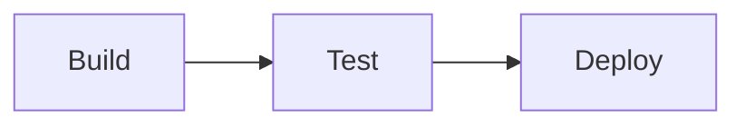
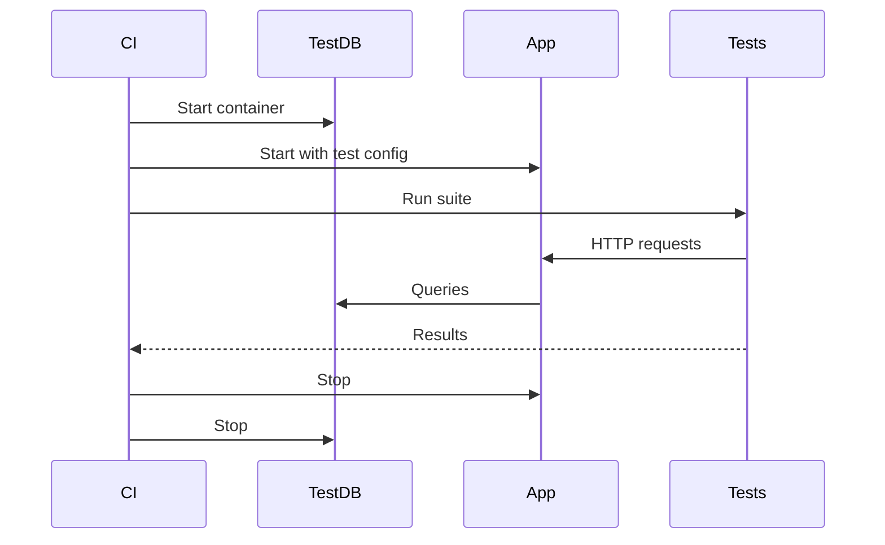
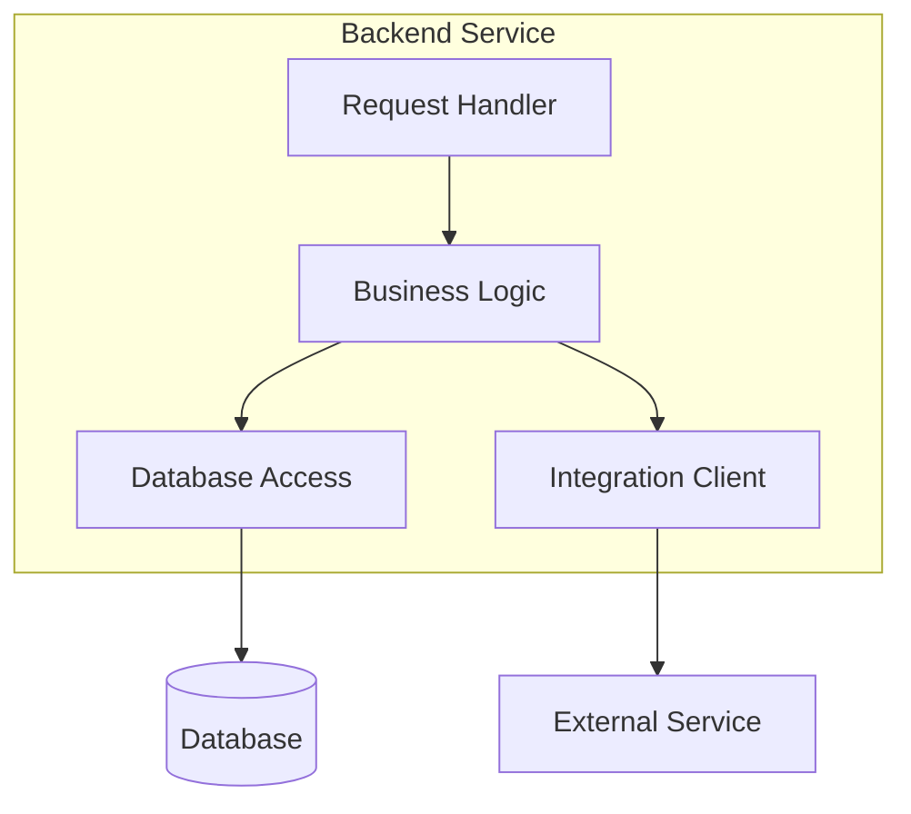
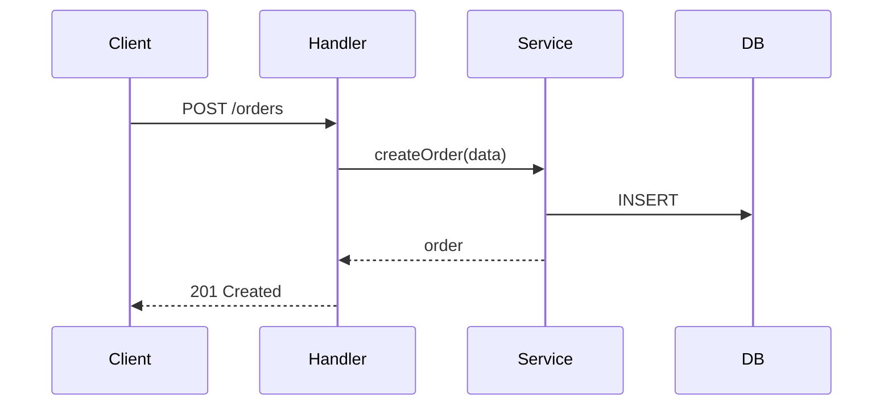
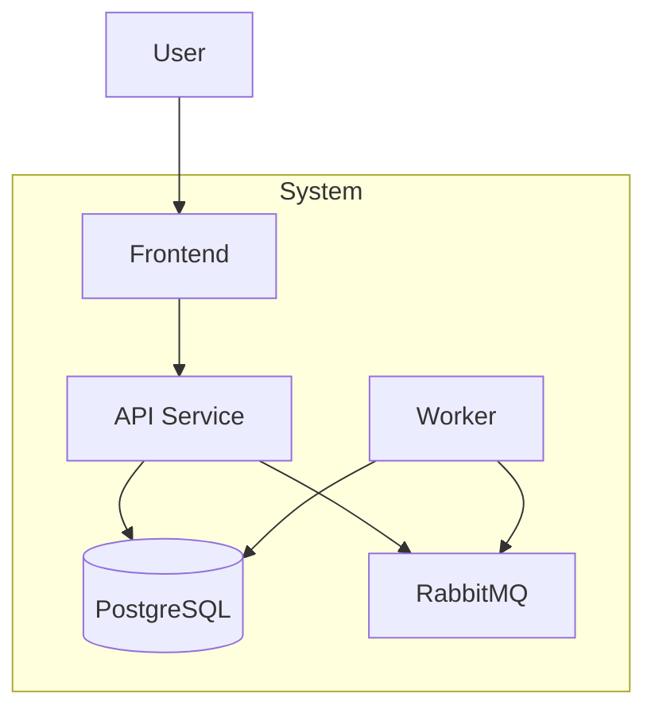
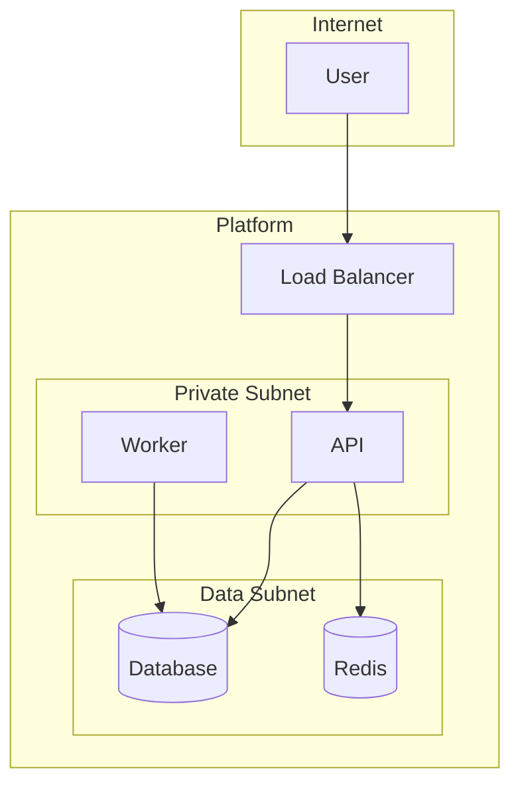
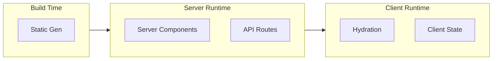
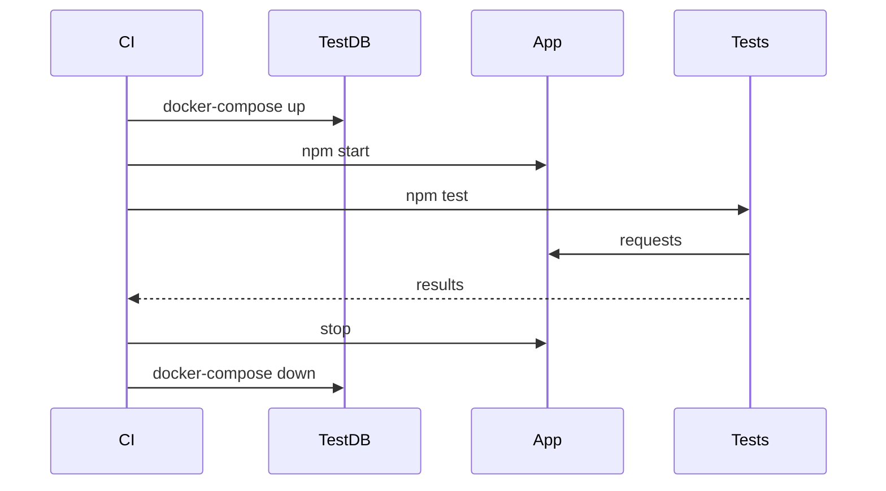
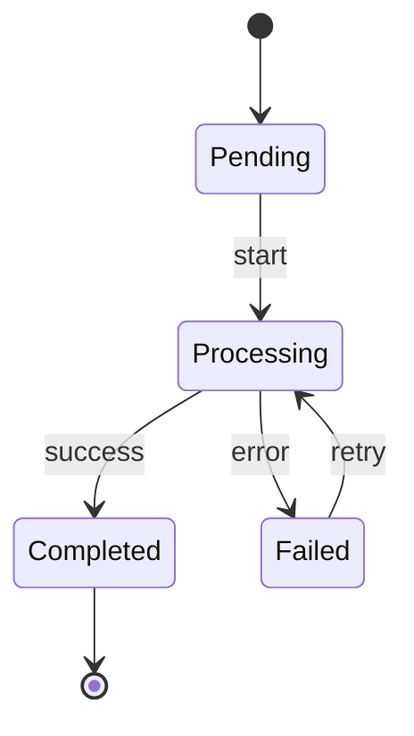

# Discovery-Driven Archetypes Implementation Plan

> **For Claude:** REQUIRED SUB-SKILL: Use superpowers:executing-plans to implement this plan task-by-task.

**Goal:** Enhance C3 container/component skills with discovery-driven role patterns, archetype hints, and platform documentation support.

**Architecture:** Add new reference files for role taxonomy, archetype hints, and discovery questions. Modify existing skills to use Task Explore for codebase discovery and AskUserQuestion for Socratic questioning. Add platform documentation pattern to context level.

**Tech Stack:** Markdown skill files, Mermaid diagrams, Claude Code tools (Task Explore, AskUserQuestion)

---

## Task 1: Create Role Taxonomy Reference

**Files:**
- Create: `references/role-taxonomy.md`

**Step 1: Create the role taxonomy reference file**

```markdown
# Role Taxonomy

Role patterns are **vocabulary for discussion**, not requirements to fill in.

Use these patterns to:
- Recognize what you discover in code
- Ask informed questions during discovery
- Document using shared language

## Communication Roles

How the component/container connects to the outside world.

| Role | Description | Discovery Cues |
|------|-------------|----------------|
| Request Handler | Receives sync requests (HTTP, gRPC, GraphQL) | Route files, controllers, handlers |
| Event Consumer | Receives async messages/events | Queue listeners, subscribers, on() handlers |
| Event Producer | Emits messages/events | publish(), emit(), send() calls |
| Scheduled Handler | Time-triggered execution | Cron config, @Scheduled, setInterval |
| Gateway/Edge | External traffic ingress | Proxy config, load balancer rules |

## Processing Roles

What the component does with data/requests.

| Role | Description | Discovery Cues |
|------|-------------|----------------|
| Business Logic | Domain rules, workflows, validation | Service classes, use cases, domain/ |
| Transformer | Data mapping, format conversion | Mappers, serializers, adapters |
| Aggregator | Combines data from multiple sources | BFF patterns, Promise.all, concurrent calls |
| Saga Coordinator | Multi-step distributed workflows | State machines, orchestrators, compensating transactions |
| Form Handler | Input capture, validation, submission | Form components, useForm, validators |

## State Roles

How the component manages data persistence.

| Role | Description | Discovery Cues |
|------|-------------|----------------|
| Database Access | ACID-compliant storage | ORM calls, repositories, SQL queries |
| Cache Access | Ephemeral/best-effort storage | Redis clients, cache decorators, memoization |
| Object Storage | Large blob storage | S3 clients, file upload handlers |
| State Container | Application state (frontend) | Redux, Zustand, Pinia, stores/ |
| Client Cache | API response caching (frontend) | React Query, SWR, Apollo cache |

## Presentation Roles

Frontend-specific UI concerns.

| Role | Description | Discovery Cues |
|------|-------------|----------------|
| View Layer | Renders UI from state | Components, templates, JSX/TSX |
| Router | URL-to-view mapping | Route config, pages/, app/ directory |
| Hydration | SSR-to-client state transfer | use client, hydration boundaries |

## Integration Roles

How the component communicates with other systems.

| Role | Description | Discovery Cues |
|------|-------------|----------------|
| Internal Client | Calls within trust boundary | Service clients, internal SDK, gRPC stubs |
| External Client | Calls third-party systems | API adapters, webhook handlers, OAuth flows |

## Operational Roles

Deployment and runtime concerns.

| Role | Description | Discovery Cues |
|------|-------------|----------------|
| Sidecar | Co-located helper process | Envoy config, log shippers, secret injectors |
| Init/Bootstrap | Pre-start setup | Migration scripts, secret fetch, cert rotation |
| Health/Readiness | Orchestrator signals | /health, /ready endpoints, probes |

## Using Role Vocabulary

**During discovery:**
- "I see route handlers here - this looks like a Request Handler role. Accurate?"
- "There's a Redis client - is this Cache Access or something else?"

**When documenting:**
- Use role names in component descriptions
- Don't force every role to be present
- Document what exists, not what "should" exist

**Anti-patterns:**
- Treating roles as checkboxes to fill
- Forcing code into role categories that don't fit
- Creating roles for hypothetical future needs
```

**Step 2: Verify file created**

Run: `cat references/role-taxonomy.md | head -20`
Expected: Shows the header and first section

**Step 3: Commit**

```bash
git add references/role-taxonomy.md
git commit -m "docs: add role taxonomy reference for discovery vocabulary"
```

---

## Task 2: Create Archetype Hints Reference

**Files:**
- Create: `references/archetype-hints.md`

**Step 1: Create the archetype hints reference file**

```markdown
# Container Archetype Hints

Archetypes are **starting points for exploration**, not templates to fill.

Use these to:
- Recognize container patterns during discovery
- Know what roles to look for
- Ask informed questions

## Backend Service

**Typical Roles:** Request Handler, Business Logic, Database Access

**Discovery approach:**
1. Look for: package.json (express, fastify, nestjs), go.mod (chi, gin), requirements.txt (fastapi, django)
2. Find entry points: main.ts, app.py, main.go
3. Trace routes → handlers → services → data layer

**Questions to ask:**
- "What endpoints does this expose?"
- "Where does business logic live?"
- "What database/storage does this use?"

## Frontend SPA

**Typical Roles:** View Layer, State Container, Router, Integration

**Discovery approach:**
1. Look for: package.json (react, vue, svelte, angular)
2. Find component structure: src/components/, src/pages/
3. Find state management: store/, redux/, zustand

**Questions to ask:**
- "What UI framework?"
- "How is state managed?"
- "How does it communicate with backend?"

## Meta-Framework (Next.js, Nuxt, SvelteKit)

**Typical Roles:** Varies by execution context

**Discovery approach:**
1. Identify framework: next.config.js, nuxt.config.ts, svelte.config.js
2. Map execution contexts:
   - Server build-time: getStaticProps, generateStaticParams
   - Server runtime: API routes, server actions, RSC
   - Client runtime: use client components, client state

**Execution Context Table:**

| Context | Available Roles |
|---------|-----------------|
| Server Build-time | Data Access, View Layer, Configuration |
| Server Runtime | Request Handler, Business Logic, Data Access |
| Client Runtime | View Layer, State Container, Router, Form Handler |

**Questions to ask:**
- "What renders on server vs client?"
- "Are there API routes?"
- "How is data fetched (server vs client)?"

## Worker / Background Processor

**Typical Roles:** Event Consumer, Business Logic, Database Access

**Discovery approach:**
1. Look for: queue connection config, job definitions
2. Find handlers: workers/, jobs/, consumers/
3. Trace: queue → handler → processing → output

**Questions to ask:**
- "What queue/broker does this consume from?"
- "What triggers job execution?"
- "Where do results go?"

## API Gateway / BFF

**Typical Roles:** Request Handler, Aggregator, Internal Client

**Discovery approach:**
1. Look for: proxy config, route aggregation
2. Find upstream service definitions
3. Check for auth/rate limiting middleware

**Questions to ask:**
- "What services does this route to?"
- "Any request transformation or aggregation?"
- "Where is auth handled?"

## Infrastructure Container

**No code components - has Configuration Surface instead**

**Discovery approach:**
1. Identify technology: PostgreSQL, Redis, RabbitMQ, etc.
2. Find configuration: terraform, helm, docker-compose
3. Document interfaces and operational characteristics

**Documentation pattern:**

```markdown
## Configuration Surface
| Parameter | Value | Rationale |

## Interfaces
- Inbound: [port, protocol, auth method]
- Outbound: [replication, backups]

## Operational Characteristics
- Backup: [strategy, retention]
- Failover: [automatic/manual, RTO]
- Scaling: [horizontal/vertical, constraints]

## Dependencies
- Requires: [VPC, IAM, encryption keys]
- Consumed by: [list of containers]
```

## CLI Tool

**Typical Roles:** Request Handler (args), Business Logic, Integration

**Discovery approach:**
1. Look for: bin/ directory, CLI framework (commander, cobra, click)
2. Find command definitions
3. Trace: command → handler → action

**Questions to ask:**
- "What commands are available?"
- "What does each command do?"
- "Any external service calls?"
```

**Step 2: Verify file created**

Run: `cat references/archetype-hints.md | head -20`
Expected: Shows the header and first archetype

**Step 3: Commit**

```bash
git add references/archetype-hints.md
git commit -m "docs: add archetype hints reference for container discovery"
```

---

## Task 3: Create Discovery Questions Reference

**Files:**
- Create: `references/discovery-questions.md`

**Step 1: Create the discovery questions reference file**

```markdown
# Discovery Questions

Questions to ask during Socratic discovery. Use AskUserQuestion tool when presenting choices.

## Philosophy

1. **Ask to understand**, not to enforce
2. **Accept "we don't"** as valid answer (document as TBD)
3. **Explore before asking** - use Task Explore first
4. **Present choices** when options are clear (use AskUserQuestion)
5. **Open-ended** when context is needed

## Container-Level Questions

### Identity
- "What is this container's primary responsibility?"
- "Who/what calls this container?"
- "What would break if this container was removed?"

### Technology (use AskUserQuestion for choices)
- "What runtime/framework? [discovered options from exploration]"
- "What language version?"
- "Any significant libraries?"

### Structure
- "How is the code organized?"
- "What are the main entry points?"
- "Any distinct layers or modules?"

### Dependencies
- "What databases/caches does this use?"
- "What other services does this call?"
- "Any external APIs?"

### Testing
- "How is this container tested?"
- "What runs in CI?"
- "Any manual testing steps?"

## Component-Level Questions

### Purpose
- "What does this component do?"
- "Why does it exist separately from [adjacent component]?"
- "What would you lose if this was merged into its caller?"

### Implementation
- "What's the main pattern here? [service, repository, handler, etc.]"
- "Any complex algorithms or business rules?"
- "How are errors handled?"

### Configuration
- "What configuration does this need?"
- "Any environment-specific behavior?"
- "Secrets or sensitive values?"

### Dependencies
- "What does this component depend on?"
- "What depends on this component?"
- "Any circular dependencies?"

## Context-Level Questions

### System Boundary
- "What is this system responsible for?"
- "What is explicitly NOT in scope?"
- "Who are the users/actors?"

### External Systems
- "What external systems does this integrate with?"
- "Who owns those systems?"
- "What happens when they're unavailable?"

### Cross-Cutting Concerns
- "How is authentication handled?"
- "How is logging/monitoring done?"
- "Any shared infrastructure?"

## Platform Questions

### Deployment
- "How are containers deployed?"
- "What orchestrator (K8s, ECS, etc.)?"
- "Rollback strategy?"

### Networking
- "Network topology?"
- "Service discovery mechanism?"
- "Any service mesh?"

### Secrets
- "Where are secrets stored?"
- "How are they injected?"
- "Rotation policy?"

### CI/CD
- "What triggers deployments?"
- "Pipeline stages?"
- "Approval gates?"

## When User Doesn't Know

If the user doesn't know the answer:
1. Mark as `TBD` in documentation
2. Move on - don't block on unknowns
3. Note it as something to discover later
4. Don't guess or assume

Example:
```markdown
## Testing
TBD - testing strategy not yet established
```
```

**Step 2: Verify file created**

Run: `cat references/discovery-questions.md | head -20`
Expected: Shows the header and philosophy

**Step 3: Commit**

```bash
git add references/discovery-questions.md
git commit -m "docs: add discovery questions reference for Socratic questioning"
```

---

## Task 4: Create Platform Patterns Reference

**Files:**
- Create: `references/platform-patterns.md`

**Step 1: Create the platform patterns reference file**

```markdown
# Platform Documentation Patterns

Platform concerns are part of Context conceptually, split into separate files for manageability.

## Structure

```
.c3/
├── README.md              # Context (c3-0) - links to platform/
├── platform/              # Context-level platform docs
│   ├── deployment.md      # c3-0-deployment
│   ├── networking.md      # c3-0-networking
│   ├── secrets.md         # c3-0-secrets
│   └── ci-cd.md           # c3-0-cicd
```

Platform docs use `c3-0-*` IDs to indicate they're Context-level.

## Deployment Documentation

```markdown
---
id: c3-0-deployment
c3-version: 3
title: Deployment
---

# Deployment

## Strategy {#c3-0-deployment-strategy}
[Blue-green, canary, rolling, etc.]

## Orchestrator {#c3-0-deployment-orchestrator}
[Kubernetes, ECS, etc. with version]

## Container Registry {#c3-0-deployment-registry}
[Where images are stored]

## Rollback {#c3-0-deployment-rollback}
[How to rollback, RTO expectations]

## Per-Container Deployment
| Container | Strategy | Health Check | Replicas |
|-----------|----------|--------------|----------|
```

## Networking Documentation

```markdown
---
id: c3-0-networking
c3-version: 3
title: Networking
---

# Networking

## Topology {#c3-0-networking-topology}
[Mermaid diagram of network layout]

## Ingress {#c3-0-networking-ingress}
| Source | Destination | Port | Protocol |
|--------|-------------|------|----------|

## Service Discovery {#c3-0-networking-discovery}
[DNS, service mesh, etc.]

## Service Mesh {#c3-0-networking-mesh}
[If applicable: Istio, Linkerd, etc.]
```

## Secrets Documentation

```markdown
---
id: c3-0-secrets
c3-version: 3
title: Secrets Management
---

# Secrets Management

## Storage {#c3-0-secrets-storage}
[Vault, AWS Secrets Manager, etc.]

## Injection Method {#c3-0-secrets-injection}
[Env vars, mounted volumes, CSI driver]

## Rotation {#c3-0-secrets-rotation}
[Policy, automation]

## Per-Container Secrets
| Container | Secrets Required | Injection |
|-----------|------------------|-----------|
```

## CI/CD Documentation

```markdown
---
id: c3-0-cicd
c3-version: 3
title: CI/CD Pipeline
---

# CI/CD Pipeline

## Pipeline Tool {#c3-0-cicd-tool}
[GitHub Actions, GitLab CI, Jenkins, etc.]

## Stages {#c3-0-cicd-stages}


## Triggers {#c3-0-cicd-triggers}
| Event | Action |
|-------|--------|
| Push to main | Deploy to staging |
| Tag v*.*.* | Deploy to production |

## Approval Gates {#c3-0-cicd-gates}
[Manual approvals, automated checks]

## Artifacts {#c3-0-cicd-artifacts}
[Where build outputs are stored]
```

## Linking from Context

In `.c3/README.md` (Context document), add:

```markdown
## Platform {#c3-0-platform}

Platform infrastructure documentation:
- [Deployment](platform/deployment.md)
- [Networking](platform/networking.md)
- [Secrets Management](platform/secrets.md)
- [CI/CD Pipeline](platform/ci-cd.md)
```

## Discovery Approach

Platform documentation is **optional**. During c3-adopt:

1. Ask: "Do you want to document platform concerns (deployment, networking, secrets, CI/CD)?"
2. If yes, create platform/ directory and scaffold files
3. Use discovery questions from discovery-questions.md
4. Accept TBD for unknown areas
```

**Step 2: Verify file created**

Run: `cat references/platform-patterns.md | head -20`
Expected: Shows the header and structure

**Step 3: Commit**

```bash
git add references/platform-patterns.md
git commit -m "docs: add platform patterns reference for context-level infrastructure"
```

---

## Task 5: Create Testing Discovery Reference

**Files:**
- Create: `references/testing-discovery.md`

**Step 1: Create the testing discovery reference file**

```markdown
# Testing Discovery

Document what exists, not what should exist. Accept "we don't test this" as valid.

## Philosophy

1. **Discover, don't prescribe** - find existing tests, don't mandate new ones
2. **Accept gaps** - document TBD, suggest improvements as optional
3. **Level-appropriate** - unit at component, integration at container, system at context
4. **No enforcement** - user decides what's worth documenting

## Discovery by Level

### Component Level

**Questions:**
- "Are there tests for this component?"
- "Where do they live?"
- "How do you run them?"

**If tests exist, document:**
```markdown
## Testing {#c3-nnn-testing}
- Location: `src/__tests__/componentName.test.ts`
- Run: `npm test -- componentName`
- Coverage: [if known]
```

**If no tests:**
```markdown
## Testing {#c3-nnn-testing}
TBD - no tests currently
```

### Container Level

**Questions:**
- "How do you test this container as a whole?"
- "Any integration tests?"
- "Contract tests with other services?"
- "What runs in CI?"

**If tests exist, document:**
```markdown
## Testing Strategy {#c3-n-testing}

### Integration Tests
- Location: `tests/integration/`
- Run: `npm run test:integration`
- Dependencies: [what needs to be running]

### Contract Tests
- Location: `tests/contracts/`
- Pact broker: [URL if applicable]
```

**If partial:**
```markdown
## Testing Strategy {#c3-n-testing}

### Integration Tests
- Location: `tests/integration/`
- Run: `npm run test:integration`

### Contract Tests
TBD - not yet implemented
```

### Context Level

**Questions:**
- "Any end-to-end tests?"
- "System tests across containers?"
- "Chaos/resilience testing?"
- "Where does this run (staging, prod)?"

**Document in Context or platform/:**
```markdown
## System Testing {#c3-0-testing}

### End-to-End
- Location: `e2e/` (or separate repo)
- Environment: staging
- Run: `npm run e2e`

### Chaos Testing
TBD - not yet implemented
```

## Test Orchestration Diagram

When cross-component or cross-container testing involves complex setup, offer a diagram:



Only generate if it **helps clarify**. Trivial setups don't need diagrams.

## Suggesting Improvements

After documenting what exists, you MAY suggest improvements:

```markdown
## Testing {#c3-nnn-testing}
- Location: `src/__tests__/`
- Coverage: ~40%

> **Suggestion:** Consider adding tests for error paths in `handlePayment()`.
```

Suggestions are:
- Clearly marked as optional
- Specific and actionable
- Not blocking documentation completion
```

**Step 2: Verify file created**

Run: `cat references/testing-discovery.md | head -20`
Expected: Shows the header and philosophy

**Step 3: Commit**

```bash
git add references/testing-discovery.md
git commit -m "docs: add testing discovery reference for test documentation"
```

---

## Task 6: Create Diagram Patterns Reference

**Files:**
- Create: `references/diagram-patterns.md`

**Step 1: Create the diagram patterns reference file**

```markdown
# Diagram Patterns

Diagrams should **clarify**, not mandate. Generate when helpful, skip when trivial.

## When to Use Diagrams

**Use a diagram when:**
- Relationships are non-obvious
- Data flow has multiple steps
- Test orchestration is complex
- Architecture overview aids understanding

**Skip diagrams when:**
- Relationships are trivial (A calls B)
- Text description is clearer
- Diagram would just repeat prose

## Component Relationships (Container Level)

Show how components within a container interact.



**When to use:** Container has 3+ components with non-trivial relationships.

## Data Flow (Sequence)

Show how a request flows through the system.



**When to use:** Request involves multiple components/services, error handling branches, or async steps.

## Container Overview (Context Level)

Show all containers and their relationships.



**When to use:** System has 3+ containers.

## Platform Topology

Show infrastructure layout.



**When to use:** Documenting platform/networking.

## Execution Context (Meta-Frameworks)

Show server vs client code paths.



**When to use:** Documenting Next.js, Nuxt, SvelteKit applications.

## Test Orchestration

Show test setup and teardown.



**When to use:** Integration tests with external dependencies.

## State Machine (Complex Business Logic)

Show state transitions for workflows.



**When to use:** Component manages state transitions (orders, workflows, sagas).

## Anti-Patterns

**Don't:**
- Generate diagrams for every component (noise)
- Create diagrams that just mirror the prose
- Use complex diagram types when simple flowchart works
- Force diagrams where text is clearer

**Do:**
- Ask "does this diagram add clarity?"
- Keep diagrams focused (5-10 nodes max)
- Use consistent naming with documentation
- Update diagrams when code changes
```

**Step 2: Verify file created**

Run: `cat references/diagram-patterns.md | head -20`
Expected: Shows the header and when-to-use guidance

**Step 3: Commit**

```bash
git add references/diagram-patterns.md
git commit -m "docs: add diagram patterns reference for Mermaid templates"
```

---

## Task 7: Update c3-adopt Skill

**Files:**
- Modify: `skills/c3-adopt/SKILL.md`

**Step 1: Read current file**

Run: `cat skills/c3-adopt/SKILL.md`

**Step 2: Add Task Explore integration and update Phase 1**

After the Quick Reference table (around line 22), add references to new files:

Find this section:
```markdown
## Guardrails
```

Replace/update the Guardrails section to include new references:

```markdown
## Guardrails

**Required reading before starting:**
- @references/derivation-guardrails.md - Hierarchy and abstraction rules
- @references/v3-structure.md - File paths and ID patterns
- @references/role-taxonomy.md - Component role vocabulary
- @references/archetype-hints.md - Container archetype patterns
- @references/discovery-questions.md - Socratic questioning guide
```

**Step 3: Update Phase 1 to use Task Explore**

Find Phase 1 (around line 34) and update to:

```markdown
## Phase 1: Discovery & Scaffolding

### Step 1.1: Full Codebase Exploration

**Use Task Explore (very thorough) to build container map:**

Prompt for Task Explore:
```
Explore this codebase thoroughly to identify all deployable containers.

Look for:
1. Package managers: package.json, go.mod, requirements.txt, Cargo.toml, pom.xml
2. Entry points: main.*, index.*, app.*, server.*
3. Docker/container files: Dockerfile, docker-compose.yml
4. Framework indicators: next.config.*, nuxt.config.*, angular.json
5. Infrastructure: terraform/, helm/, k8s/

For each potential container found:
- Directory path
- Likely archetype (backend, frontend, worker, infrastructure)
- Key technologies detected
- Entry points found

Return a structured container map.
```

### Step 1.2: Present Container Map

Show discovered containers to user:

```markdown
## Discovered Containers

| # | Path | Archetype | Technologies |
|---|------|-----------|--------------|
| 1 | /api | Backend | Node.js, Express, PostgreSQL |
| 2 | /web | Frontend | Next.js, React |
| 3 | /worker | Worker | Node.js, BullMQ |
| 4 | - | Infrastructure | PostgreSQL, Redis |

Does this match your understanding? Any containers missing or incorrectly identified?
```

Use AskUserQuestion if choices needed.

### Step 1.3: Scaffold .c3/ Directory

Create structure based on confirmed containers:

```
.c3/
├── README.md           # Context stub
├── c3-1-{slug}/        # First container
│   └── README.md
├── c3-2-{slug}/        # Second container
│   └── README.md
└── adr/                # ADR directory
```
```

**Step 4: Update Phase 3 to reference archetype hints**

Find Phase 3 (around line 142) and update:

```markdown
## Phase 3: Container Discovery

For each container identified in Phase 1:

### Step 3.1: Archetype-Guided Exploration

Reference @references/archetype-hints.md for the container's archetype.

Use Task Explore to discover:
- Component structure within the container
- Dependencies (upstream, downstream)
- Technology specifics

### Step 3.2: Socratic Refinement

Using @references/discovery-questions.md, ask container-level questions:
- Identity: "What is this container's primary responsibility?"
- Technology: Use AskUserQuestion with discovered options
- Dependencies: "What does this call? What calls this?"
- Testing: "How is this tested?"

### Step 3.3: Delegate to c3-container-design

Pass discovered information to container-design skill for documentation.
```

**Step 5: Add Phase 6 for Platform (optional)**

After Phase 5 (around line 231), add:

```markdown
## Phase 6: Platform Documentation (Optional)

Ask user:
```
Do you want to document platform concerns?
- Deployment strategy
- Networking topology
- Secrets management
- CI/CD pipeline

These are optional but help complete the system picture.
```

If yes:
1. Create `.c3/platform/` directory
2. Reference @references/platform-patterns.md
3. Use discovery questions for each area
4. Accept TBD for unknowns
```

**Step 6: Commit**

```bash
git add skills/c3-adopt/SKILL.md
git commit -m "feat(c3-adopt): add Task Explore integration and archetype discovery"
```

---

## Task 8: Update c3-container-design Skill

**Files:**
- Modify: `skills/c3-container-design/SKILL.md`

**Step 1: Read current file**

Run: `cat skills/c3-container-design/SKILL.md`

**Step 2: Add role taxonomy reference**

After the Overview section (around line 14), add:

```markdown
## Role Vocabulary

Reference @references/role-taxonomy.md for component role patterns.

Use roles as **discovery vocabulary**, not requirements:
- "This looks like a Request Handler role - accurate?"
- "I see Database Access here - what database?"
```

**Step 3: Update Socratic Questions to use AskUserQuestion**

Find Socratic Questions section (around line 127) and update:

```markdown
## Socratic Questions

Use @references/discovery-questions.md for full question bank.

**Use AskUserQuestion tool when presenting choices:**

Example for technology discovery:
```
Question: "What web framework does this use?"
Options (from Task Explore findings):
- Express (discovered in package.json)
- Fastify
- Other
```

**Use open-ended questions for context:**
- "What is this container's primary responsibility?"
- "What would break if this was removed?"
```

**Step 4: Add execution context section for meta-frameworks**

After the Infrastructure Container Template (around line 225), add:

```markdown
## Meta-Framework Containers

For Next.js, Nuxt, SvelteKit containers, document by execution context:

Reference @references/archetype-hints.md for execution context table.

```markdown
## Execution Contexts {#c3-n-contexts}

| Context | Roles | Examples |
|---------|-------|----------|
| Server Build-time | Data Access, View Layer | getStaticProps, generateStaticParams |
| Server Runtime | Request Handler, Business Logic | API routes, server actions |
| Client Runtime | View Layer, State Container | Client components, stores |
```

Document components by which context they run in.
```

**Step 5: Commit**

```bash
git add skills/c3-container-design/SKILL.md
git commit -m "feat(c3-container-design): add role vocabulary and execution contexts"
```

---

## Task 9: Update c3-component-design Skill

**Files:**
- Modify: `skills/c3-component-design/SKILL.md`

**Step 1: Read current file**

Run: `cat skills/c3-component-design/SKILL.md`

**Step 2: Add role taxonomy integration**

After Component Nature Types section (around line 45), add:

```markdown
## Role Mapping

Map discovered components to roles from @references/role-taxonomy.md:

| Nature Type | Typical Roles |
|-------------|---------------|
| Resource/Integration | Database Access, Cache Access, External Client |
| Business Logic | Business Logic, Saga Coordinator |
| Framework/Entrypoint | Request Handler, Event Consumer |
| Cross-cutting | Health/Readiness, Observability |
| Testing | (testing infrastructure, not a role) |

Use roles as vocabulary: "This resource component provides Database Access - correct?"
```

**Step 3: Update discovery approach**

Find Exploration Questions section (around line 116) and update:

```markdown
## Discovery Approach

### Step 1: Understand Flow

Look in all directions:
- **Upward:** What calls this component?
- **Downward:** What does this component call?
- **Adjacent:** What runs alongside this?

### Step 2: Task Explore (if needed)

For complex components, use Task Explore:
```
Explore this component at [path]:
- What does it depend on? (imports, injections)
- What depends on it? (who imports this)
- What's the main pattern? (service, repository, handler)
- How are errors handled?
```

### Step 3: Socratic Questions

Use @references/discovery-questions.md for component-level questions.
Use AskUserQuestion when choices are clear.
```

**Step 4: Add testing discovery section**

Before the Document Template section (around line 175), add:

```markdown
## Testing Discovery

Reference @references/testing-discovery.md for testing documentation.

Ask: "Are there tests for this component?"

If yes, document location and how to run.
If no, document as TBD - don't enforce.

```markdown
## Testing {#c3-nnn-testing}
- Location: `src/__tests__/componentName.test.ts`
- Run: `npm test componentName`
```
```

**Step 5: Commit**

```bash
git add skills/c3-component-design/SKILL.md
git commit -m "feat(c3-component-design): add role mapping and testing discovery"
```

---

## Task 10: Update c3-context-design Skill

**Files:**
- Modify: `skills/c3-context-design/SKILL.md`

**Step 1: Read current file**

Run: `cat skills/c3-context-design/SKILL.md`

**Step 2: Add platform section to template**

Find Document Template section (around line 151) and add Platform section:

```markdown
## Platform {#c3-0-platform}

Platform infrastructure documentation (if applicable):
- [Deployment](platform/deployment.md)
- [Networking](platform/networking.md)
- [Secrets Management](platform/secrets.md)
- [CI/CD Pipeline](platform/ci-cd.md)

See @references/platform-patterns.md for templates.
```

**Step 3: Add system testing section**

In the template, add:

```markdown
## System Testing {#c3-0-testing}

Reference @references/testing-discovery.md for approach.

Document system-level tests if they exist:
- End-to-end tests
- Cross-container integration
- Chaos/resilience testing

Accept TBD if not yet established.
```

**Step 4: Commit**

```bash
git add skills/c3-context-design/SKILL.md
git commit -m "feat(c3-context-design): add platform linking and system testing"
```

---

## Task 11: Update v3-structure Reference

**Files:**
- Modify: `references/v3-structure.md`

**Step 1: Read current file**

Run: `cat references/v3-structure.md`

**Step 2: Add platform directory to structure**

Find the directory layout section and update to include platform:

```markdown
## Directory Layout

```
.c3/
├── README.md                           # Context (c3-0)
├── platform/                           # Platform docs (Context-level)
│   ├── deployment.md                   # c3-0-deployment
│   ├── networking.md                   # c3-0-networking
│   ├── secrets.md                      # c3-0-secrets
│   └── ci-cd.md                        # c3-0-cicd
├── c3-1-{container-slug}/              # Container 1
│   ├── README.md                       # Container doc (c3-1)
│   ├── c3-101-{component-slug}.md      # Component
│   └── c3-102-{component-slug}.md      # Component
├── c3-2-{container-slug}/              # Container 2
│   └── README.md                       # Container doc (c3-2)
└── adr/                                # Decision records
    └── adr-001-{slug}.md               # ADR
```
```

**Step 3: Add platform ID pattern**

Add to ID patterns section:

```markdown
## Platform IDs

Platform documents use Context-level IDs with descriptive suffix:

| Document | ID |
|----------|-------|
| Deployment | c3-0-deployment |
| Networking | c3-0-networking |
| Secrets | c3-0-secrets |
| CI/CD | c3-0-cicd |

These are conceptually part of Context (c3-0), split for manageability.
```

**Step 4: Commit**

```bash
git add references/v3-structure.md
git commit -m "docs(v3-structure): add platform directory and ID patterns"
```

---

## Task 12: Final Verification

**Step 1: Verify all new reference files exist**

Run:
```bash
ls -la references/
```

Expected: Should show 8 files:
- derivation-guardrails.md (existing)
- socratic-method.md (existing)
- v3-structure.md (existing)
- skill-protocol.md (existing)
- role-taxonomy.md (new)
- archetype-hints.md (new)
- discovery-questions.md (new)
- platform-patterns.md (new)
- testing-discovery.md (new)
- diagram-patterns.md (new)

**Step 2: Verify skill modifications**

Run:
```bash
grep -l "role-taxonomy" skills/*/SKILL.md
grep -l "archetype-hints" skills/*/SKILL.md
grep -l "Task Explore" skills/*/SKILL.md
```

Expected: Should show c3-adopt, c3-container-design, c3-component-design

**Step 3: Run any existing tests**

Check if tests exist:
```bash
ls -la tests/ 2>/dev/null || echo "No tests directory"
```

**Step 4: Final commit with all changes**

```bash
git status
git log --oneline -10
```

Verify commits are atomic and well-described.

---

## Summary

| Task | Files | Purpose |
|------|-------|---------|
| 1 | references/role-taxonomy.md | Role vocabulary for discovery |
| 2 | references/archetype-hints.md | Container archetype patterns |
| 3 | references/discovery-questions.md | Socratic question bank |
| 4 | references/platform-patterns.md | Platform doc templates |
| 5 | references/testing-discovery.md | Testing documentation approach |
| 6 | references/diagram-patterns.md | Mermaid diagram templates |
| 7 | skills/c3-adopt/SKILL.md | Task Explore + archetype discovery |
| 8 | skills/c3-container-design/SKILL.md | Role vocabulary + execution contexts |
| 9 | skills/c3-component-design/SKILL.md | Role mapping + testing discovery |
| 10 | skills/c3-context-design/SKILL.md | Platform linking + system testing |
| 11 | references/v3-structure.md | Platform directory structure |
| 12 | (verification) | Verify all changes |

**No migration needed** - all changes are additive (new reference files) or backwards-compatible (skill enhancements).
