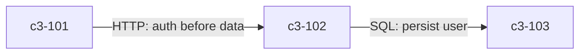

# Diagram-First Templates Design

## Problem

Current C3 templates are table-heavy and verbose:
- **Linkages** - relationships are better shown as graphs
- **Testing** - scenario lists don't communicate strategy
- **Comments** - multi-line `<!-- AI: ... -->` hints waste tokens
- **Selection** - no guidance on which template to use when

## Design Principles

1. **Diagrams for relationships** - flowcharts beat tables for showing connections
2. **Strategy over scenarios** - testing guidance beats exhaustive lists
3. **Single-line hints** - compact `<!-- hint -->` format
4. **Type selectors** - each template states when to use it
5. **Progressive complexity** - simple components get minimal docs

## Solution

### Linkages: Annotated Flowcharts

Replace linkage tables with mermaid diagrams. Reasoning becomes edge labels.

**Before:**
```markdown
| From | To | Protocol | Reasoning |
|------|-----|----------|-----------|
| c3-101 | c3-102 | HTTP | Auth before data access |
| c3-102 | c3-103 | SQL | Persist validated user |
```

**After:**
```markdown
## Linkages


```

**Benefit:** ~40% token reduction. Visual clarity. Reasoning inline.

### Testing: Strategy Over Scenarios

Replace scenario tables with strategic guidance.

**Before:**
```markdown
| Scenario | Verifies |
|----------|----------|
| Valid user input | Creates session |
| Invalid credentials | Returns 401 |
| Missing token | Returns 403 |
```

**After:**
```markdown
## Testing Strategy

**Unit scope:** Input validation and transformation logic.

**Boundaries:** Auth service → DB transitions. Mock DB layer.

**Key assertion:** Session token format matches JWT spec.
```

**Benefit:** Guides developers. Doesn't go stale with implementation changes.

### Comments: Single-Line Hints

Replace verbose multi-line comments with compact single-line format.

**Before:**
```markdown
<!-- AI: 2-3 sentences on what this system does and why it exists -->
```

**After:**
```markdown
<!-- system purpose -->
```

### Type Selectors

Add selection hint at top of each template to guide usage.

**Example:**
```markdown
<!-- USE: Core infrastructure (databases, auth, messaging) -->
```

### ADR: Decision Drivers

Add decision drivers section to capture forces behind decisions.

**Addition:**
```markdown
## Decision Drivers
<!-- forces that led to this decision -->
```

## Template Changes

### context.md

| Section | Current | Proposed |
|---------|---------|----------|
| Actors | Table | Keep (truly tabular) |
| Containers | Table | Keep (registry) |
| External Systems | Table | Keep (registry) |
| Linkages | Table | **Flowchart** |
| E2E Testing | Table | **Strategy prose** |

### container.md

| Section | Current | Proposed |
|---------|---------|----------|
| Components (3 tables) | Tables | Keep (registries) |
| Fulfillment | Table | Keep (contract mapping) |
| Linkages | Table | **Flowchart** |
| Integration Tests | Table | **Strategy prose** |
| Mocking | Table | **Strategy prose** |
| Fixtures | Table | **Strategy prose** |

### component-foundation.md

| Section | Current | Proposed |
|---------|---------|----------|
| Contract | Table | **Provides/Expects prose** |
| Edge Cases | Table | **Bullet list** |
| Testing | Table | **Strategy prose** |

### component-feature.md

| Section | Current | Proposed |
|---------|---------|----------|
| Uses | Table | **Dependency diagram** |
| Behavior | Table | **Sequence diagram** |
| Testing | Table | **Strategy prose** |

### component-auxiliary.md

| Section | Current | Proposed |
|---------|---------|----------|
| Conventions | Table | Keep (rules are tabular) |
| Testing | Table | **Strategy prose** |

### adr-000.md

| Section | Current | Proposed |
|---------|---------|----------|
| Problem | Table | Keep (impact mapping) |
| Decision Drivers | (new) | **Add section** |
| Structure Created | Table | Keep (registry) |
| Rationale | Table | Keep (comparison) |
| Adoption Progress | Table | Keep (status tracking) |
| Audit Record | Table | Keep (changelog) |

## Implementation

1. Update template files in `/templates/`
2. Update diagram-patterns.md with linkage diagram patterns
3. Update references if needed

## Validation

- Templates render correctly in GitHub/GitLab
- Diagrams follow existing mermaid conventions
- Strategy sections provide actionable guidance
