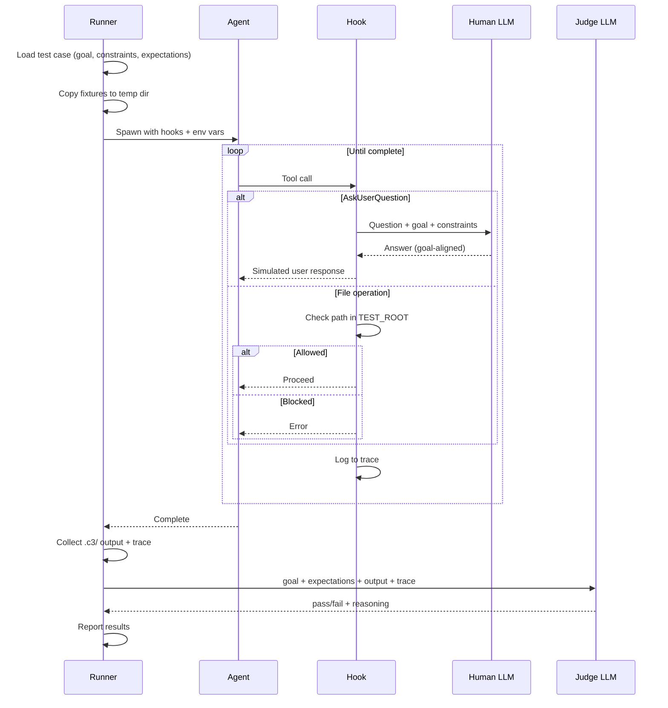

# Eval Flow Design

Simple evaluation framework for testing C3 skills with goal-oriented LLM actors.

## Flow Diagram

[View interactive diagram](https://diashort.apps.quickable.co/d/ac69f62c)



## Architecture

```
┌─────────────────────────────────────────────────────────────┐
│                       Test Runner                            │
│  1. Load test case (goal, constraints, expectations)        │
│  2. Copy fixtures to temp dir                               │
│  3. Spawn Agent with hooks                                  │
│  4. Hooks intercept AskUserQuestion → call Human LLM        │
│  5. Hooks capture trace (all tool calls)                    │
│  6. On completion, call Judge LLM with output + trace       │
│  7. Report pass/fail + reasoning                            │
└─────────────────────────────────────────────────────────────┘
         │
         ├── Agent (Claude running skill)
         │     └── Isolated to temp dir via hooks
         │
         ├── Human LLM (separate Claude call)
         │     └── Answers questions aligned to goal
         │
         └── Judge LLM (separate Claude call)
               └── Evaluates output against goal
```

## Goal-Oriented Design

All actors derive behavior from the **goal**, not scripted steps:

| Actor | Receives | Does |
|-------|----------|------|
| Human | Goal + Constraints + Question | Answers to advance toward goal |
| Agent | Command | Executes skill, produces output |
| Judge | Goal + Expectations + Output + Trace | Evaluates if output serves goal |

## Test Case Format

```yaml
name: "onboard simple express app"

# Fixtures copied to temp dir before test
fixtures: "fixtures/simple-express-app"

# Command to run
command: "/onboard"

# What we're trying to achieve
goal: |
  Document a simple Express.js REST API called "Simple Shop API"
  so future developers understand its architecture.

# Boundaries for the human answerer
constraints:
  - Single container (the API itself)
  - Auth middleware is foundation, users/products are features
  - Must complete full onboarding (not partial)

# What the judge evaluates
expectations:
  - C3 docs accurately describe the system's purpose
  - Components correctly categorized (foundation vs feature)
  - ADR-000 captures discovery reasoning
```

## Components

### 1. Trace Hook (`eval/hooks/trace-hook.ts`)

Command-based hook that:
- **Sandbox**: Blocks Read/Glob/Grep outside `$TEST_ROOT`
- **Human intercept**: On AskUserQuestion, calls Human LLM
- **Trace**: Logs all tool calls to `$TRACE_FILE`

Environment variables:
- `TEST_ROOT` - Allowed directory for file operations
- `TRACE_FILE` - JSON lines file for tool call logs
- `GOAL` - Goal text for Human LLM
- `CONSTRAINTS` - Constraints for Human LLM

### 2. Human LLM

System prompt:
```
You are a developer who built this project.

Goal: {goal}
Constraints: {constraints}

Claude is onboarding your project and asking questions.
Answer to help achieve the goal. Pick the option that best aligns.
Be concise - just the answer, no explanation.
```

User message:
```
Question: {question}
Options: {options as numbered list}

Reply with just the option number or a short answer.
```

### 3. Judge LLM

System prompt:
```
You evaluate if an AI agent's output serves a stated goal.

Be strict but fair. Focus on whether the output achieves the intent,
not whether it matches exact wording.
```

User message:
```
## Goal
{goal}

## Constraints
{constraints}

## Expectations
{expectations as numbered list}

## Output Produced
{.c3/ directory contents}

## Trace (tool calls made)
{trace summary}

---

Evaluate each expectation. Return JSON:
{
  "pass": boolean,
  "score": number (0-100),
  "expectations": [
    { "text": "...", "pass": boolean, "reasoning": "..." }
  ],
  "summary": "Overall assessment"
}
```

### 4. Test Runner (`eval/run.ts`)

```typescript
interface TestCase {
  name: string;
  fixtures: string;
  command: string;
  goal: string;
  constraints: string[];
  expectations: string[];
}

interface TestResult {
  name: string;
  pass: boolean;
  score: number;
  duration: number;
  trace: ToolCall[];
  judgment: JudgeResponse;
}

async function runTest(casePath: string): Promise<TestResult> {
  const testCase = loadYaml(casePath);

  // 1. Setup temp dir with fixtures
  const tempDir = await setupFixtures(testCase.fixtures);

  // 2. Setup env for hooks
  const traceFile = path.join(tempDir, '.trace.jsonl');
  const env = {
    TEST_ROOT: tempDir,
    TRACE_FILE: traceFile,
    GOAL: testCase.goal,
    CONSTRAINTS: JSON.stringify(testCase.constraints),
  };

  // 3. Run agent with hooks
  const start = Date.now();
  await runAgent(testCase.command, tempDir, env);
  const duration = Date.now() - start;

  // 4. Collect output and trace
  const output = await collectOutput(tempDir);
  const trace = await loadTrace(traceFile);

  // 5. Call judge
  const judgment = await callJudge(testCase, output, trace);

  // 6. Cleanup
  await cleanup(tempDir);

  return {
    name: testCase.name,
    pass: judgment.pass,
    score: judgment.score,
    duration,
    trace,
    judgment,
  };
}
```

## Directory Structure

```
eval/
├── run.ts                          # Test runner CLI
├── plugin.json                     # Plugin manifest
├── lib/
│   ├── types.ts                    # Shared TypeScript types
│   ├── judge.ts                    # Judge LLM caller
│   └── trace.ts                    # Trace parsing utilities
├── hooks/
│   ├── hooks.json                  # Hook configuration
│   └── trace-hook.ts               # Bun hook (sandbox + human + trace)
├── cases/
│   └── onboard-simple.yaml         # First test case
├── fixtures/
│   └── simple-express-app/         # Minimal Express project
│       ├── package.json
│       └── src/
│           ├── index.ts
│           ├── middleware/
│           │   └── auth.ts
│           └── routes/
│               ├── users.ts
│               └── products.ts
└── results/                        # Test outputs (auto-created)
    └── {timestamp}/
        ├── summary.json
        └── {test-name}.json
```

## Isolation Model

Each test runs in complete isolation:
- Fresh temp directory with copied fixtures
- Agent can only access files within temp dir (hook enforces)
- Human/Judge are separate API calls (no shared context with Agent)
- Trace captures everything for debugging

## Usage

```bash
# Run single test
bun eval/run.ts cases/onboard-simple.yaml

# Run all tests
bun eval/run.ts cases/

# Run with verbose output
bun eval/run.ts cases/onboard-simple.yaml --verbose
```

## Future Extensions

- Parallel test execution
- Retry logic for flaky tests
- Cost tracking (API calls per test)
- Comparison mode (before/after skill changes)
- CI integration
