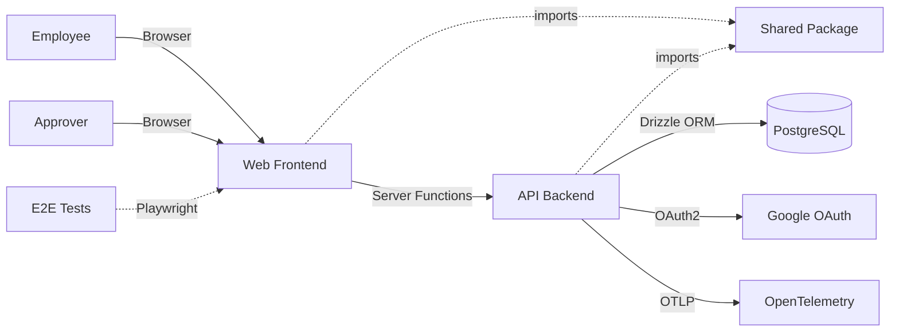

# Acountee

Acountee is an internal finance management system that streamlines invoice processing, payment request workflows, and multi-step approval chains. It enables employees to create payment requests linked to invoices, which then flow through configurable approval workflows before completion.

## Overview

## Actors

| ID | Actor | Type | Interacts With | Purpose |
|----|-------|------|----------------|---------|
| A1 | Employee | user | c3-1 | Creates payment requests, uploads invoices, tracks status |
| A2 | Approver | user | c3-1 | Reviews and approves/rejects payment requests |

## Containers

### Application Containers

| ID | Name | Type | Status | Purpose |
|----|------|------|--------|---------|
| c3-1 | Web Frontend | app | active | React UI for invoice management, PR creation, approval workflows |
| c3-2 | API Backend | service | active | Server-side logic, database operations, authentication, business flows |
| c3-3 | E2E Tests | test-suite | active | Playwright tests verifying critical user journeys |
| c3-7 | Shared Package | library | active | Shared types, schemas, and utilities used across containers |

### External Containers

| ID | Name | Type | Status | Purpose |
|----|------|------|--------|---------|
| c3-4 | PostgreSQL | database | active | Primary data store for invoices, PRs, approvals, users, audit logs |
| c3-5 | Google OAuth | api | active | Authentication provider - employees sign in with Google accounts |
| c3-6 | OpenTelemetry | api | active | Distributed tracing and observability |

## Linkages

| From | To | Protocol | Reasoning |
|------|-----|----------|-----------|
| A1, A2 | c3-1 | HTTPS | Employees and approvers access the system via web browser |
| c3-1 | c3-2 | TanStack Server Functions | Frontend calls server functions for all data operations |
| c3-1, c3-2 | c3-7 | import | Shared types ensure consistency across frontend/backend |
| c3-2 | c3-4 | PostgreSQL (Drizzle) | All business data persisted to PostgreSQL via Drizzle ORM |
| c3-2 | c3-5 | OAuth2 | User authentication delegated to Google for identity verification |
| c3-2 | c3-6 | OTLP HTTP | Traces exported for observability and debugging |
| c3-3 | c3-1 | HTTP (Playwright) | E2E tests simulate user interactions against the full application |

## E2E Testing

> Tests container <-> container linkages. Critical user flows that cross boundaries.

| Flow | Containers Involved | Verifies |
|------|---------------------|----------|
| Login Flow | c3-1, c3-2, c3-5 | User can authenticate via Google OAuth |
| Invoice Upload | c3-1, c3-2, c3-4 | Invoices are parsed, stored, and displayed correctly |
| Payment Request Creation | c3-1, c3-2, c3-4 | PRs created with linked invoices, correct amounts |
| Approval Workflow | c3-1, c3-2, c3-4 | Multi-step approvals progress correctly through anyof/allof modes |
| Payment Completion | c3-1, c3-2, c3-4 | Approved PRs can be marked complete |
