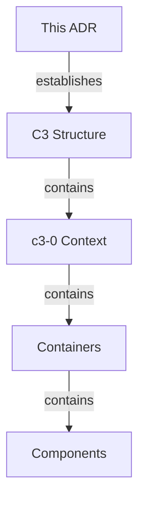

# C3 Architecture Documentation Adoption

## Overview

## Status

**Implemented** - 2026-01-05

## Problem

| Situation | Impact |
|-----------|--------|
| No architecture docs | Onboarding takes time |
| Knowledge in heads | Bus factor risk |
| Ad-hoc decisions | Inconsistent patterns |

## Decision

Adopt C3 (Context-Container-Component) methodology for architecture documentation.

## Structure Created

### Application Containers

| Level | ID | Name | Purpose |
|-------|-----|------|---------|
| Context | c3-0 | Acountee | System overview - internal finance tool |
| Container | c3-1 | Web Frontend | React SPA for invoice/PR/approval UI |
| Container | c3-2 | API Backend | Server-side logic, database, auth, sync |
| Container | c3-3 | E2E Tests | Playwright test suite |
| Container | c3-7 | Shared Package | Shared types, schemas, utilities |

### External Containers

| Level | ID | Name | Purpose |
|-------|-----|------|---------|
| Container | c3-4 | PostgreSQL | Primary relational database |
| Container | c3-5 | Google OAuth | Authentication provider |
| Container | c3-6 | OpenTelemetry | Distributed tracing |

## Rationale

| Consideration | C3 Approach |
|---------------|-------------|
| Layered abstraction | Context -> Container -> Component |
| Change isolation | Strategic vs tactical separation |
| Growth-ready | Structure exists before content |
| Decision tracking | ADRs capture evolution |

## Consequences

### Positive

- Architecture visible and navigable
- Onboarding accelerated
- Decisions documented with reasoning
- External dependencies clearly documented

### Negative

- Maintenance overhead (docs can drift)
- Initial time investment

## Verification

- [x] `.c3/README.md` exists (c3-0)
- [x] All containers have `README.md`
- [x] Diagrams use consistent IDs
- [x] Linkages have reasoning
- [x] Component docs created
- [x] External systems documented as containers

## Adoption Progress

| Level | Category | Status | Documented | Remaining |
|-------|----------|--------|------------|-----------|
| Context | - | Complete | 1 | 0 |
| Containers | Application | Complete | 4 | 0 |
| Containers | External | Complete | 3 | 0 |
| Components | Auxiliary | Complete | 6 | 0 |
| Components | Foundation | Complete | 9 | 0 |
| Components | Feature | Complete | 4 | 0 |

### Component Documentation Created

#### c3-1 Web Frontend
| ID | Name | Category |
|----|------|----------|
| c3-101 | Router | Foundation |
| c3-102 | AuthLayout | Foundation |
| c3-103 | State Atoms | Foundation |
| c3-104 | UI Variants | Foundation |
| c3-111 | Form Patterns | Auxiliary |
| c3-112 | Data Sync | Auxiliary |
| c3-113 | Error Handling | Auxiliary |
| c3-121 | Invoice Screen | Feature |
| c3-122 | Payment Requests Screen | Feature |

#### c3-2 API Backend
| ID | Name | Category |
|----|------|----------|
| c3-201 | Entry Point | Foundation |
| c3-202 | Scope & DI | Foundation |
| c3-203 | Database Layer | Foundation |
| c3-204 | Logger | Foundation |
| c3-205 | Middleware | Foundation |
| c3-211 | Flow Patterns | Auxiliary |
| c3-212 | Query Patterns | Auxiliary |
| c3-213 | Real-time Sync | Auxiliary |
| c3-221 | PR Flows | Feature |
| c3-224 | Auth Flows | Feature |

### Actors Documented

| ID | Actor | Type |
|----|-------|------|
| A1 | Employee | user |
| A2 | Approver | user |

## Audit Record

| Phase | Date | Notes |
|-------|------|-------|
| Adopted | 2026-01-05 | Initial C3 structure created |
| Containers | 2026-01-05 | Context, 3 app containers documented with component inventories |
| Components | 2026-01-05 | 19 component docs created (Auxiliary, Foundation, Feature) |
| Externals | 2026-01-05 | PostgreSQL, Google OAuth, OpenTelemetry as separate containers |
| Shared | 2026-01-05 | Shared package documented as library container |
