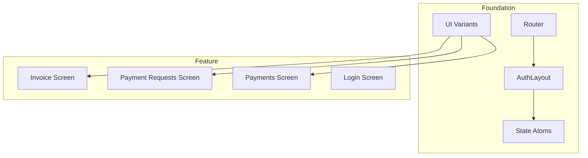

# Web Frontend

The Web Frontend is a React single-page application built with TanStack Router and TanStack Start. It provides the user interface for employees to manage invoices, create payment requests, and process approvals. State management is handled via @pumped-fn/react-lite atoms with SSR-prefetched data.

## Overview

## Components

| ID | Name | Category | Status | Responsibility |
|----|------|----------|--------|----------------|
| c3-101 | Router | foundation | active | TanStack Router configuration, route tree, scroll restoration |
| c3-102 | AuthLayout | foundation | active | Authenticated layout wrapper, sidebar navigation, theme toggle, user menu |
| c3-103 | State Atoms | foundation | active | @pumped-fn/lite atoms for user, invoices, PRs, payments, approval flow state |
| c3-104 | UI Variants | foundation | active | tailwind-variants definitions for modal, alert, button, input, table styling |
| c3-121 | Invoice Screen | feature | active | Invoice list with filtering, invoice detail drawer, status management |
| c3-122 | Payment Requests Screen | feature | active | PR list, PR creation/editing, approval workflow UI, filter panel |
| c3-123 | Payments Screen | feature | active | Payment tracking, completion status |
| c3-124 | Login Screen | feature | active | Google OAuth login flow, redirect handling |
| c3-131 | Information Architecture | documentation | active | Screen inventory with regions at medium abstraction level |
| c3-132 | User Flows | documentation | active | Exhaustive flow documentation with preconditions and dependencies |
| c3-133 | UI Patterns | documentation | active | Catalog of UI design patterns with implementation references |

## Refs

This container uses the following refs (see `.c3/refs/`):

| Ref | Usage |
|-----|-------|
| ref-form-patterns | Form validation and submission conventions |
| ref-data-sync | Real-time WebSocket synchronization |
| ref-error-handling | Error boundary and display patterns |
| ref-design-system | DaisyUI theme and tailwind-variants styling |
| ref-visual-specs | Typography scale, spacing tokens, wireframes |

## Fulfillment

| Link (from c3-0) | Fulfilled By | Constraints |
|------------------|--------------|-------------|
| A1 (Employee) -> c3-1 | c3-121, c3-122, c3-123 | Must be authenticated via c3-102 |
| A2 (Approver) -> c3-1 | c3-122 | PRs filtered by user role/team via c3-103 |
| c3-1 -> c3-2 | TanStack Server Functions | All data operations via createServerFn |

## Linkages

| From | To | Reasoning |
|------|-----|-----------|
| c3-101 | c3-102 | Router mounts AuthLayout for /_authed/* routes |
| c3-102 | c3-103 | AuthLayout initializes state atoms with SSR-prefetched data via ScopeProvider |
| c3-103 | c3-121, c3-122, c3-123 | State atoms provide data to feature screens |
| c3-104 | c3-121, c3-122, c3-123 | UI variants used for consistent styling across screens |

## Testing

> Tests component <-> component linkages within this container.

### Integration Tests

| Scenario | Components Involved | Verifies |
|----------|---------------------|----------|
| Auth redirect | c3-101, c3-102, c3-124 | Unauthenticated users redirect to login |
| Data loading | c3-102, c3-103 | SSR data populates state atoms correctly |
| Real-time sync | c3-103, c3-121, c3-122 | WebSocket messages update UI state |
| Form submission | c3-122 | PR forms validate and submit correctly |

### Mocking

| Dependency | How to Mock | When |
|------------|-------------|------|
| Server Functions | createServerFn mock | Unit testing feature screens |
| WebSocket | Mock WS server | Testing data sync behavior |
| Router | MemoryHistory | Component isolation tests |

### Fixtures

| Entity | Factory/Source | Notes |
|--------|----------------|-------|
| User | test/fixtures/user.ts | Includes permissions array |
| Invoice | test/fixtures/invoice.ts | ListInvoiceRow format |
| Payment Request | test/fixtures/pr.ts | ListPrRow format with approval state |
