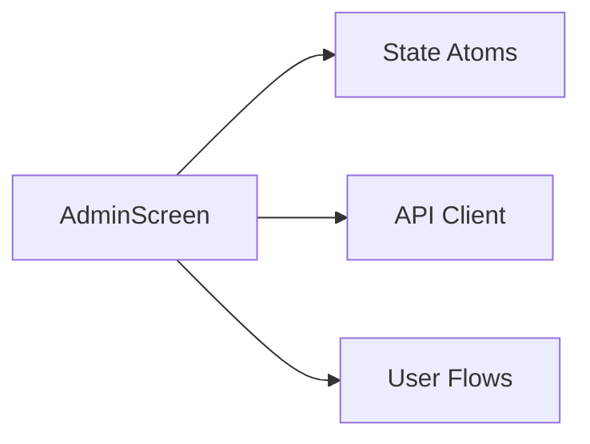

# Admin Screen

Single-page user administration interface accessible only to users with owner role. Provides user management operations through a table-based UI.

## Dependencies

## Route

| Path | Component | SSR |
|------|-----------|-----|
| `/_authed/admin` | AdminScreen | data-only |

## Features

| Feature | Description |
|---------|-------------|
| User List | Table showing email, team, status, and roles for all users |
| Create User | Form to add new user by email address |
| Delete User | Remove user (blocked if last owner) |
| Transfer Ownership | Assign owner role to any user |

## Access Control

- Route requires authentication via `_authed` layout
- API returns `NOT_OWNER` failure for non-owners
- UI displays 403 Access Denied page when backend rejects

## State Management

Uses TanStack Query for server state:
- Query key: `['admin', 'users']`
- Mutations invalidate query on success

## UI Components

- Loading spinner during data fetch
- Error alert for load failures
- 403 page for unauthorized access
- DaisyUI table with zebra striping
- Badge indicators for status and roles

## References

- Admin screen - apps/start/src/screens/AdminScreen.tsx
- Admin route - apps/start/src/routes/_authed/admin.tsx
- Admin functions - apps/start/src/server/functions/admin.ts
