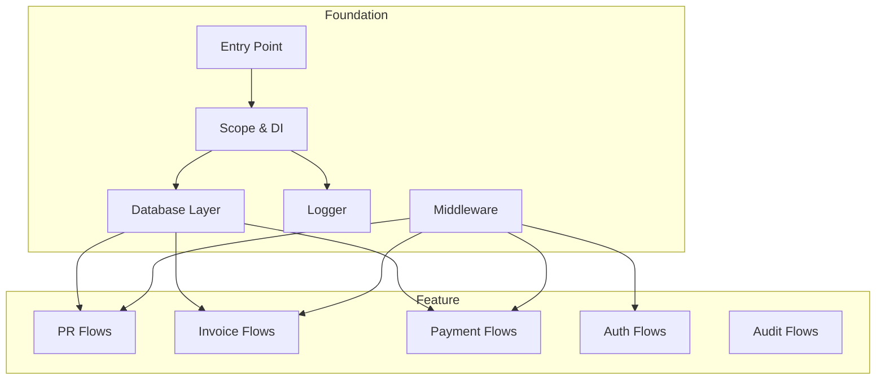

# API Backend

The API Backend handles all server-side operations including database queries, business flow execution, authentication, and real-time data synchronization. Built with @pumped-fn/lite for dependency injection, it uses flows for business logic orchestration, services for domain operations, and queries for database access. Server functions are exposed to the frontend via TanStack Start's createServerFn.

## Overview

## Components

| ID | Name | Category | Status | Responsibility |
|----|------|----------|--------|----------------|
| c3-201 | Entry Point | foundation | active | Server bootstrap, scope creation, signal handling, graceful shutdown |
| c3-202 | Scope & DI | foundation | active | @pumped-fn/lite scope management, dependency injection, context tags |
| c3-203 | Database Layer | foundation | active | Drizzle ORM setup, PostgreSQL connection, schema definitions, transactions |
| c3-204 | Logger | foundation | active | Pino logger configuration, structured logging, request correlation |
| c3-205 | Middleware | foundation | active | TanStack middleware for execution context, user authentication from cookies |
| c3-221 | PR Flows | feature | active | Payment request CRUD, approval/unapproval, status transitions, invoice linking |
| c3-222 | Invoice Flows | feature | active | Invoice listing, parsing, status updates, file attachment handling |
| c3-223 | Payment Flows | feature | active | Payment method management, completion tracking |
| c3-224 | Auth Flows | feature | active | Google OAuth flow, test token auth, session cookie management |
| c3-225 | Audit Flows | feature | active | Audit log queries, security event tracking |

## Refs

This container uses the following refs (see `.c3/refs/`):

| Ref | Usage |
|-----|-------|
| ref-flow-patterns | @pumped-fn/lite flow definitions with Zod parsing |
| ref-query-patterns | Database queries wrapped in service atoms |
| ref-realtime-sync | WebSocket sync for broadcasting changes |

## Fulfillment

| Link (from c3-0) | Fulfilled By | Constraints |
|------------------|--------------|-------------|
| c3-1 -> c3-2 (Server Functions) | c3-205, c3-221, c3-222, c3-223 | All via createServerFn with middleware |
| c3-2 -> E1 (PostgreSQL) | c3-203 | Transactions for multi-step operations |
| c3-2 -> E2 (Google OAuth) | c3-224 | OAuth2 token exchange |
| c3-2 -> E3 (OpenTelemetry) | c3-201, c3-204 | OTLP export configured at startup |

## Linkages

| From | To | Reasoning |
|------|-----|-----------|
| c3-201 | c3-202 | Entry creates root scope with extensions and tags |
| c3-202 | c3-203 | Scope resolves database connection atom |
| c3-205 | c3-221, c3-222, c3-223, c3-224 | Middleware provides execution context to flows |
| c3-203 | c3-221, c3-222, c3-223 | Feature flows execute database queries |

## Testing

> Tests component <-> component linkages within this container.

### Integration Tests

| Scenario | Components Involved | Verifies |
|----------|---------------------|----------|
| PR Creation | c3-205, c3-221, c3-203 | Creates PR with approval steps in transaction |
| Approval Flow | c3-205, c3-221, c3-203 | Step progression, anyof/allof mode logic |
| Auth Cookie | c3-205, c3-224 | User lookup from cookie, permission loading |
| Sync Broadcast | c3-221 | Changes emit to WebSocket clients |

### Mocking

| Dependency | How to Mock | When |
|------------|-------------|------|
| PostgreSQL | test-db.ts with test database | Integration tests |
| Google OAuth | Mock googleapis responses | Auth flow tests |
| WebSocket | Mock sync.emit | Flow unit tests |

### Fixtures

| Entity | Factory/Source | Notes |
|--------|----------------|-------|
| PR | apps/start/test/fixtures/pr.ts | Includes approval flow config |
| Invoice | apps/start/test/fixtures/invoice.ts | With services array |
| User | apps/start/test/fixtures/user.ts | Permissions array |
