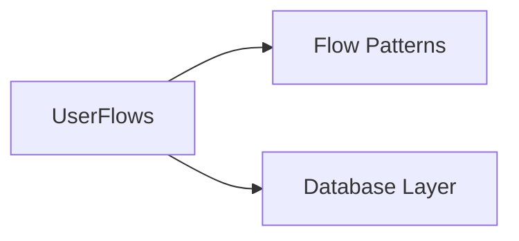

# User Flows

Business logic flows for user lifecycle management. All operations require owner role verification before execution.

## Dependencies



## Flows Inventory

| Flow | Purpose |
|------|---------|
| listUsers | List all users with their roles (owner-only) |
| createUser | Create new user account (owner-only) |
| updateUser | Update user permissions/team/status (owner-only) |
| deleteUser | Remove user, cannot delete last owner (owner-only) |
| transferOwnership | Assign owner role to another user (owner-only) |

## Owner Guard Pattern

Every flow implements the same authorization pattern:

```typescript
const { isOwner } = await ctx.exec({
  fn: rbacQueries.isOwner,
  params: [{ user_email: currentUser.email }]
});
if (!isOwner) {
  return { success: false, reason: "NOT_OWNER" };
}
```

This pattern:
- Checks current user has owner role via RBAC query
- Returns `NOT_OWNER` failure if check fails
- Executes before any business logic

## Last Owner Protection

The `deleteUser` flow includes additional protection:

```typescript
if (targetIsOwner) {
  const { count } = await ctx.exec({ fn: rbacQueries.countOwners, params: [] });
  if (count <= 1) {
    return { success: false, reason: "CANNOT_DELETE_LAST_OWNER" };
  }
}
```

## References

- User flows - apps/start/src/server/flows/user.ts
- RBAC queries - apps/start/src/server/dbs/queries/rbac.ts
- User queries - apps/start/src/server/dbs/queries/users.ts

## Testing

- List: returns all users with enriched role data
- Create: requires owner, creates user with optional team
- Update: owner can modify permissions/team/status
- Delete: cannot delete last owner
- Transfer: assigns owner role to target user
