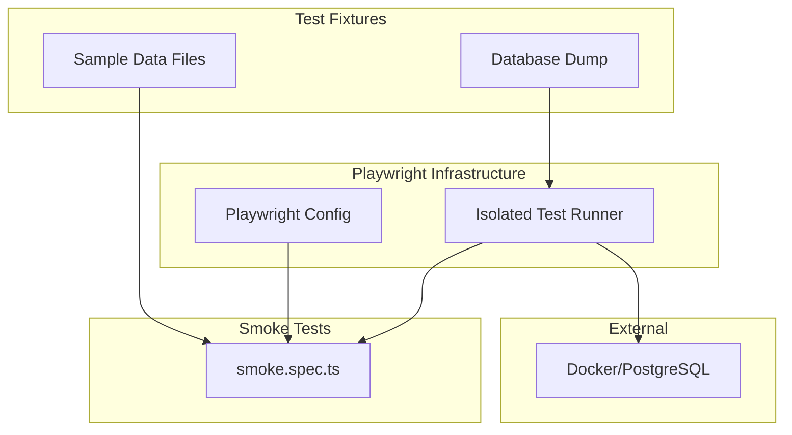

# E2E Tests

The E2E Tests container provides fast, efficient smoke testing using Playwright. Tests run against the full application stack (frontend + backend) to verify critical user journeys in ~1 minute total.

Supports two modes:
- **Isolated Mode**: Fresh PostgreSQL database in Docker - no external dependencies
- **Local Mode**: Uses existing app and database - faster for development

## Overview



## Components

### Foundation
> Infrastructure for running browser-based tests

| ID | Name | Status | Responsibility |
|----|------|--------|----------------|
| c3-301 | Playwright Config | active | Test runner config, browser setup, timeout settings |
| c3-302 | Isolated Test Runner | active | Shell script orchestrating Docker, DB setup, app startup |

### Feature
> The actual test suite

| ID | Name | Status | Responsibility |
|----|------|--------|----------------|
| c3-310 | Smoke Test Suite | active | All 6 critical happy-path tests |

### Auxiliary
> Test data and fixtures

| ID | Name | Status | Responsibility |
|----|------|--------|----------------|
| c3-320 | Test Fixtures | active | Sample invoice XML, attachments, images |
| c3-321 | Database Dump | active | PostgreSQL dump for isolated test environment |

## Test Coverage

| Test | Duration | Verifies |
|------|----------|----------|
| Login & Navigation | ~8s | Auth via test token, all 4 main routes render |
| Invoice Upload | ~8s | XML invoice import, file upload works |
| PR Creation | ~9s | Form submission, PR appears in list |
| Approval Workflow | ~28s | 3-stage approval with user switching |
| Payment Method Creation | ~8s | CRUD operations |
| Invoice-PR Linking UI | ~5s | Linking/unlinking UI components |

**Total runtime: ~1 minute**

## Fulfillment

| Link (from c3-0) | Fulfilled By | Constraints |
|------------------|--------------|-------------|
| c3-3 -> c3-1 (Playwright) | c3-310 Smoke Tests | Requires app on localhost:3001 |
| Test authentication | Test token | ENABLE_TEST_TOKEN=true, TEST_TOKEN=1234 |
| Isolated environment | c3-302 Runner + Docker | Requires Docker for PostgreSQL container |

## Linkages

| From | To | Reasoning |
|------|-----|-----------|
| c3-301 | c3-310 | Config provides test runner settings |
| c3-302 | c3-310 | Isolated runner orchestrates full environment before tests |
| c3-302 | c3-321 | Runner loads database dump into container |
| c3-320 | c3-310 | Fixtures provide test data (invoice XML, etc.) |
| c3-321 | c3-302 | Database dump provides initial state for isolated tests |

## Running Tests

### Isolated Mode (Recommended)

Runs with fresh PostgreSQL in Docker - no external dependencies:

```bash
cd apps/e2e && bun run test:isolated
```

This script:
1. Cleans up any existing processes on test ports
2. Starts PostgreSQL container with dynamic port allocation
3. Loads test database dump
4. Starts the app with test environment
5. Runs Playwright tests
6. Cleans up containers on exit

### Local Mode

Uses existing app and database (faster for development):

```bash
# Terminal 1: Start the app (dev mode with test tokens)
cd apps/start && bun run dev

# Terminal 2: Run tests against running app
cd apps/e2e && bun run test
```

### Debug Modes

```bash
# With visible browser
cd apps/e2e && bun run test:headed

# With UI mode for time-travel debugging
cd apps/e2e && bun run test:ui

# Step through with Playwright Inspector
cd apps/e2e && bun run test:debug
```

## Test Users

| Email | Role | Used For |
|-------|------|----------|
| `khoa.dang@silentium.io` | Accountant | PR creation, supervisor approval |
| `loan@silentium.io` | Manager | Stage 1 approval |
| `duke@silentium.io` | CEO | Final approval |

## Environment Variables

| Variable | Default | Description |
|----------|---------|-------------|
| `BASE_URL` | `http://localhost:3001` | App URL to test against |
| `TEST_TOKEN` | `1234` | Test authentication token |
| `PLAYWRIGHT_SKIP_VALIDATE_HOST_REQUIREMENTS` | `1` | Skip host validation (WSL2/Nix) |
| `SKIP_TESTCONTAINERS` | - | Set to skip testcontainers setup (local mode) |
| `PGURI` | - | PostgreSQL connection string (set by isolated runner) |
| `ENABLE_TEST_TOKEN` | - | Enable test token authentication in app |

## Testing

> This container IS the test suite.

### Integration Tests

| Scenario | Components Involved | Verifies |
|----------|---------------------|----------|
| Full Approval Flow | c3-310 | 3-stage approval with user switches completes |
| Data Workflow | c3-310 | PR creation, invoice linking |
| File Operations | c3-310, c3-320 | Invoice XML upload |

### Mocking

| Dependency | How to Mock | When |
|------------|-------------|------|
| None | N/A | Smoke tests run against real app |

### Fixtures

| Entity | Factory/Source | Notes |
|--------|----------------|-------|
| Sample Invoice | fixtures/sample-invoice.xml | Valid VN e-invoice format |
| Invalid Invoice | fixtures/invalid-invoice.txt | For error flow tests |
| Test Attachment | fixtures/test-attachment.pdf | PR attachment upload |
| Test Image | fixtures/test-image.png | Image attachment tests |
| Database Dump | fixtures/test-database.sql | PostgreSQL dump for isolated mode |

## Architecture Decision

See ADR: [adr-20260106-dev-browser-e2e](../adr/adr-20260106-dev-browser-e2e.md)

Simplified Playwright tests for:
- Faster execution (~1 minute vs several minutes)
- Simpler architecture (single test file)
- Focus on critical happy paths only
- Isolated mode with Docker for reproducible CI/CD runs

## Requirements

### Local Mode
- Running app instance with test tokens enabled

### Isolated Mode
- Docker (for PostgreSQL container)
- Ports 3000, 3001, 42069 available

## File References

| Component | Path |
|-----------|------|
| Playwright Config | `apps/e2e/playwright.config.ts` |
| Isolated Runner | `apps/e2e/scripts/run-isolated-tests.sh` |
| Smoke Tests | `apps/e2e/tests/smoke.spec.ts` |
| Sample Invoice | `apps/e2e/fixtures/sample-invoice.xml` |
| Database Dump | `apps/e2e/fixtures/test-database.sql` |
| Package Config | `apps/e2e/package.json` |
