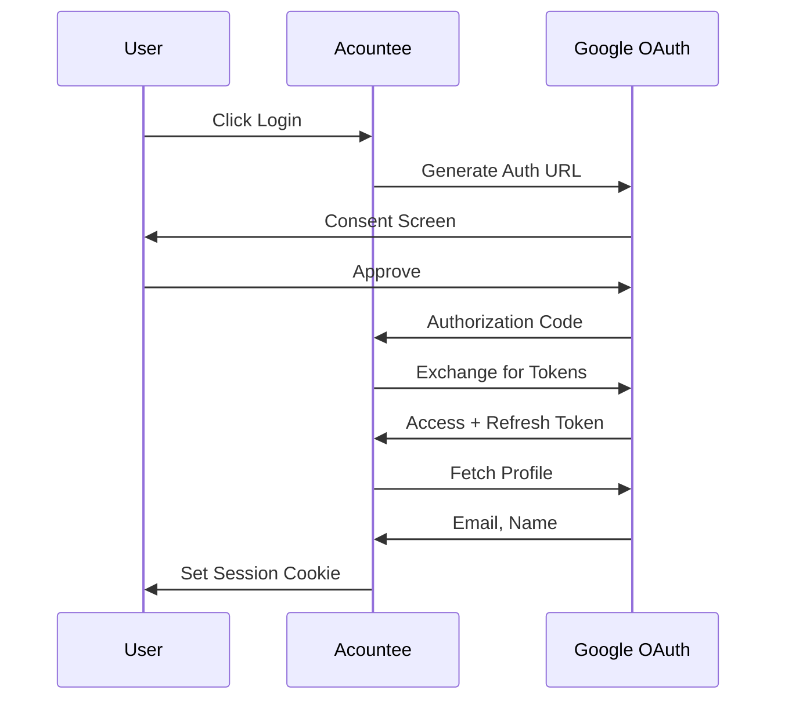

# Google OAuth

Google OAuth provides user authentication via OAuth2 flow. Users sign in with their Google accounts, and the application receives identity information (email, name, avatar).

## Overview

## Configuration

| Variable | Purpose | Required |
|----------|---------|----------|
| GOOGLE_CLIENT_ID | OAuth app identifier | Yes |
| GOOGLE_CLIENT_SECRET | OAuth app secret | Yes |
| BASE_URL | For redirect URI construction | Yes |

## Components

### OAuth Flow
> Steps in the authentication process.

| ID | Name | Status | Responsibility |
|----|------|--------|----------------|
| c3-501 | Auth URL Generation | active | Create URL with scopes, redirect URI |
| c3-502 | Token Exchange | active | Exchange auth code for tokens |
| c3-503 | Profile Fetch | active | Get user email and name from Google API |

## Scopes Requested

| Scope | Purpose |
|-------|---------|
| email | Get user's email address |
| userinfo.profile | Get user's name and avatar |

## Edge Cases

| Scenario | Behavior |
|----------|----------|
| Invalid code | Token exchange fails, return to login |
| User denies consent | Callback with error, return to login |
| Token expired | Requires re-authentication |
| Google API down | Auth fails, show error |

## Testing

| Scenario | Verifies |
|----------|----------|
| URL generation | Includes correct scopes and redirect |
| Token exchange | Handles valid code correctly |
| Profile fetch | Extracts email and name |
| Test token bypass | ENABLE_TEST_TOKEN allows dev auth |
