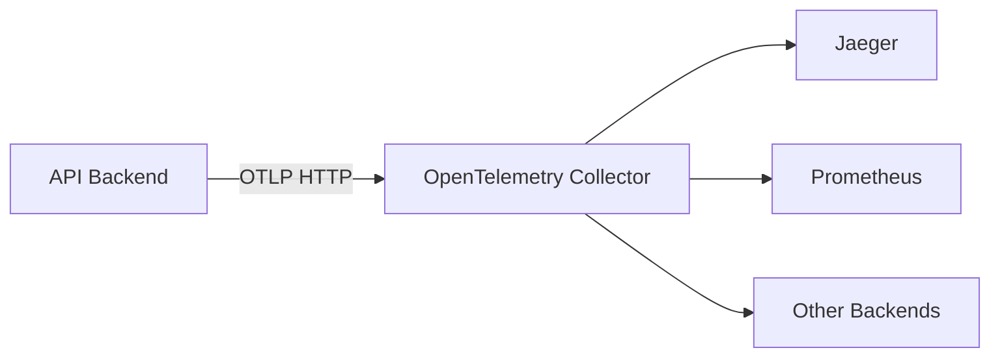

# OpenTelemetry

OpenTelemetry Collector receives traces from the application and forwards them to observability backends. Enables distributed tracing, performance monitoring, and debugging.

## Overview

## Configuration

| Variable | Purpose | Required |
|----------|---------|----------|
| OTEL_ENDPOINT | Collector URL (e.g., http://localhost:4318) | No |
| OTEL_NAME | Service name in traces | No (defaults to acountee-start) |
| OTEL_TYPE | Transport type (http, grpc, console) | No |

## Components

### Tracing
> Trace types and instrumentation.

| ID | Name | Status | Responsibility |
|----|------|--------|----------------|
| c3-601 | HTTP Spans | active | Trace incoming HTTP requests |
| c3-602 | Database Spans | active | Trace SQL query execution |
| c3-603 | Flow Spans | active | Trace business logic execution |

## Trace Structure

| Span Type | Captured Data |
|-----------|---------------|
| HTTP request | Method, URL, status, duration |
| Database query | Query type, table, duration |
| External call | Target service, duration |
| Flow execution | Flow name, input, result |

## Edge Cases

| Scenario | Behavior |
|----------|----------|
| Collector unavailable | Traces dropped, app continues |
| No OTEL_ENDPOINT set | Tracing disabled |
| High trace volume | Sampling may apply |
| Network issues | Async export, no blocking |

## Testing

| Scenario | Verifies |
|----------|----------|
| Trace export | Spans sent to collector |
| Service name | Correct name in traces |
| Disabled mode | No errors when endpoint not set |
| Console mode | Traces logged to stdout |
