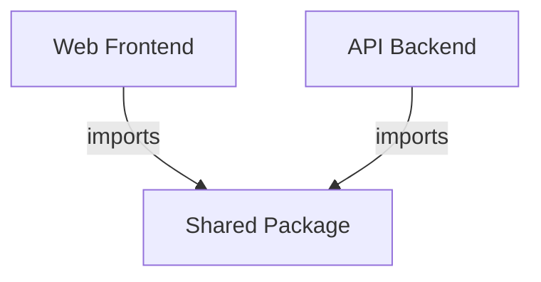

# Shared Package

The shared package (`packages/shared`) provides common types, Zod schemas, and utility functions that are used by both the frontend and backend. Ensures type consistency across the application boundary.

## Overview

## Components

### Types & Schemas
> Shared type definitions and validation schemas.

| ID | Name | Status | Responsibility |
|----|------|--------|----------------|
| c3-701 | Approval Schemas | active | ApprovalStep, ApprovalFlow Zod schemas |
| c3-702 | Approval Types | active | TypeScript types derived from schemas |
| c3-703 | Parse Helpers | active | parseApprovalFlow, parseApprovers |
| c3-704 | Conversion Helpers | active | stepsToApprovalFlow, recordsToApprovers |

## Fulfillment

| Link (from c3-0) | Fulfilled By | Constraints |
|------------------|--------------|-------------|
| Type sharing | c3-701, c3-702 | Used by c3-1 and c3-2 |
| API validation | c3-703 | Validates approval flow input |
| Format conversion | c3-704 | Converts between relational and JSONB formats |

## Linkages

| From | To | Reasoning |
|------|-----|-----------|
| c3-1 (Web Frontend) | c3-701 | Validate form input for approval flows |
| c3-2 (API Backend) | c3-704 | Convert database rows to API format |
| ref-flow-patterns | c3-701 | Schemas used in flow input parsing |

## Testing

| Scenario | Verifies |
|----------|----------|
| Schema validation | Valid approval flows pass, invalid fail |
| Type inference | TypeScript types match schema |
| Conversion accuracy | Relational <-> JSONB round-trips correctly |
| Array parsing | PostgreSQL array_agg format parsed correctly |
