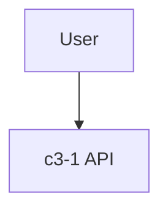

# StaleApp

Application with outdated documentation for testing degradation detection.

## Actors

- **User**: End user

## Containers

## Container Index

| ID | Name | Purpose |
|----|------|---------|
| c3-1 | API | API service |
