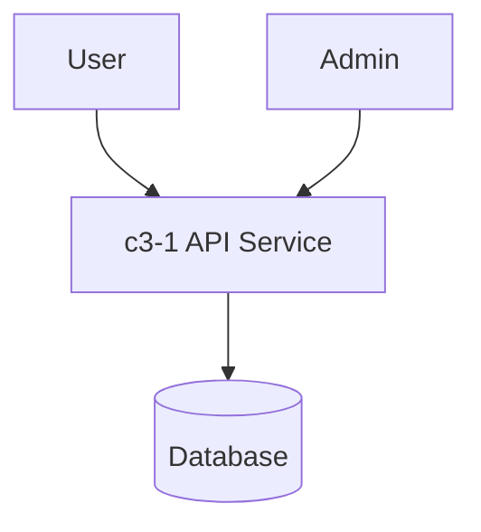

# TestApp

A simple test application with API and database components.

## Actors

- **User**: End user accessing the application
- **Admin**: Administrator managing the system

## Containers

## External Systems

- **Database**: PostgreSQL database for persistence

## Container Index

| ID | Name | Purpose |
|----|------|---------|
| c3-1 | API Service | REST API handling user requests |
