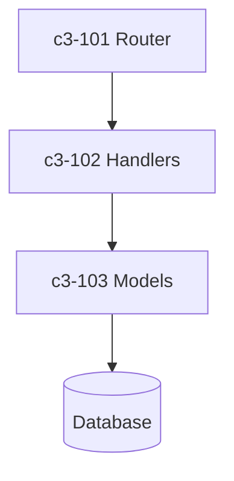

# API Service

REST API service handling all user requests.

## Complexity Assessment

**Level:** simple
**Why:** Single purpose API with basic CRUD operations, no complex state management.

## Technology Stack

- Runtime: Node.js
- Framework: Express
- Database: PostgreSQL via pg driver

## Components

## Component Index

| ID | Name | Category | Purpose |
|----|------|----------|---------|
| c3-101 | Router | foundation | Route definitions and middleware |
| c3-102 | Handlers | feature | Request handlers for each endpoint |
| c3-103 | Models | foundation | Database models and queries |
