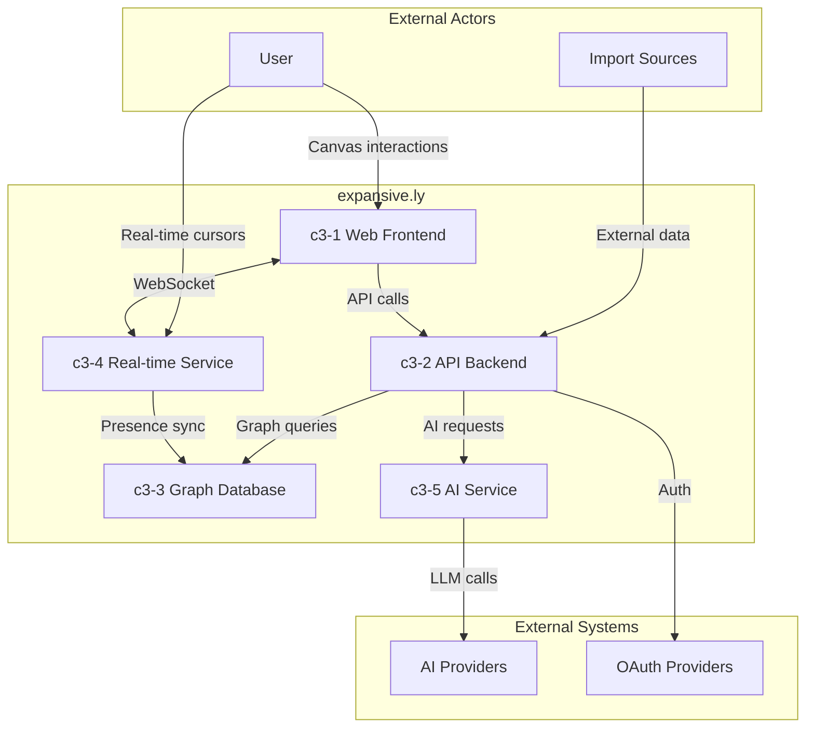
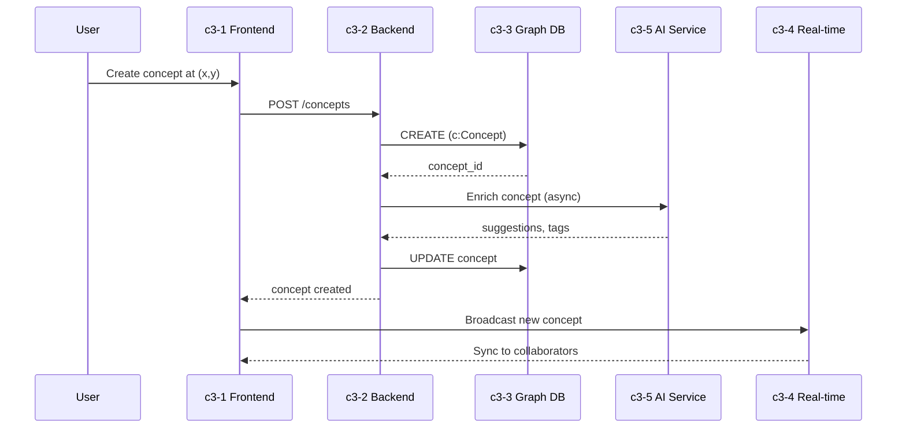
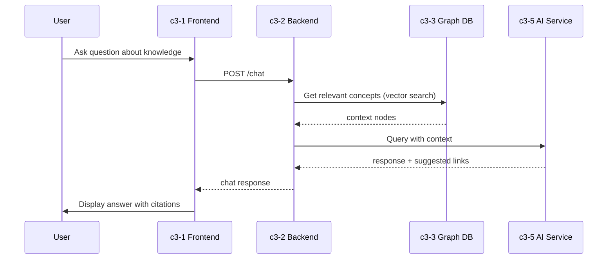

# expansive.ly

## Overview

expansive.ly is a spatial knowledge canvas (Miro/FigJam style) where users position knowledge nodes freely in 2D space. Knowledge units are "Concepts" - abstract ideas that can contain multiple resources. The platform supports progressive disclosure where knowledge can be pre-defined and revealed as suggestions (onboarding), or freely discovered. All interactions are enriched by AI via suggestions and chat.

## Containers

| ID | Name | Purpose |
|----|------|---------|
| c3-1 | Web Frontend | React-based spatial canvas application with TanStack Router |
| c3-2 | API Backend | Bun runtime backend handling business logic and orchestration |
| c3-3 | Graph Database | Neo4j for native concept/relationship storage |
| c3-4 | Real-time Service | Live cursor sync and collaborative editing |
| c3-5 | AI Service | Multi-provider AI integration for suggestions and chat |

## Container Interactions

## External Actors

| Actor | Type | Interaction |
|-------|------|-------------|
| User | Human | Interacts with canvas, creates concepts, asks AI questions |
| Import Sources | System | Notion, Roam, Obsidian, browser bookmarks |

## External Systems

| ID | System | Type | Purpose |
|----|--------|------|---------|
| E1 | AI Providers | service | OpenAI, Anthropic, etc. for LLM capabilities |
| E2 | OAuth Providers | auth | Google, GitHub for user authentication |
| E3 | Redis | cache/pubsub | Real-time Pub/Sub and presence state |

## Linkages

| From | To | Protocol | Purpose |
|------|-----|----------|---------|
| c3-1 | c3-2 | HTTPS/REST | Canvas operations, concept CRUD |
| c3-1 | c3-4 | WebSocket | Live cursor positions, presence |
| c3-2 | c3-3 | Bolt | Graph queries and mutations |
| c3-2 | c3-5 | Internal | AI request orchestration |
| c3-4 | c3-3 | Bolt | Presence state persistence |
| c3-4 | E3 | Redis | Pub/Sub for presence broadcast |
| c3-5 | E1 | HTTPS | LLM API calls |
| c3-2 | E2 | HTTPS/OAuth | Authentication flow |

## Key Data Flows

### Concept Creation Flow

### AI Chat Flow

