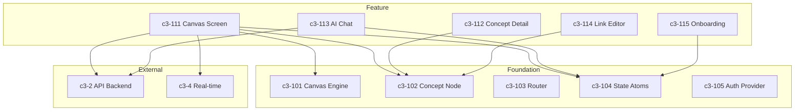

# Web Frontend

## Complexity Assessment

**Level:** complex
**Why:** Spatial canvas with drag-drop interactions, real-time collaboration sync, complex state management for canvas/selection/viewport, and multiple data flows (CRUD, real-time, AI suggestions).

## Technology Stack

| Layer | Technology | Purpose |
|-------|------------|---------|
| Framework | React 18+ | Component-based UI |
| Routing | TanStack Router | Type-safe routing |
| State | Jotai/Zustand | Canvas and application state |
| Canvas | Canvas API / SVG | Spatial rendering |
| Styling | Tailwind CSS | Utility-first styling |
| Real-time | WebSocket | Live collaboration |

## Components

| ID | Name | Category | Responsibility | Status |
|----|------|----------|----------------|--------|
| c3-101 | Canvas Engine | foundation | Spatial rendering, pan/zoom, viewport management | Documented |
| c3-102 | Concept Node | foundation | Visual representation of knowledge concepts | Documented |
| c3-103 | Router Config | foundation | Route definitions and navigation guards | |
| c3-104 | State Atoms | foundation | Global state management for canvas and UI | Documented |
| c3-105 | Auth Provider | foundation | OAuth flow and session management | |
| c3-111 | Canvas Screen | feature | Main canvas workspace view | Documented |
| c3-112 | Concept Detail Panel | feature | Side panel for concept deep-dive | |
| c3-113 | AI Chat Panel | feature | Chat interface with knowledge base | Documented |
| c3-114 | Link Editor | feature | Manual link creation between concepts | |
| c3-115 | Onboarding Flow | feature | Guided discovery and template setup | Documented |

## Internal Structure

## Fulfillment

| Linkage | Component | How |
|---------|-----------|-----|
| c3-1 -> c3-2 | c3-111, c3-113 | REST API calls via fetch/tanstack-query |
| c3-1 <-> c3-4 | c3-104 | WebSocket connection managed in state atoms |
