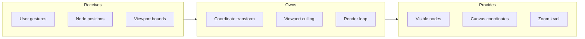
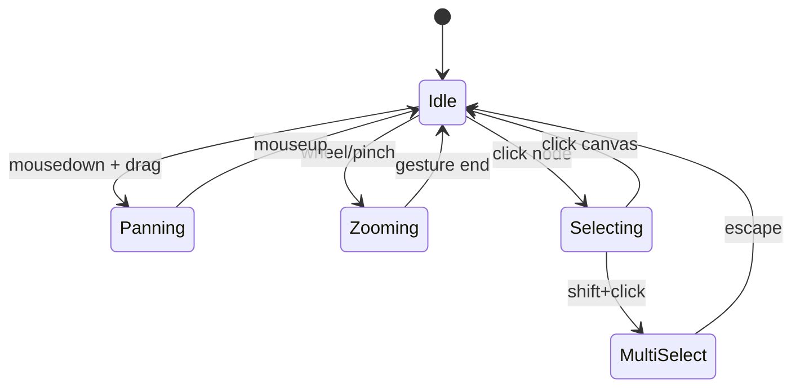

# Canvas Engine

## Goal

Provide a performant 2D canvas that handles thousands of nodes with smooth pan/zoom interactions, coordinate transformations, and viewport culling.

## Contract

From c3-1 (Web Frontend): "Spatial rendering, pan/zoom, viewport management"

## Interface Diagram

## Hand-offs

| Direction | What | To/From |
|-----------|------|---------|
| IN | Pan/zoom gestures | Browser events |
| IN | Node array with positions | c3-104 State Atoms |
| IN | Selection state | c3-104 State Atoms |
| OUT | Viewport bounds | c3-111 Canvas Screen |
| OUT | Screen-to-canvas transform | c3-102 Concept Node |
| OUT | Visible node IDs | c3-111 Canvas Screen (for optimization) |

## Conventions

| Rule | Why |
|------|-----|
| All positions in canvas coordinates | Screen coordinates only at render time |
| Viewport culling at 10% margin | Prevent pop-in during fast pans |
| Minimum zoom 0.1, maximum 4.0 | Usability bounds |
| Debounce zoom events 16ms | 60fps target |

## State Machine

## Edge Cases

| Scenario | Behavior |
|----------|----------|
| Zoom at cursor position | Zoom towards cursor, not center |
| Pan beyond content bounds | Soft stop with elastic bounce-back |
| Pinch zoom on touch | Same behavior as scroll wheel |
| Large node counts (>1000) | Enable spatial indexing (quadtree) |

## References

- Canvas rendering: `src/canvas/CanvasEngine.tsx`
- Viewport state: `src/atoms/viewport.ts`
- Cites: ref-canvas-interactions
