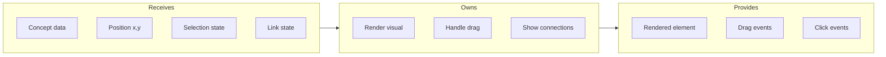

# Concept Node

## Goal

Render individual knowledge concepts as interactive canvas elements with consistent visual treatment, drag behavior, and state-aware styling.

## Contract

From c3-1 (Web Frontend): "Visual representation of knowledge concepts"

## Interface Diagram

## Hand-offs

| Direction | What | To/From |
|-----------|------|---------|
| IN | Concept model | c3-104 State Atoms |
| IN | Canvas coordinates | c3-101 Canvas Engine |
| IN | Selection/hover state | c3-104 State Atoms |
| OUT | Position updates | c3-104 State Atoms |
| OUT | Selection events | c3-111 Canvas Screen |
| OUT | Context menu triggers | c3-111 Canvas Screen |

## Conventions

| Rule | Why |
|------|-----|
| Fixed width 200px, variable height | Consistent grid snapping |
| Title truncated at 50 chars | Visual consistency |
| Preview content max 3 lines | Scannable at default zoom |
| Drag threshold 5px | Distinguish click from drag |

## Visual States

| State | Appearance |
|-------|------------|
| Default | White background, subtle shadow |
| Hovered | Elevated shadow, highlight border |
| Selected | Primary color border, handles visible |
| Multi-selected | Dashed border, grouped behavior |
| AI-suggested | Pulsing glow, ghost opacity |
| Linked | Connection indicators at edges |

## Edge Cases

| Scenario | Behavior |
|----------|----------|
| Very long title | Ellipsis with tooltip on hover |
| Empty concept | Placeholder text, distinct style |
| Rapid position updates | Throttle to 60fps |
| Overlapping nodes | Z-index based on selection, recency |

## References

- Node component: `src/components/ConceptNode.tsx`
- Node styles: `src/styles/concept-node.css`
- Cites: ref-design-system
