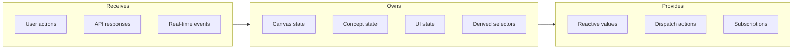
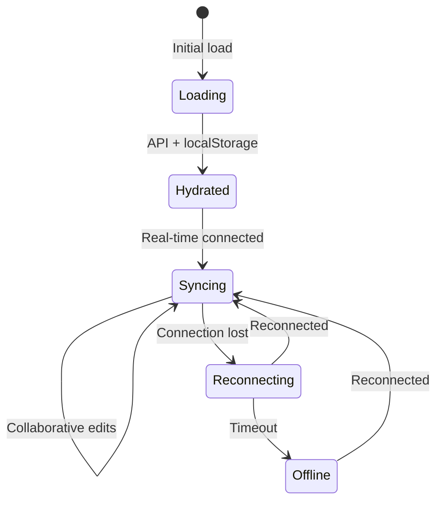

# State Atoms

## Goal

Provide reactive, granular state management that enables efficient re-renders and clear data flow between canvas components.

## Contract

From c3-1 (Web Frontend): "Global state management for canvas and UI"

## Interface Diagram

## Hand-offs

| Direction | What | To/From |
|-----------|------|---------|
| IN | Concept CRUD results | c3-2 API Backend |
| IN | Position/presence updates | c3-4 Real-time |
| IN | User interactions | Canvas components |
| OUT | Canvas viewport state | c3-101 Canvas Engine |
| OUT | Concept data | c3-102 Concept Node |
| OUT | Selection state | All feature components |

## State Domains

| Domain | Contents | Persistence |
|--------|----------|-------------|
| Canvas | viewport, zoom, pan position | Session only |
| Concepts | concept entities, positions | API-synced |
| Selection | selected IDs, multi-select | Session only |
| Presence | collaborator cursors, names | Real-time |
| UI | panels open, modal state | LocalStorage |

## Conventions

| Rule | Why |
|------|-----|
| Atoms are read-only externally | Mutations through actions only |
| Derived state via selectors | Single source of truth |
| Optimistic updates for positions | Smooth UX during collaboration |
| Batch real-time updates | Prevent render thrashing |

## State Flow

## Edge Cases

| Scenario | Behavior |
|----------|----------|
| Conflicting position updates | Last-write-wins with server timestamp |
| Large concept sets (>500) | Pagination in concept atom |
| Stale real-time connection | Auto-reconnect with exponential backoff |
| LocalStorage quota exceeded | Graceful degradation, log warning |

## References

- Atom definitions: `src/atoms/index.ts`
- Canvas atoms: `src/atoms/canvas.ts`
- Concept atoms: `src/atoms/concepts.ts`
- Cites: ref-state-management
