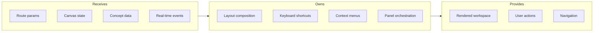

# Canvas Screen

## Goal

Compose the primary workspace where users interact with their knowledge graph spatially, orchestrating canvas engine, nodes, links, and panels.

## Contract

From c3-1 (Web Frontend): "Main canvas workspace view"

## Interface Diagram



## Hand-offs

| Direction | What | To/From |
|-----------|------|---------|
| IN | Canvas ID from route | c3-103 Router |
| IN | Concepts and positions | c3-104 State Atoms |
| IN | Collaborator presence | c3-4 Real-time |
| OUT | CRUD operations | c3-2 API Backend |
| OUT | Real-time broadcasts | c3-4 Real-time |
| OUT | Panel visibility | c3-112, c3-113 |

## Layout Zones

| Zone | Purpose |
|------|---------|
| Main Canvas | c3-101 Canvas Engine with c3-102 nodes |
| Toolbar | Create, link, search, zoom controls |
| Detail Panel | c3-112 Concept Detail (slide-out right) |
| Chat Panel | c3-113 AI Chat (slide-out left) |
| Minimap | Overview navigation (bottom-right) |
| Presence Bar | Collaborator avatars (top-right) |

## Keyboard Shortcuts

| Key | Action |
|-----|--------|
| Space + drag | Pan canvas |
| Cmd/Ctrl + scroll | Zoom |
| N | New concept at cursor |
| L | Enter link mode |
| Delete | Remove selected |
| Cmd/Ctrl + / | Toggle AI chat |
| Escape | Clear selection / exit mode |

## Conventions

| Rule | Why |
|------|-----|
| Panels overlay, don't push | Maximize canvas real estate |
| Auto-save positions on drag end | No explicit save action |
| Optimistic UI for all mutations | Responsive feel |
| Link mode requires explicit exit | Prevent accidental links |

## State Machine

```mermaid
stateDiagram-v2
    [*] --> Default
    Default --> LinkMode: Press L
    Default --> SearchMode: Press /
    Default --> PanMode: Hold Space
    LinkMode --> Default: Press Escape
    LinkMode --> LinkMode: Click node (add to link)
    SearchMode --> Default: Press Escape
    PanMode --> Default: Release Space
```

## Edge Cases

| Scenario | Behavior |
|----------|----------|
| Empty canvas | Show getting started prompt |
| No permission to edit | Read-only mode, hide edit controls |
| Connection lost | Show offline banner, queue changes |
| Panel overlap on mobile | Single panel at a time |

## References

- Screen component: `src/screens/CanvasScreen.tsx`
- Keyboard handling: `src/hooks/useKeyboardShortcuts.ts`
- Cites: ref-canvas-interactions, ref-keyboard-shortcuts
