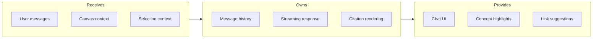
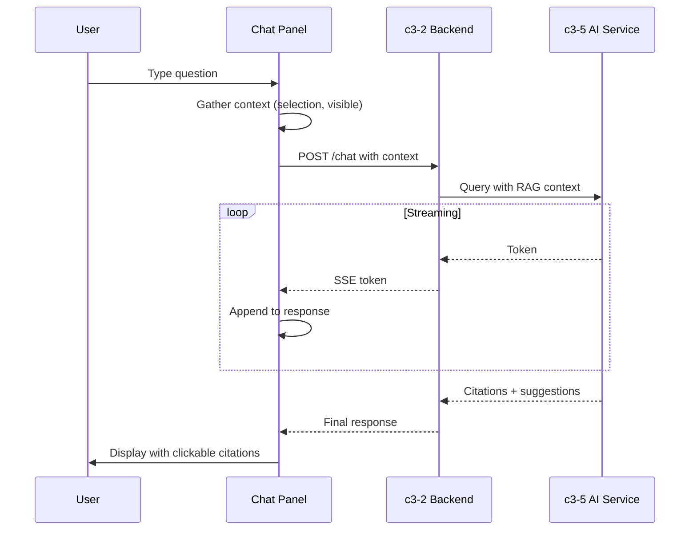

# AI Chat Panel

## Goal

Enable conversational exploration of the knowledge graph, with AI responses that cite specific concepts and suggest relevant links.

## Contract

From c3-1 (Web Frontend): "Chat interface with knowledge base"

## Interface Diagram

## Hand-offs

| Direction | What | To/From |
|-----------|------|---------|
| IN | Current selection | c3-104 State Atoms |
| IN | Visible concepts (context) | c3-111 Canvas Screen |
| IN | User query | User input |
| OUT | Chat request | c3-2 API Backend -> c3-5 AI Service |
| OUT | Concept focus requests | c3-111 Canvas Screen |
| OUT | Link creation suggestions | c3-111 Canvas Screen |

## Message Types

| Type | Visual | Behavior |
|------|--------|----------|
| User | Right-aligned, blue | Plain text with markdown |
| AI Response | Left-aligned, gray | Streaming, with citations |
| Citation | Inline chip | Clickable, highlights concept on canvas |
| Suggestion | Action card | "Explore X" / "Link A to B" buttons |
| Error | Red banner | Retry button |

## Conventions

| Rule | Why |
|------|-----|
| Include visible concepts as context | Relevant responses |
| Stream responses token-by-token | Lower perceived latency |
| Citations link to canvas positions | Spatial connection |
| History persisted per canvas | Context continuity |

## Interaction Flow

## Edge Cases

| Scenario | Behavior |
|----------|----------|
| Very long response | Auto-scroll, "scroll to bottom" button |
| Citation not on canvas | Show "concept not in view" with locate button |
| Network interruption mid-stream | Show partial response, retry button |
| Empty canvas context | General knowledge mode, suggest starting points |

## References

- Chat component: `src/components/AIChatPanel.tsx`
- Streaming hook: `src/hooks/useStreamingChat.ts`
- Cites: ref-ai-integration, ref-streaming-patterns
