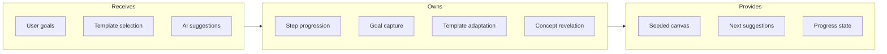
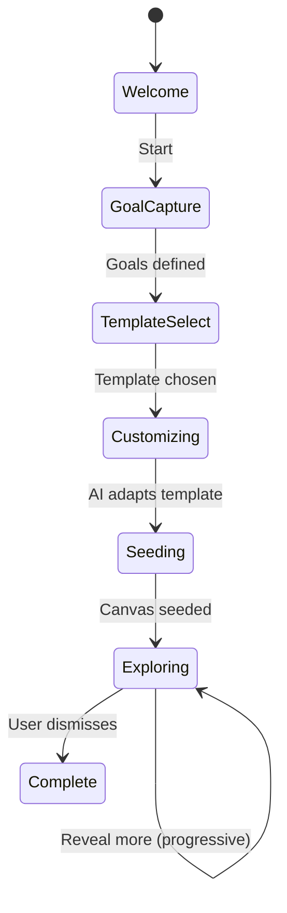

# Onboarding Flow

## Goal

Guide users through initial canvas setup with progressive disclosure - reveal concepts gradually based on user goals and AI-adapted templates.

## Contract

From c3-1 (Web Frontend): "Guided discovery and template setup"

## Interface Diagram

## Hand-offs

| Direction | What | To/From |
|-----------|------|---------|
| IN | Available templates | c3-2 API Backend |
| IN | AI-adapted suggestions | c3-5 AI Service |
| IN | User responses | User input |
| OUT | Canvas seed data | c3-104 State Atoms |
| OUT | Revealed concepts | c3-111 Canvas Screen |
| OUT | Onboarding progress | c3-2 API Backend |

## Onboarding States

## Step Details

| Step | User Action | System Response |
|------|-------------|-----------------|
| Welcome | View intro | Show value prop, examples |
| Goal Capture | Describe intent | AI extracts topics, domains |
| Template Select | Choose template | Show 3-5 relevant options |
| Customizing | Adjust preferences | AI refines seed concepts |
| Seeding | Confirm | Populate canvas with starter concepts |
| Exploring | Interact | Progressively reveal related concepts |

## Progressive Disclosure

| Trigger | Revelation |
|---------|------------|
| Complete first concept | Suggest 2-3 related |
| Create first link | Show link suggestions |
| Ask first AI question | Unlock full chat |
| 5 concepts created | Offer advanced templates |

## Conventions

| Rule | Why |
|------|-----|
| Templates are suggestions, not locks | User freedom |
| AI adapts to stated goals | Personalized experience |
| Can skip any step | Respect user agency |
| Progress saved, resumable | No lost work |

## Edge Cases

| Scenario | Behavior |
|----------|----------|
| Skip all onboarding | Empty canvas, minimal tooltip guidance |
| Template has 50+ concepts | Reveal 5 initially, rest progressive |
| User changes goals mid-flow | Offer to restart or merge |
| Returning user new canvas | Abbreviated flow, remember preferences |

## References

- Onboarding component: `src/flows/OnboardingFlow.tsx`
- Template API: `src/api/templates.ts`
- Cites: ref-onboarding-patterns, ref-progressive-disclosure
