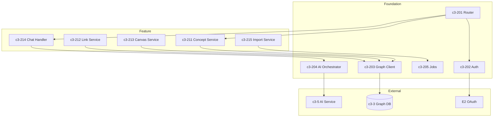

# API Backend

## Complexity Assessment

**Level:** complex
**Why:** Orchestrates graph database operations, AI service calls, auth flows, and handles multi-tenant data isolation. Multiple integration points with distinct failure modes.

## Technology Stack

| Layer | Technology | Purpose |
|-------|------------|---------|
| Runtime | Bun | High-performance JavaScript runtime |
| Framework | Elysia/Hono | Type-safe HTTP framework |
| Database | Neo4j Driver | Graph database connectivity |
| Auth | Custom + OAuth | Session and social auth |
| Validation | Zod/Valibot | Request/response validation |
| Queue | BullMQ | Background job processing |

## Components

| ID | Name | Category | Responsibility | Status |
|----|------|----------|----------------|--------|
| c3-201 | HTTP Router | foundation | Request routing and middleware chain | Documented |
| c3-202 | Auth Middleware | foundation | Token validation, session management | Documented |
| c3-203 | Graph Client | foundation | Neo4j connection and query builder | Documented |
| c3-204 | AI Orchestrator | foundation | Multi-provider AI routing | |
| c3-205 | Job Processor | foundation | Background task execution | |
| c3-211 | Concept Service | feature | CRUD operations for concepts | Documented |
| c3-212 | Link Service | feature | Relationship management between concepts | |
| c3-213 | Canvas Service | feature | Canvas-level operations and sharing | |
| c3-214 | Chat Handler | feature | AI chat request orchestration | Documented |
| c3-215 | Import Service | feature | External source import pipelines | |

## Internal Structure

## Fulfillment

| Linkage | Component | How |
|---------|-----------|-----|
| c3-2 -> c3-3 | c3-203 | Bolt protocol, connection pooling |
| c3-2 -> c3-5 | c3-204 | Internal HTTP calls |
| c3-2 -> E2 | c3-202 | OAuth 2.0 flows |
