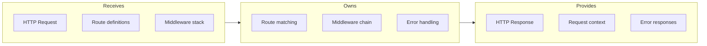

# HTTP Router

## Goal

Provide type-safe routing with consistent middleware ordering, request validation, and response formatting across all API endpoints.

## Contract

From c3-2 (API Backend): "Request routing and middleware chain"

## Interface Diagram

## Hand-offs

| Direction | What | To/From |
|-----------|------|---------|
| IN | Raw HTTP request | Bun HTTP server |
| IN | Route handlers | Service modules |
| OUT | Parsed request | c3-202 Auth, Service handlers |
| OUT | Formatted response | Client |
| OUT | Error envelope | Client |

## Route Groups

| Prefix | Auth | Purpose |
|--------|------|---------|
| /api/v1/auth | Public | Login, OAuth callbacks |
| /api/v1/concepts | Required | Concept CRUD |
| /api/v1/canvas | Required | Canvas operations |
| /api/v1/chat | Required | AI chat endpoints |
| /api/v1/import | Required | Import operations |
| /health | Public | Health checks |

## Middleware Order

| Order | Middleware | Purpose |
|-------|------------|---------|
| 1 | Request ID | Trace ID injection |
| 2 | Logging | Request/response logging |
| 3 | CORS | Cross-origin handling |
| 4 | Rate Limit | Request throttling |
| 5 | Auth | Token validation (per-route) |
| 6 | Validation | Request body/params |
| 7 | Handler | Business logic |

## Conventions

| Rule | Why |
|------|-----|
| All routes return JSON | Consistent client parsing |
| Errors use RFC 7807 format | Standard problem details |
| Request ID in all responses | Debugging correlation |
| Validation before auth for public routes | Fail fast |

## Edge Cases

| Scenario | Behavior |
|----------|----------|
| Invalid JSON body | 400 with parse error details |
| Route not found | 404 with available methods hint |
| Validation failure | 422 with field-level errors |
| Unhandled exception | 500, log stack, return safe message |

## References

- Router setup: `src/api/router.ts`
- Middleware: `src/api/middleware/`
- Cites: ref-api-conventions, ref-error-handling
