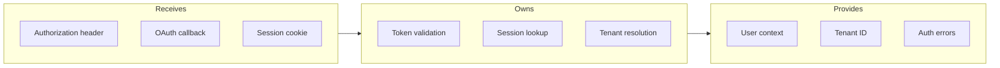
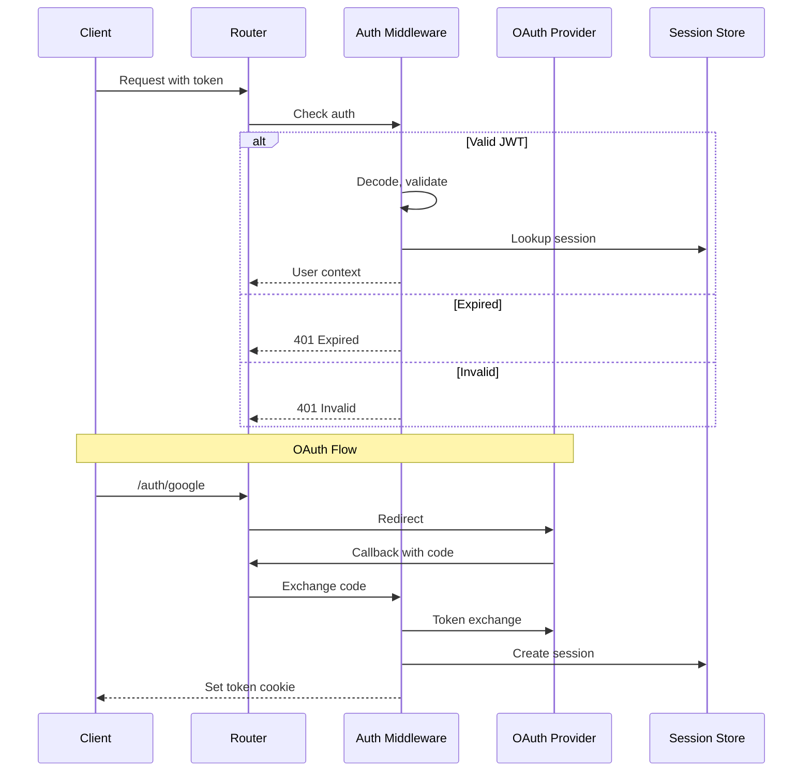

# Auth Middleware

## Goal

Secure API endpoints with JWT validation, OAuth flow handling, and tenant isolation enforcement.

## Contract

From c3-2 (API Backend): "Token validation, session management"

## Interface Diagram

## Hand-offs

| Direction | What | To/From |
|-----------|------|---------|
| IN | Bearer token | c3-201 Router (from header) |
| IN | OAuth code | OAuth provider callback |
| OUT | User context object | All protected route handlers |
| OUT | Tenant ID | c3-203 Graph Client (for isolation) |
| OUT | 401/403 response | c3-201 Router |

## Auth Flow

## Conventions

| Rule | Why |
|------|-----|
| Short-lived JWTs (15min) | Limit exposure window |
| Refresh tokens in httpOnly cookie | XSS protection |
| Tenant ID in JWT claims | Avoid lookup on every request |
| Log auth failures without PII | Security audit |

## Edge Cases

| Scenario | Behavior |
|----------|----------|
| Missing token | 401 with www-authenticate header |
| Malformed token | 401, log attempt |
| Valid token, revoked session | 401, clear cookie |
| OAuth provider down | 503 with retry-after |
| Cross-tenant access attempt | 403, log security event |

## References

- Auth middleware: `src/api/middleware/auth.ts`
- OAuth handlers: `src/api/auth/oauth.ts`
- Session store: `src/services/session.ts`
- Cites: ref-auth-patterns, ref-security
