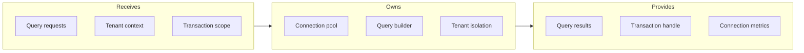
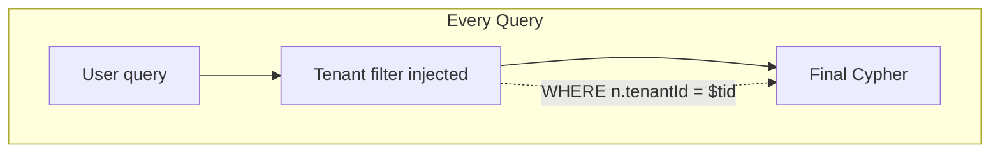

# Graph Client

## Goal

Abstract Neo4j connectivity with connection pooling, query building helpers, and tenant-isolated queries.

## Contract

From c3-2 (API Backend): "Neo4j connection and query builder"

## Interface Diagram

## Hand-offs

| Direction | What | To/From |
|-----------|------|---------|
| IN | Cypher query components | c3-211, c3-212 Services |
| IN | Tenant ID | c3-202 Auth Middleware |
| OUT | Typed query results | Service layer |
| OUT | Connection from pool | c3-3 Graph Database |
| OUT | Metrics | Monitoring system |

## Query Builder Patterns

| Pattern | Use Case |
|---------|----------|
| findOne | Single node by ID |
| findMany | Filtered node list |
| create | New node with properties |
| relate | Create relationship |
| traverse | Path queries |
| match | Complex patterns |

## Conventions

| Rule | Why |
|------|-----|
| All queries include tenant filter | Data isolation |
| Parameters only, no string concat | Injection prevention |
| Read/write session separation | Performance |
| Connection timeout 5s | Fail fast |

## Tenant Isolation

## Connection Pool

| Config | Value | Rationale |
|--------|-------|-----------|
| Max connections | 50 | Per-instance limit |
| Idle timeout | 30s | Resource reclaim |
| Acquisition timeout | 10s | Fail if unavailable |
| Validation query | Return 1 | Health check |

## Edge Cases

| Scenario | Behavior |
|----------|----------|
| Pool exhausted | Queue with timeout, then 503 |
| Query timeout | Cancel, return partial if streaming |
| Connection lost mid-transaction | Rollback, retry once |
| Schema mismatch | Log error, fail gracefully |

## References

- Graph client: `src/db/graph-client.ts`
- Query builders: `src/db/queries/`
- Cites: ref-graph-patterns, ref-data-isolation
