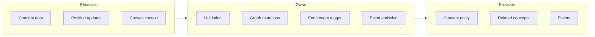
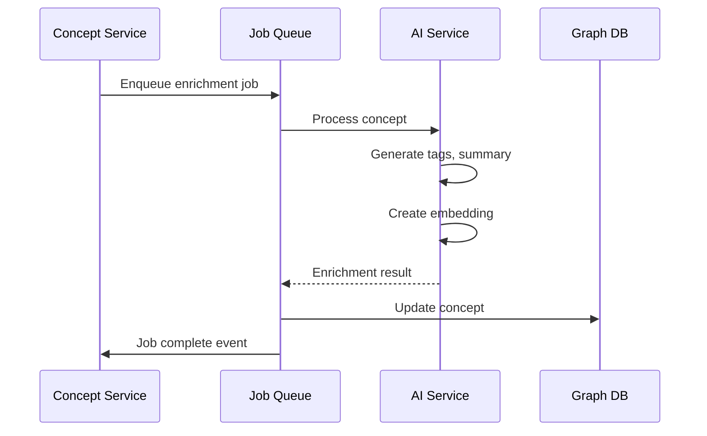

# Concept Service

## Goal

Handle concept lifecycle operations including creation, positioning, enrichment triggers, and deletion with relationship cleanup.

## Contract

From c3-2 (API Backend): "CRUD operations for concepts"

## Interface Diagram

## Hand-offs

| Direction | What | To/From |
|-----------|------|---------|
| IN | Create/update request | c3-201 Router |
| IN | User and tenant context | c3-202 Auth |
| OUT | Graph mutations | c3-203 Graph Client |
| OUT | Enrichment job | c3-205 Job Processor |
| OUT | Real-time events | c3-4 Real-time Service |

## Operations

| Operation | Validation | Side Effects |
|-----------|------------|--------------|
| Create | Title required, position valid | Trigger enrichment, emit event |
| Update | Concept exists, user owns | Emit update event |
| Move | Valid coordinates | Batch position update |
| Delete | Concept exists | Remove links, emit event |
| Bulk move | All IDs valid | Single transaction |

## Concept Model

| Field | Type | Description |
|-------|------|-------------|
| id | UUID | Unique identifier |
| tenantId | UUID | Tenant isolation |
| canvasId | UUID | Parent canvas |
| title | string | Display title |
| content | string | Markdown content |
| position | {x, y} | Canvas coordinates |
| tags | string[] | AI-generated + manual |
| embedding | vector | Semantic search |
| createdAt | timestamp | Creation time |
| updatedAt | timestamp | Last modification |

## Enrichment Flow

## Conventions

| Rule | Why |
|------|-----|
| Soft delete with TTL | Recovery window |
| Position batched in transactions | Consistency |
| Enrichment async | Non-blocking create |
| Title max 200 chars | Display constraints |

## Edge Cases

| Scenario | Behavior |
|----------|----------|
| Duplicate title in canvas | Allow, warn user |
| Delete with many links | Cascade delete links |
| Position conflict | Last write wins |
| Enrichment fails | Mark concept, retry 3x |

## References

- Concept service: `src/services/concept.ts`
- Concept routes: `src/api/routes/concepts.ts`
- Cites: ref-graph-patterns, ref-async-processing
