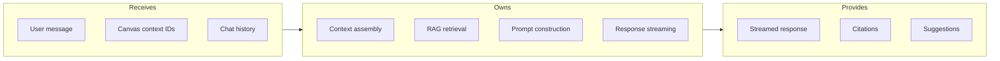
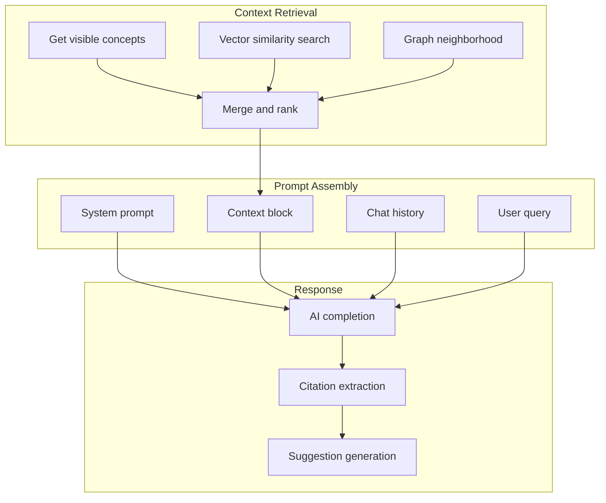

# Chat Handler

## Goal

Orchestrate AI chat requests by assembling relevant context from the knowledge graph, routing to AI providers, and streaming responses with citations.

## Contract

From c3-2 (API Backend): "AI chat request orchestration"

## Interface Diagram

## Hand-offs

| Direction | What | To/From |
|-----------|------|---------|
| IN | Chat request | c3-201 Router |
| IN | Visible concept IDs | c3-1 Frontend |
| IN | Previous messages | Request body |
| OUT | Concept lookups | c3-203 Graph Client |
| OUT | AI completion request | c3-204 AI Orchestrator |
| OUT | SSE stream | Client |

## RAG Pipeline

## Context Assembly

| Source | Weight | Purpose |
|--------|--------|---------|
| Visible concepts | High | Immediate context |
| Vector similar | Medium | Semantic relevance |
| Graph neighbors | Medium | Relationship context |
| Recent edits | Low | Activity relevance |

## Conventions

| Rule | Why |
|------|-----|
| Max 10 context concepts | Token budget |
| Stream with 100ms flush | Responsive UX |
| Citation format [c:id] | Parseable by frontend |
| History limited to 20 turns | Context window |

## Response Format

| Field | Type | Description |
|-------|------|-------------|
| content | string | AI response text (streamed) |
| citations | array | [{conceptId, title, relevance}] |
| suggestions | array | [{action, params, label}] |
| usage | object | Token counts |

## Edge Cases

| Scenario | Behavior |
|----------|----------|
| No relevant concepts | General response, suggest exploration |
| Very long context | Truncate, prioritize by relevance |
| AI provider timeout | Return partial, offer retry |
| Rate limit hit | 429 with reset time |

## References

- Chat handler: `src/api/routes/chat.ts`
- RAG pipeline: `src/services/rag.ts`
- Cites: ref-ai-integration, ref-streaming-patterns
