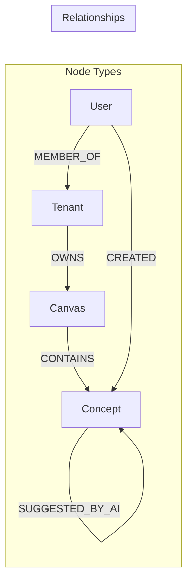

# Graph Database

## Complexity Assessment

**Level:** moderate
**Why:** Single database technology but with complex graph schema, vector indexes for semantic search, and multi-tenant data isolation requirements.

## Technology Stack

| Layer | Technology | Purpose |
|-------|------------|---------|
| Database | Neo4j 5.x | Graph storage and queries |
| Vector | Neo4j Vector Index | Semantic similarity search |
| Protocol | Bolt | Binary wire protocol |
| Backup | Neo4j Admin | Point-in-time recovery |

## Data Model

## Node Schemas

| Node | Key Properties | Indexes |
|------|----------------|---------|
| Tenant | id, name, plan | id (unique) |
| Canvas | id, tenantId, name, createdAt | id (unique), tenantId |
| Concept | id, tenantId, canvasId, title, content, position, embedding | id (unique), tenantId, canvasId, embedding (vector) |
| User | id, email, tenantId | id (unique), email (unique) |

## Relationship Types

| Relationship | From | To | Properties |
|--------------|------|-----|------------|
| OWNS | Tenant | Canvas | createdAt |
| CONTAINS | Canvas | Concept | |
| LINKS_TO | Concept | Concept | type (manual/ai/inferred), confidence, createdBy |
| SUGGESTED_BY_AI | Concept | Concept | score, status (pending/accepted/rejected) |
| MEMBER_OF | User | Tenant | role, joinedAt |
| CREATED | User | Concept | createdAt |

## Components

| ID | Name | Category | Responsibility | Status |
|----|------|----------|----------------|--------|
| c3-301 | Graph Schema | foundation | Node/relationship definitions and constraints | Documented |
| c3-302 | Vector Index | foundation | Embedding storage and similarity queries | Documented |
| c3-303 | Tenant Isolation | foundation | Multi-tenant data boundaries | |

## Query Patterns

| Pattern | Use Case | Complexity |
|---------|----------|------------|
| MATCH by ID | Single concept lookup | O(1) |
| Canvas concepts | All concepts in canvas | O(n) |
| Neighborhood | Concepts linked to X | O(edges) |
| Vector similarity | Semantic search | O(log n) |
| Path finding | Connection discovery | Variable |

## Conventions

| Rule | Why |
|------|-----|
| tenantId on all data nodes | Isolation enforcement |
| UUIDs as identifiers | Global uniqueness |
| Soft delete with deletedAt | Recovery capability |
| Vector dimension 1536 | OpenAI embedding size |
