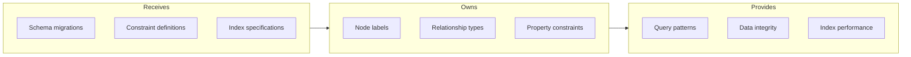

# Graph Schema

## Goal

Define the knowledge graph structure with proper constraints, indexes, and relationship semantics that enable efficient queries and data integrity.

## Contract

From c3-3 (Graph Database): "Node/relationship definitions and constraints"

## Interface Diagram

## Hand-offs

| Direction | What | To/From |
|-----------|------|---------|
| IN | Migration scripts | Deployment pipeline |
| OUT | Query capabilities | c3-203 Graph Client |
| OUT | Integrity guarantees | All services |

## Node Definitions

### Tenant

| Property | Type | Constraint |
|----------|------|------------|
| id | UUID | UNIQUE |
| name | string | NOT NULL |
| plan | enum | NOT NULL |
| createdAt | datetime | NOT NULL |

### Canvas

| Property | Type | Constraint |
|----------|------|------------|
| id | UUID | UNIQUE |
| tenantId | UUID | NOT NULL, indexed |
| name | string | NOT NULL |
| description | string | |
| createdAt | datetime | NOT NULL |
| updatedAt | datetime | NOT NULL |

### Concept

| Property | Type | Constraint |
|----------|------|------------|
| id | UUID | UNIQUE |
| tenantId | UUID | NOT NULL, indexed |
| canvasId | UUID | NOT NULL, indexed |
| title | string | NOT NULL |
| content | string | |
| positionX | float | NOT NULL |
| positionY | float | NOT NULL |
| tags | string[] | |
| embedding | float[1536] | vector indexed |
| createdAt | datetime | NOT NULL |
| updatedAt | datetime | NOT NULL |
| deletedAt | datetime | |

### User

| Property | Type | Constraint |
|----------|------|------------|
| id | UUID | UNIQUE |
| email | string | UNIQUE |
| tenantId | UUID | indexed |
| displayName | string | NOT NULL |
| avatarUrl | string | |

## Relationship Definitions

### LINKS_TO (Concept -> Concept)

| Property | Type | Description |
|----------|------|-------------|
| type | enum | manual, ai_suggested, ai_inferred |
| confidence | float | AI-generated confidence score |
| createdBy | UUID | User who created (if manual) |
| createdAt | datetime | Creation timestamp |
| label | string | Optional relationship label |

### SUGGESTED_BY_AI (Concept -> Concept)

| Property | Type | Description |
|----------|------|-------------|
| score | float | Suggestion relevance score |
| status | enum | pending, accepted, rejected |
| reason | string | AI explanation |
| suggestedAt | datetime | When suggested |

## Conventions

| Rule | Why |
|------|-----|
| Composite index on (tenantId, canvasId) | Common query pattern |
| All timestamps in UTC | Consistency |
| Deleted nodes kept 30 days | Recovery window |
| No cascading deletes in DB | Application controls |

## Migration Strategy

| Step | Action |
|------|--------|
| 1 | Add new nodes/properties as nullable |
| 2 | Migrate data |
| 3 | Add constraints |
| 4 | Remove old structures |

## References

- Schema migrations: `db/migrations/`
- Constraint scripts: `db/constraints/`
- Cites: ref-graph-patterns
