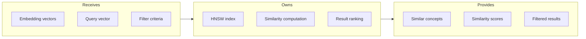
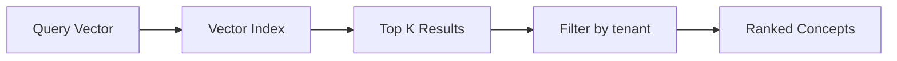

# Vector Index

## Goal

Enable semantic similarity search across concepts using vector embeddings, supporting RAG context retrieval and AI-powered suggestions.

## Contract

From c3-3 (Graph Database): "Embedding storage and similarity queries"

## Interface Diagram

## Hand-offs

| Direction | What | To/From |
|-----------|------|---------|
| IN | Concept embeddings | c3-5 AI Service (via c3-211) |
| IN | Query embedding | c3-214 Chat Handler |
| IN | Tenant/canvas filters | c3-203 Graph Client |
| OUT | Ranked concept IDs | c3-214 Chat Handler |
| OUT | Similarity scores | c3-211 Concept Service |

## Index Configuration

| Parameter | Value | Rationale |
|-----------|-------|-----------|
| Dimensions | 1536 | OpenAI ada-002 size |
| Similarity | cosine | Normalized comparison |
| Index type | HNSW | Fast approximate search |
| M (connections) | 16 | Balance speed/accuracy |
| efConstruction | 64 | Build quality |
| efSearch | 40 | Query quality |

## Query Patterns

### Basic Similarity

### Filtered Similarity

| Filter | Applied | Purpose |
|--------|---------|---------|
| tenantId | Always | Isolation |
| canvasId | Optional | Canvas scope |
| deletedAt IS NULL | Always | Exclude deleted |
| id NOT IN excluded | Optional | Exclude known |

## Conventions

| Rule | Why |
|------|-----|
| Re-embed on content change | Accuracy |
| Batch embedding updates | Performance |
| K limit 20 | Token budget |
| Score threshold 0.7 | Quality floor |

## Performance Characteristics

| Operation | Latency | Scale |
|-----------|---------|-------|
| Single query | <50ms | Up to 1M vectors |
| Batch insert | ~10ms/vector | Parallel safe |
| Index rebuild | Minutes | Per-tenant if needed |

## Edge Cases

| Scenario | Behavior |
|----------|----------|
| No embeddings yet | Return empty, trigger backfill |
| All scores below threshold | Return best match with warning |
| Query vector wrong dimension | Reject with clear error |
| Index corruption | Fall back to full scan (slow) |

## References

- Vector index setup: `db/indexes/vector.cypher`
- Embedding pipeline: `src/services/embedding.ts`
- Cites: ref-ai-integration, ref-graph-patterns
