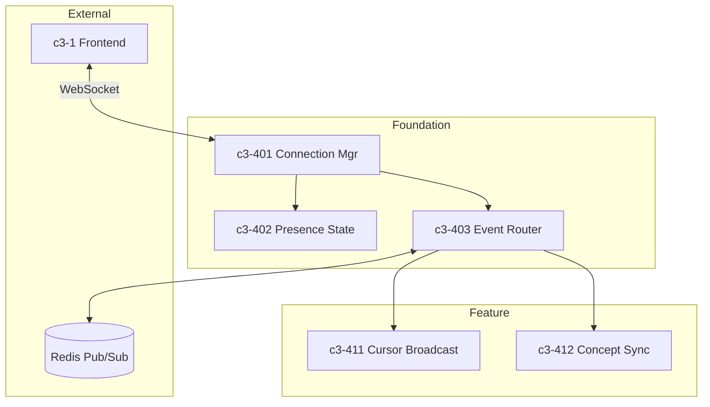
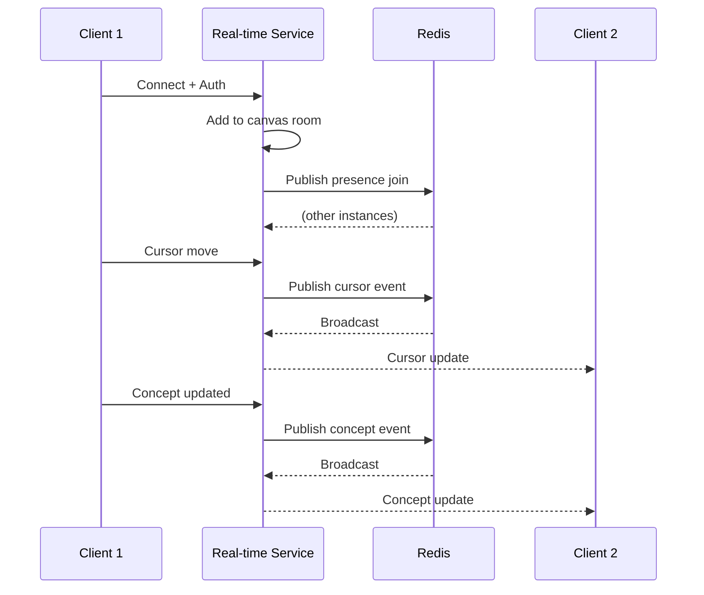

# Real-time Service

## Complexity Assessment

**Level:** moderate
**Why:** WebSocket connection management with presence state, but single-purpose service with clear boundaries. Horizontal scaling adds complexity.

## Technology Stack

| Layer | Technology | Purpose |
|-------|------------|---------|
| Runtime | Bun | WebSocket native support |
| Protocol | WebSocket | Bidirectional real-time |
| Pub/Sub | Redis | Cross-instance message distribution |
| Serialization | MessagePack | Efficient binary encoding |

## Components

| ID | Name | Category | Responsibility | Status |
|----|------|----------|----------------|--------|
| c3-401 | Connection Manager | foundation | WebSocket lifecycle and authentication | Documented |
| c3-402 | Presence State | foundation | User cursor and activity tracking | Documented |
| c3-403 | Event Router | foundation | Message routing between clients | |
| c3-411 | Cursor Broadcast | feature | Live cursor position sharing | |
| c3-412 | Concept Sync | feature | Real-time concept updates | |

## Internal Structure

## Message Flow

## Fulfillment

| Linkage | Component | How |
|---------|-----------|-----|
| c3-1 <-> c3-4 | c3-401 | WebSocket with auth token |
| c3-4 -> c3-3 | c3-402 | Presence state persistence (optional) |
