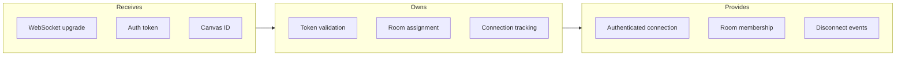
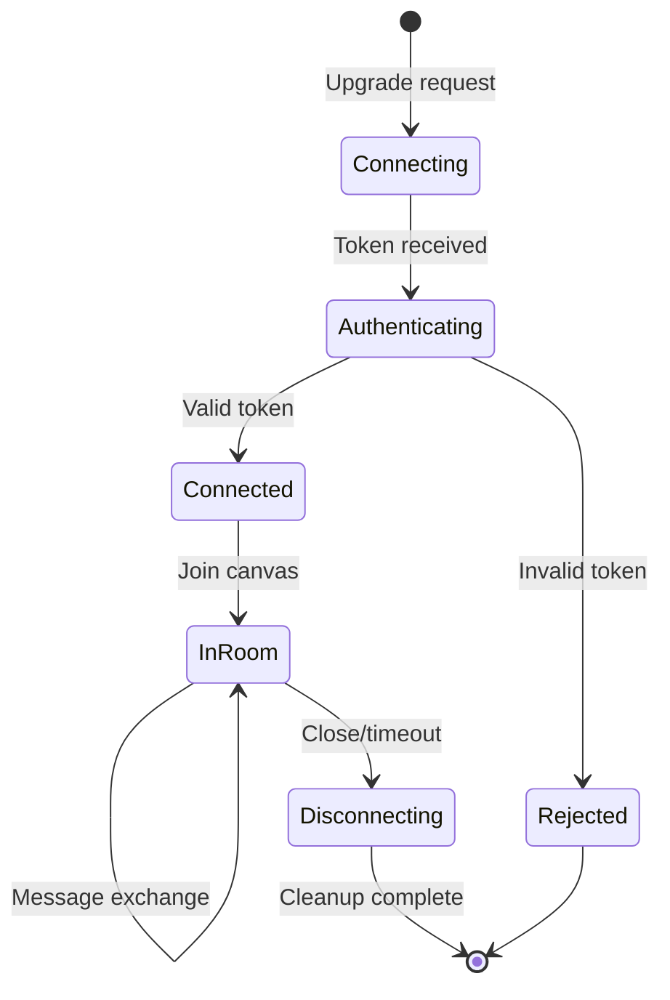

# Connection Manager

## Goal

Manage WebSocket connections with proper authentication, room assignment, and graceful disconnect handling.

## Contract

From c3-4 (Real-time Service): "WebSocket lifecycle and authentication"

## Interface Diagram

## Hand-offs

| Direction | What | To/From |
|-----------|------|---------|
| IN | Upgrade request with token | c3-1 Frontend |
| IN | Canvas ID for room join | c3-1 Frontend |
| OUT | User context | c3-402 Presence State |
| OUT | Room membership | c3-403 Event Router |
| OUT | Disconnect notification | c3-402 Presence State |

## Connection Lifecycle

## Room Model

| Concept | Description |
|---------|-------------|
| Room | Canvas-scoped message channel |
| Room ID | `canvas:{canvasId}` |
| Membership | User can be in multiple rooms |
| Isolation | Tenant-scoped rooms only |

## Conventions

| Rule | Why |
|------|-----|
| Auth on upgrade, not after | Reject early |
| Heartbeat every 30s | Detect stale connections |
| Max 1000 connections per instance | Resource limits |
| Reconnect token valid 5min | Resume after brief disconnect |

## Handshake Protocol

| Step | Client | Server |
|------|--------|--------|
| 1 | WebSocket upgrade + token | Validate token |
| 2 | | Send connection_ack |
| 3 | Join canvas room | Add to room, send room_joined |
| 4 | | Send current presence |
| 5 | Begin message exchange | |

## Edge Cases

| Scenario | Behavior |
|----------|----------|
| Token expired during session | Send reauth_required, grace period |
| Same user multiple tabs | Multiple connections allowed |
| Room full (>100 users) | Reject join with capacity error |
| Connection flood | Rate limit by IP |

## References

- Connection handler: `src/ws/connection.ts`
- Auth validation: `src/ws/auth.ts`
- Cites: ref-websocket-patterns, ref-auth-patterns
