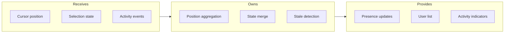
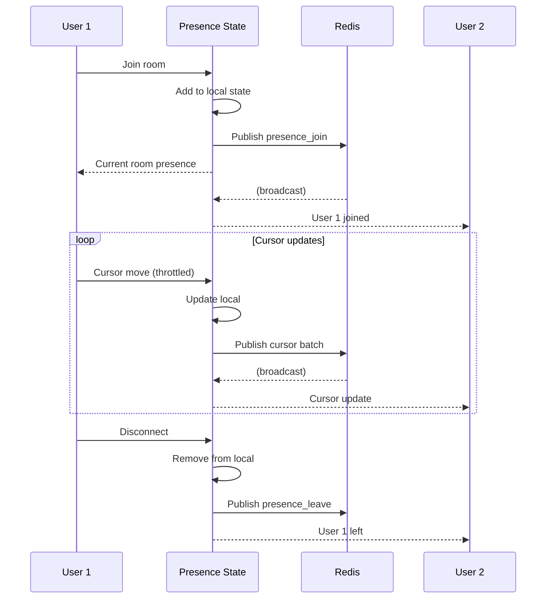

# Presence State

## Goal

Track and broadcast user presence including cursor positions, selection state, and activity indicators for collaborative awareness.

## Contract

From c3-4 (Real-time Service): "User cursor and activity tracking"

## Interface Diagram

## Hand-offs

| Direction | What | To/From |
|-----------|------|---------|
| IN | Cursor position updates | c3-1 Frontend |
| IN | Selection changes | c3-1 Frontend |
| IN | Connect/disconnect | c3-401 Connection Manager |
| OUT | Presence broadcasts | c3-403 Event Router |
| OUT | Initial presence state | c3-401 (on room join) |

## Presence Data Model

| Field | Type | Update Frequency |
|-------|------|------------------|
| userId | UUID | Static |
| displayName | string | Static |
| avatarUrl | string | Static |
| cursorX | float | High (throttled) |
| cursorY | float | High (throttled) |
| selectedIds | UUID[] | Medium |
| lastActivity | timestamp | On any action |
| viewportBounds | {x,y,w,h} | Low |

## State Flow

## Conventions

| Rule | Why |
|------|-----|
| Throttle cursor to 20Hz | Network efficiency |
| Batch cursor updates | Reduce message count |
| Stale after 60s inactivity | Show idle indicator |
| Remove after 5min stale | Clean up |

## Cursor Interpolation

| Client Behavior | Server Support |
|-----------------|----------------|
| Interpolate between updates | Send velocity hint |
| Smooth animation | Include timestamp |
| Predict next position | Linear extrapolation |

## Edge Cases

| Scenario | Behavior |
|----------|----------|
| Very fast cursor movement | Downsample, keep latest |
| Same user in two tabs | Show both cursors |
| User goes idle | Mark as idle after 60s |
| Redis unavailable | Local-only mode, warn |

## References

- Presence handler: `src/ws/presence.ts`
- Cursor batching: `src/ws/cursor-batch.ts`
- Cites: ref-realtime-patterns, ref-collaborative-editing
