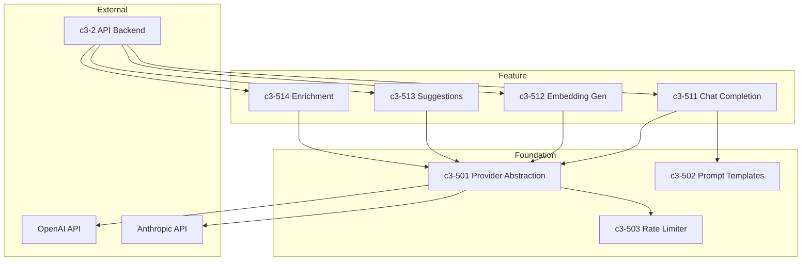

# AI Service

## Complexity Assessment

**Level:** moderate
**Why:** Multi-provider abstraction adds complexity, but well-defined interfaces. Main concerns are rate limiting, fallback handling, and prompt management.

## Technology Stack

| Layer | Technology | Purpose |
|-------|------------|---------|
| Runtime | Bun | Same as API backend |
| Providers | OpenAI, Anthropic | LLM completions |
| Embeddings | OpenAI ada-002 | Vector generation |
| Streaming | SSE | Response streaming |
| Cache | Redis | Response caching |

## Components

| ID | Name | Category | Responsibility | Status |
|----|------|----------|----------------|--------|
| c3-501 | Provider Abstraction | foundation | Unified interface across AI providers | Documented |
| c3-502 | Prompt Templates | foundation | Managed prompt library | Documented |
| c3-503 | Rate Limiter | foundation | Per-tenant rate limiting | |
| c3-511 | Chat Completion | feature | Conversational AI responses | |
| c3-512 | Embedding Generator | feature | Vector generation for concepts | |
| c3-513 | Suggestion Engine | feature | AI-powered link and explore suggestions | Documented |
| c3-514 | Enrichment Pipeline | feature | Auto-tagging and summarization | |

## Internal Structure

## Provider Capabilities

| Capability | OpenAI | Anthropic |
|------------|--------|-----------|
| Chat | gpt-4o | claude-3.5-sonnet |
| Embeddings | ada-002 | - |
| Streaming | Yes | Yes |
| Function calling | Yes | Yes |

## Fulfillment

| Linkage | Component | How |
|---------|-----------|-----|
| c3-2 -> c3-5 | All features | Internal HTTP / direct import |
| c3-5 -> E1 | c3-501 | Provider-specific HTTPS APIs |
