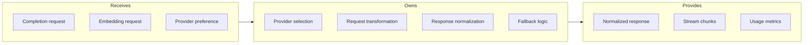
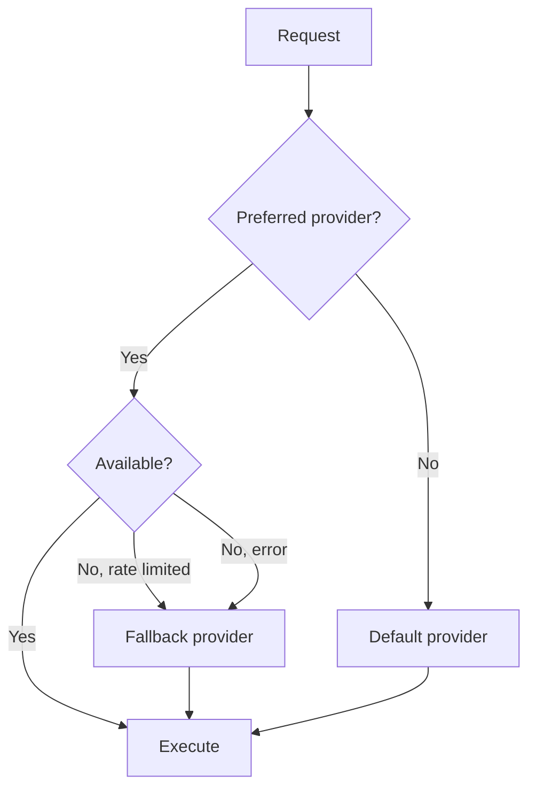

# Provider Abstraction

## Goal

Abstract multiple AI provider APIs behind a unified interface, handling authentication, rate limits, and automatic fallback.

## Contract

From c3-5 (AI Service): "Unified interface across AI providers"

## Interface Diagram

## Hand-offs

| Direction | What | To/From |
|-----------|------|---------|
| IN | Completion params | c3-511 Chat, c3-513 Suggestions |
| IN | Text for embedding | c3-512 Embedding Generator |
| OUT | Provider API calls | E1 (OpenAI, Anthropic) |
| OUT | Normalized response | Feature components |
| OUT | Usage stats | Monitoring, c3-503 Rate Limiter |

## Unified Request

| Field | Type | Maps To |
|-------|------|---------|
| model | enum | Provider-specific model |
| messages | array | Conversation history |
| maxTokens | number | Response length |
| temperature | float | Creativity |
| stream | boolean | SSE streaming |
| functions | array | Tool definitions |

## Provider Selection

## Conventions

| Rule | Why |
|------|-----|
| Normalize all responses | Consumer agnostic |
| Log provider used | Debugging, cost tracking |
| Timeout 30s completion | Prevent hangs |
| Retry transient errors 2x | Reliability |

## Fallback Strategy

| Primary Failure | Fallback | Condition |
|-----------------|----------|-----------|
| OpenAI rate limited | Anthropic | If supported |
| Anthropic timeout | OpenAI | If supported |
| All providers down | Graceful error | No fallback |

## Edge Cases

| Scenario | Behavior |
|----------|----------|
| Unsupported model request | Map to closest equivalent |
| Streaming error mid-response | Return partial, indicate incomplete |
| Provider returns invalid JSON | Retry, then error |
| Token count exceeds limit | Truncate context, warn |

## References

- Provider client: `src/ai/provider.ts`
- Fallback logic: `src/ai/fallback.ts`
- Cites: ref-ai-integration, ref-error-handling
