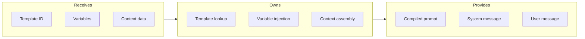

# Prompt Templates

## Goal

Maintain a structured library of prompts for different AI use cases, with variable injection, versioning, and A/B testing support.

## Contract

From c3-5 (AI Service): "Managed prompt library"

## Interface Diagram

## Hand-offs

| Direction | What | To/From |
|-----------|------|---------|
| IN | Template selection | Feature components |
| IN | Dynamic variables | c3-214 Chat Handler |
| IN | Context concepts | c3-214 Chat Handler |
| OUT | Formatted messages | c3-501 Provider Abstraction |

## Template Categories

| Category | Templates | Purpose |
|----------|-----------|---------|
| Chat | chat_with_context, chat_general | Conversational responses |
| Suggestion | suggest_links, suggest_explore | Discovery recommendations |
| Enrichment | enrich_tags, enrich_summary | Auto-enhancement |
| Onboarding | adapt_template, goal_extraction | User guidance |

## Template Structure

| Field | Type | Description |
|-------|------|-------------|
| id | string | Unique identifier |
| version | string | Semver version |
| system | string | System prompt template |
| user | string | User message template |
| variables | object | Required variables schema |
| maxTokens | number | Default response limit |
| temperature | float | Default creativity |

## Variable Injection

| Syntax | Example | Description |
|--------|---------|-------------|
| {{var}} | {{user_name}} | Simple substitution |
| {{#each}} | {{#each concepts}} | Loop over array |
| {{#if}} | {{#if has_context}} | Conditional sections |

## Conventions

| Rule | Why |
|------|-----|
| All templates versioned | Reproducibility |
| Variables validated | Fail fast on missing |
| No hardcoded content | Maintainability |
| Prompts in separate files | Easy editing |

## Template Example: chat_with_context

| Section | Content |
|---------|---------|
| System | You are a knowledge assistant for {{canvas_name}}. Answer based on the provided concepts. |
| Context block | Available concepts: {{#each concepts}}[{{id}}] {{title}}: {{summary}}{{/each}} |
| Instructions | Cite concepts using [c:id] format. Suggest related topics. |

## Edge Cases

| Scenario | Behavior |
|----------|----------|
| Missing variable | Throw clear error with variable name |
| Template not found | Fallback to default, log warning |
| Context too long | Truncate, prioritize by relevance |
| Variable injection XSS | Sanitize user content |

## References

- Template store: `src/ai/prompts/`
- Template loader: `src/ai/template-loader.ts`
- Cites: ref-ai-integration
