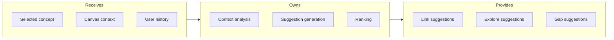
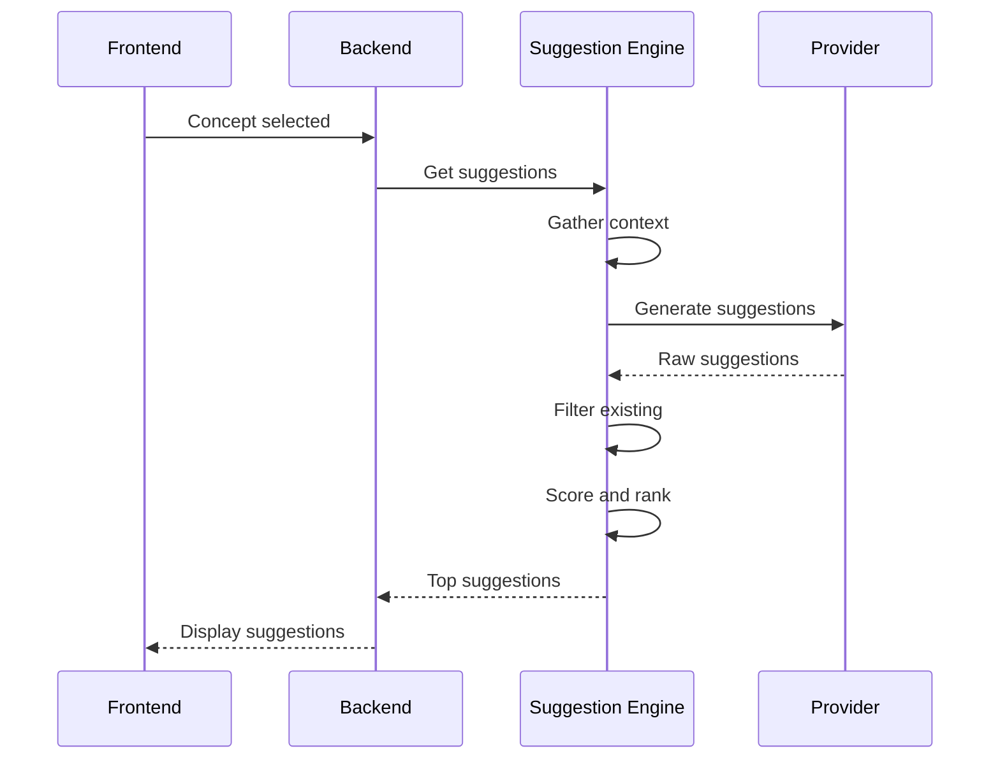

# Suggestion Engine

## Goal

Generate contextual suggestions for concept links, related topics to explore, and knowledge gaps to fill based on canvas content and user behavior.

## Contract

From c3-5 (AI Service): "AI-powered link and explore suggestions"

## Interface Diagram

## Hand-offs

| Direction | What | To/From |
|-----------|------|---------|
| IN | Selected concept data | c3-2 API Backend |
| IN | Visible concepts | c3-2 API Backend |
| IN | User exploration history | c3-2 API Backend |
| OUT | AI completion request | c3-501 Provider Abstraction |
| OUT | Ranked suggestions | c3-2 API Backend -> c3-1 Frontend |

## Suggestion Types

| Type | Trigger | Output |
|------|---------|--------|
| Link | Concept selected | Existing concepts to link |
| Explore | Concept created/viewed | New topics to add |
| Gap | Canvas analysis | Missing connections |
| Pattern | Multiple concepts | Emerging themes |

## Suggestion Flow

## Suggestion Model

| Field | Type | Description |
|-------|------|-------------|
| type | enum | link, explore, gap, pattern |
| targetId | UUID | Existing concept (for links) |
| title | string | Suggested concept title (for explore) |
| reason | string | AI explanation |
| confidence | float | 0-1 score |
| action | object | {type, params} for execution |

## Conventions

| Rule | Why |
|------|-----|
| Max 5 suggestions per type | Avoid overwhelm |
| Filter already-linked | No duplicates |
| Include confidence score | User decision support |
| Explain reasoning | Trust building |

## Scoring Factors

| Factor | Weight | Description |
|--------|--------|-------------|
| Semantic similarity | 0.4 | Embedding distance |
| Graph proximity | 0.3 | Existing path length |
| User history | 0.2 | Past interactions |
| Recency | 0.1 | Recently viewed concepts |

## Edge Cases

| Scenario | Behavior |
|----------|----------|
| No context available | Generic domain suggestions |
| All suggestions already linked | Show "well connected" message |
| Low confidence only | Show fewer, indicate uncertainty |
| Very large canvas | Sample representative subset |

## References

- Suggestion engine: `src/ai/suggestions.ts`
- Scoring logic: `src/ai/suggestion-scorer.ts`
- Cites: ref-ai-integration, ref-graph-patterns
