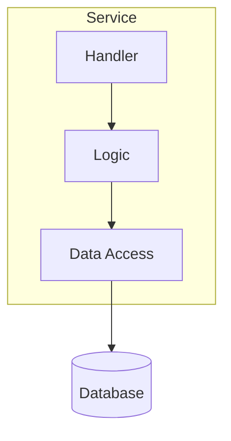
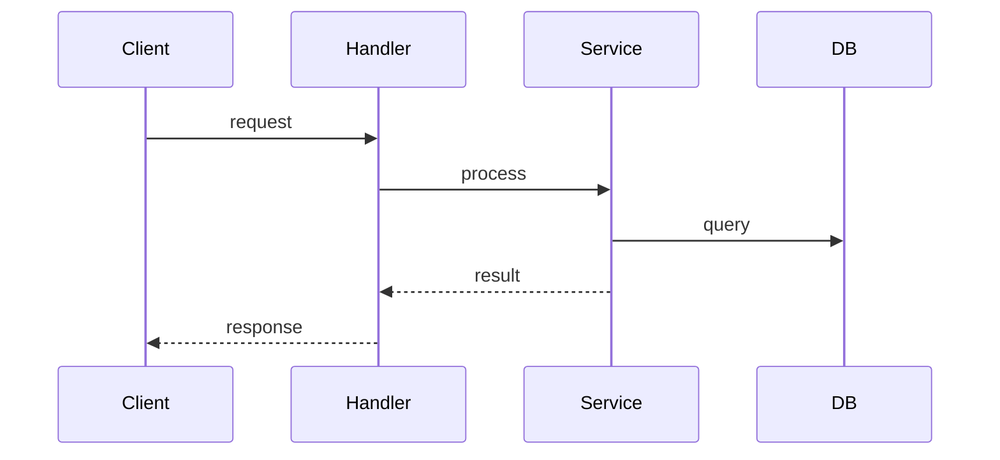
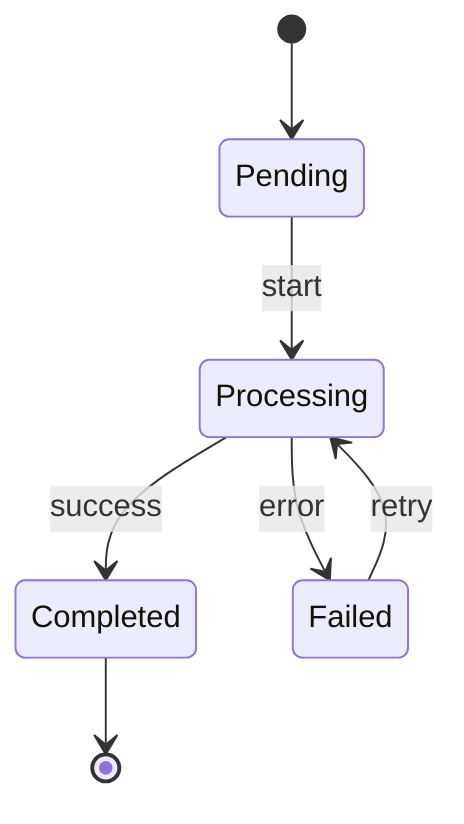

# Diagram Patterns

Diagrams should **clarify**, not mandate. Generate when helpful, skip when trivial.

---

## Mermaid Only (Mandatory)

**ALL diagrams MUST use Mermaid syntax.**

| Prohibited | Why |
|------------|-----|
| ASCII art (`+---+ → +---+`) | Not renderable |
| Unicode boxes (`┌──┐`) | Platform-dependent |
| Plain text flows (`A --> B`) | Not a diagram |

**Why Mermaid:** Renderable in GitHub/GitLab, accessible, maintainable, consistent.

---

## When to Use Diagrams

| Use diagram when | Skip diagram when |
|------------------|-------------------|
| Relationships are non-obvious | A calls B (trivial) |
| Data flow has multiple steps | Text description is clearer |
| Architecture overview aids understanding | Would just repeat prose |

---

## Diagram Types

### Flowchart (Structure)

Shows static structure and dependencies.

**Best for:** "What exists and what connects"

| Can Show | Cannot Show |
|----------|-------------|
| Components, dependencies | Temporal ordering |
| Data flow direction | Request/response pairing |
| Groupings (subgraphs) | Error paths |

### Sequence (Flow)

Shows temporal ordering and interactions.

**Best for:** "What happens when X occurs"

| Can Show | Cannot Show |
|----------|-------------|
| Temporal ordering | Overall structure |
| Request/response pairs | Dependencies beyond flow |
| Sync vs async | Multiple entry points |

### State (Lifecycle)

Shows state transitions for entities.

**Best for:** "What states can this entity be in"

| Can Show | Cannot Show |
|----------|-------------|
| States, transitions | Who performs transition |
| Triggers, terminal states | Multiple entities |

---

## Quick Reference by Complexity

| Container Type | Recommended |
|---------------|-------------|
| Simple (1-3 components) | Component table, maybe one flowchart |
| Moderate (4-6 components) | Flowchart, maybe one sequence |
| Complex (7+ components) | Flowchart + ONE critical sequence |

---

## Combination Patterns

| Pattern | When to Use |
|---------|-------------|
| **Flowchart + Sequence** | Complex structure AND non-obvious key flow |
| **Flowchart + State** | Manages entities with complex lifecycles |

---

## Anti-Patterns

| Avoid | Why |
|-------|-----|
| Two flowcharts at different zoom levels | Can't mentally map between |
| Sequence for every endpoint | Noise, maintenance nightmare |
| State diagram for < 4 states | Overkill |
| Table + diagram showing same thing | Redundant, will drift |

---

## Decision Checklist

| Factor | Question |
|--------|----------|
| **Clarity** | Can prose alone convey this? |
| **Value** | Will readers return to this? |
| **Cost** | How often will it change? |

**Decision:** INCLUDE / SKIP / SIMPLIFY
