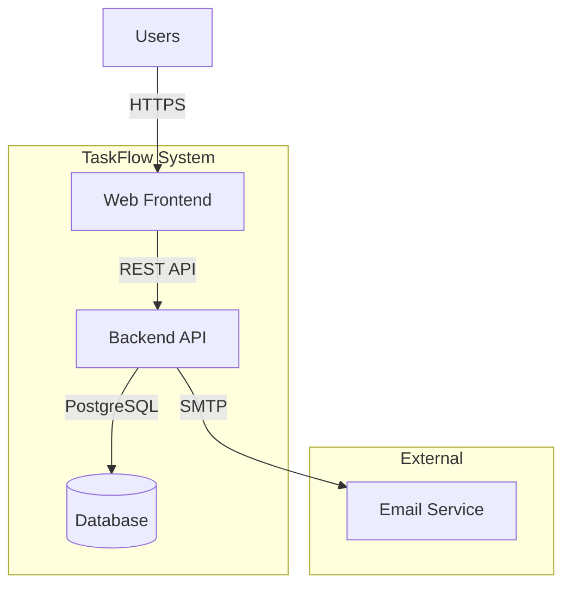
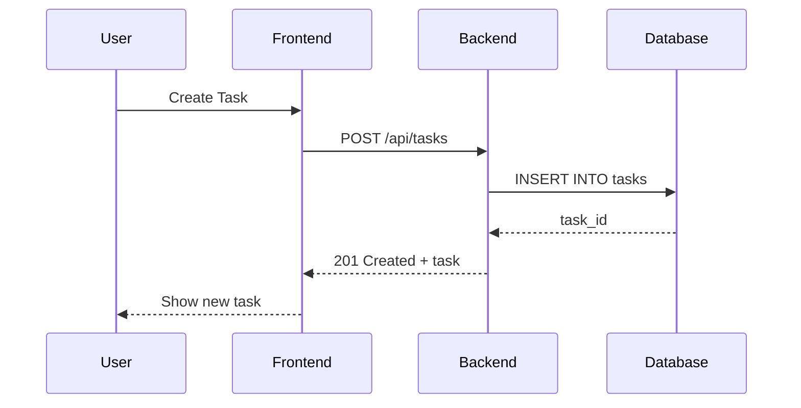
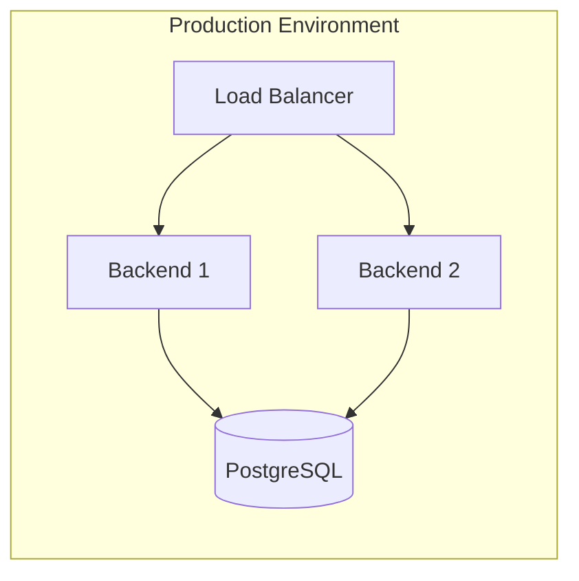

# [CTX-001-system-overview] TaskFlow System Architecture Overview

## Overview {#ctx-001-overview}

TaskFlow is a task management application that allows users to create, organize, and track tasks. The system consists of a web frontend, a REST API backend, and a PostgreSQL database.

**Key Features:**
- User authentication and authorization
- Task creation, editing, and deletion
- Task categorization and filtering
- Due date tracking and notifications

## Architecture {#ctx-001-architecture}



## Containers {#ctx-001-containers}

| Container | Type | Description |
|-----------|------|-------------|
| [CON-001-backend](./containers/CON-001-backend.md) | Code | REST API handling business logic |
| [CON-002-frontend](./containers/CON-002-frontend.md) | Code | Web user interface |
| [CON-003-postgres](./containers/CON-003-postgres.md) | Infrastructure | Data persistence |

## Protocols {#ctx-001-protocols}

| From | To | Protocol | Implementations |
|------|-----|----------|--------------------|
| Frontend | Backend | REST/HTTPS | [CON-002#api-calls], [CON-001#rest-endpoints] |
| Backend | Postgres | SQL/TCP | [CON-001#db-access], [CON-003#config] |
| Backend | Email Service | SMTP/TLS | [CON-001#email-integration] |

### REST API Protocol {#ctx-001-rest-api}

Primary protocol for frontend-backend communication. Chosen for simplicity and broad tooling support.



**API Characteristics:**
- JSON request/response bodies
- JWT-based authentication
- Versioned via URL prefix (`/api/v1/`)
- Rate limited at 100 requests/minute per user

See [ADR-001: REST API Choice](./adr/ADR-001-rest-api.md) for decision rationale.

### Database Protocol {#ctx-001-database-protocol}

PostgreSQL wire protocol over TCP:
- Connection pooling (10-50 connections)
- SSL/TLS encryption in production
- Read replicas for scaling (future)

## Cross-Cutting Concerns {#ctx-001-cross-cutting}

### Authentication {#ctx-001-authentication}

JWT-based authentication with refresh tokens:
- Access tokens: 15-minute expiry
- Refresh tokens: 7-day expiry, stored in httpOnly cookies
- Token validation at API gateway level

**Implemented in:**
- [CON-001#auth-middleware](./containers/CON-001-backend.md#con-001-auth-middleware) - Token validation
- [CON-002#auth-handling](./containers/CON-002-frontend.md#con-002-auth-handling) - Token storage and refresh

### Logging {#ctx-001-logging}

Structured JSON logging across all containers:
- Correlation IDs for request tracing
- Log levels: DEBUG, INFO, WARN, ERROR
- Centralized logging via stdout (container-friendly)

**Implemented in:**
- [CON-001#logging](./containers/CON-001-backend.md#con-001-logging) - Backend logging
- [CON-002#logging](./containers/CON-002-frontend.md#con-002-logging) - Frontend logging

### Error Handling {#ctx-001-error-handling}

Consistent error response format:
```json
{
  "error": {
    "code": "TASK_NOT_FOUND",
    "message": "Task with ID 123 not found",
    "correlationId": "abc-123-def"
  }
}
```

**Implemented in:**
- [CON-001#error-handling](./containers/CON-001-backend.md#con-001-error-handling) - Error formatting
- [CON-002#error-handling](./containers/CON-002-frontend.md#con-002-error-handling) - Error display

## Deployment {#ctx-001-deployment}

Docker-based deployment suitable for:
- Local development (docker-compose)
- Cloud deployment (Kubernetes, ECS)
- Simple VPS hosting



**Scaling Strategy:**
- Horizontal scaling for backend (stateless)
- Vertical scaling for database (single primary)
- CDN for static frontend assets

## Related {#ctx-001-related}

- [ADR-001: REST API Choice](./adr/ADR-001-rest-api.md)
