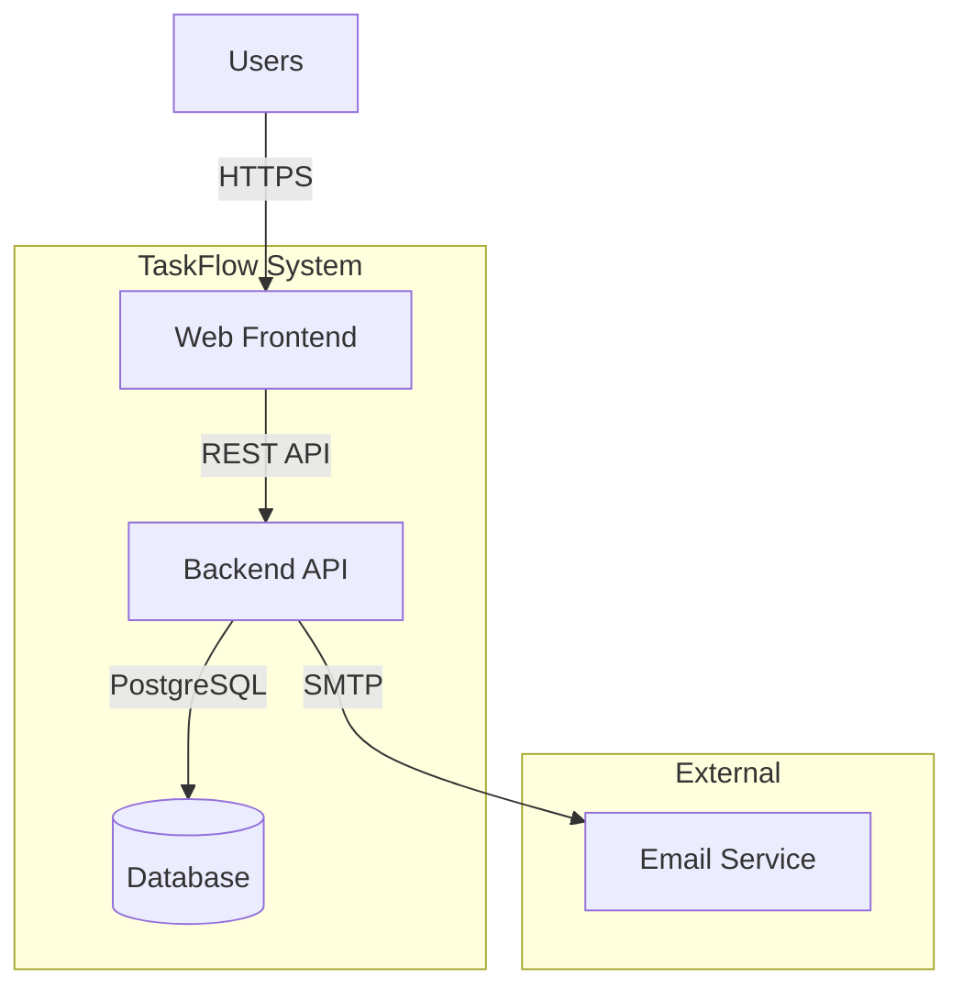
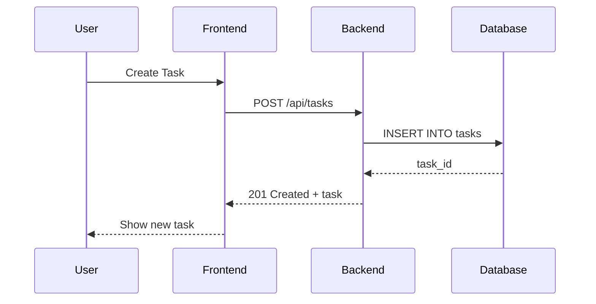
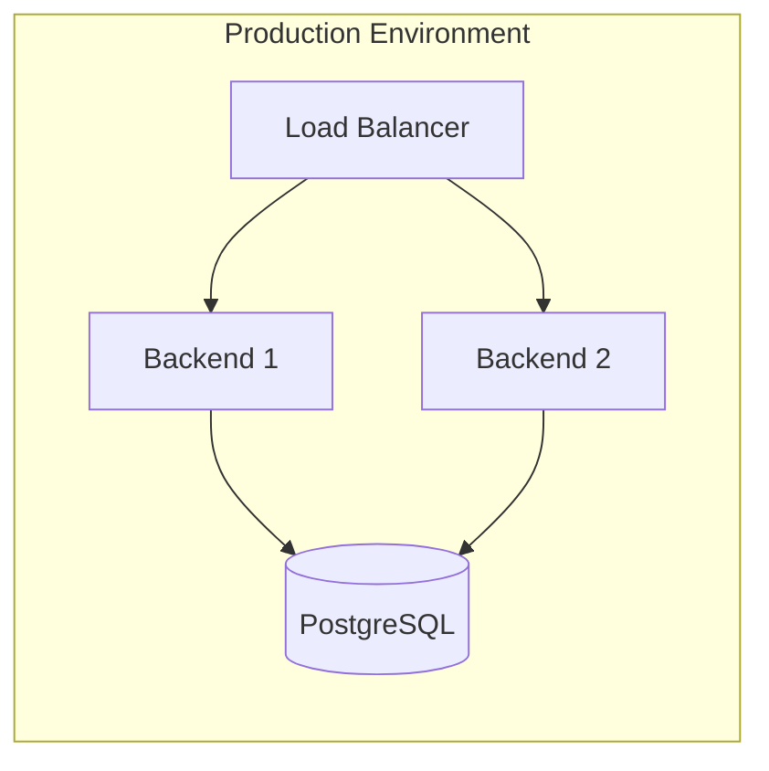

# [CTX-001-system-overview] TaskFlow System Architecture Overview

## Overview {#ctx-001-overview}
<!--
Describes the system at the highest level - what it does, who uses it,
and what the major components are. Read to understand the big picture.
-->

TaskFlow is a task management application that allows users to create, organize, and track tasks. The system consists of a web frontend, a REST API backend, and a PostgreSQL database.

**Key Features:**
- User authentication and authorization
- Task creation, editing, and deletion
- Task categorization and filtering
- Due date tracking and notifications

## Architecture {#ctx-001-architecture}
<!--
Shows the complete system diagram with all containers, external systems,
and their relationships. Read to understand how pieces fit together.
-->



**Architecture Decisions:**
- Monolithic backend for simplicity (suitable for small-medium scale)
- PostgreSQL for relational data with strong consistency
- REST API for broad client compatibility
- Server-side rendering optional via frontend

## Containers {#ctx-001-containers}
<!--
Lists all containers with brief descriptions and links. Read to navigate
to specific container details.
-->

| Container | Description | Technology |
|-----------|-------------|------------|
| [CON-001-backend](./containers/CON-001-backend.md) | REST API handling business logic | Node.js + Express |
| [CON-002-frontend](./containers/CON-002-frontend.md) | Web user interface | React + TypeScript |
| CON-003-database | Data persistence | PostgreSQL 15 |

## Protocols & Communication {#ctx-001-protocols}
<!--
Explains communication protocols used across the system and why chosen.
Read to understand integration patterns.
-->

### REST API {#ctx-001-rest-api}

Primary protocol for frontend-backend communication. Chosen for simplicity and broad tooling support.



**API Characteristics:**
- JSON request/response bodies
- JWT-based authentication
- Versioned via URL prefix (`/api/v1/`)
- Rate limited at 100 requests/minute per user

See [ADR-001: REST API Choice](./adr/ADR-001-rest-api.md) for decision rationale.

### Database Protocol {#ctx-001-database-protocol}

PostgreSQL wire protocol over TCP:
- Connection pooling (10-50 connections)
- SSL/TLS encryption in production
- Read replicas for scaling (future)

## Cross-Cutting Concerns {#ctx-001-cross-cutting}
<!--
Describes concerns that span multiple containers like authentication,
logging, and monitoring. Read to understand system-wide patterns.
-->

### Authentication {#ctx-001-authentication}

JWT-based authentication with refresh tokens:
- Access tokens: 15-minute expiry
- Refresh tokens: 7-day expiry, stored in httpOnly cookies
- Token validation at API gateway level

### Logging {#ctx-001-logging}

Structured JSON logging across all containers:
- Correlation IDs for request tracing
- Log levels: DEBUG, INFO, WARN, ERROR
- Centralized logging via stdout (container-friendly)

### Error Handling {#ctx-001-error-handling}

Consistent error response format:
```json
{
  "error": {
    "code": "TASK_NOT_FOUND",
    "message": "Task with ID 123 not found",
    "correlationId": "abc-123-def"
  }
}
```

## Deployment {#ctx-001-deployment}
<!--
High-level deployment architecture - cloud vs on-prem, scaling approach,
infrastructure patterns. Read to understand operational context.
-->

Docker-based deployment suitable for:
- Local development (docker-compose)
- Cloud deployment (Kubernetes, ECS)
- Simple VPS hosting



**Scaling Strategy:**
- Horizontal scaling for backend (stateless)
- Vertical scaling for database (single primary)
- CDN for static frontend assets

## Related {#ctx-001-related}

- [ADR-001: REST API Choice](./adr/ADR-001-rest-api.md)
- [ADR-002: PostgreSQL Database](./adr/ADR-002-postgresql.md)
- [ADR-004: JWT Authentication](./adr/ADR-004-jwt-auth.md)
- [CON-001: Backend Container](./containers/CON-001-backend.md)
- [CON-002: Frontend Container](./containers/CON-002-frontend.md)
