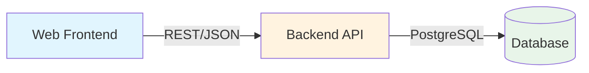

# [ADR-001] Use REST API for Client-Server Communication

## Status {#adr-001-status}

**Accepted** - 2025-01-21

## Context {#adr-001-context}
<!--
Current situation and why change/decision is needed.
-->

TaskFlow needs a communication protocol between the web frontend and backend API. The application is a task management system with standard CRUD operations on tasks, users, and related entities.

**Requirements:**
- Support web browser clients
- JSON data exchange
- Authentication via tokens
- Moderate scale (1000s of concurrent users initially)
- Team familiarity with chosen technology
- Tooling and debugging support

**Current Team Skills:**
- Strong experience with REST APIs
- Some experience with GraphQL
- Limited experience with gRPC

## Decision {#adr-001-decision}
<!--
High-level approach with reasoning.
-->

We will use **REST API with JSON** as the communication protocol between frontend and backend.

### High-Level Approach (Context Level) {#adr-001-context-level}



The REST API provides:
- Clear resource-based URL structure
- Standard HTTP methods (GET, POST, PUT, DELETE)
- Stateless request/response pattern
- Native browser support without additional libraries

### Container-Level Details {#adr-001-container-level}

**Affected Container:** [CON-001-backend](../containers/CON-001-backend.md)

**API Design Principles:**
- Resource-oriented URLs (`/api/v1/tasks`, `/api/v1/users`)
- HTTP methods indicate operations
- JSON request and response bodies
- HTTP status codes for error handling
- Versioning via URL prefix

**URL Structure:**
```
/api/v1/tasks          GET (list), POST (create)
/api/v1/tasks/:id      GET (read), PUT (update), DELETE (delete)
/api/v1/tasks/:id/complete   POST (action)
```

### Component-Level Impact {#adr-001-component-level}

**Routing Layer:**
- Express.js router with versioned prefixes
- Route parameter validation via middleware
- Request body parsing for JSON

**Service Layer:**
- Services receive validated request data
- Return domain objects (not HTTP responses)
- No knowledge of HTTP protocol

**Example Route Handler:**

```typescript
// src/routes/tasks.ts
router.get('/api/v1/tasks', authenticate, async (req, res) => {
  const tasks = await taskService.listTasks(req.user.id, req.query);
  res.json({ data: tasks });
});

router.post('/api/v1/tasks', authenticate, validate(createTaskSchema), async (req, res) => {
  const task = await taskService.createTask(req.user.id, req.body);
  res.status(201).json({ data: task });
});
```

## Alternatives Considered {#adr-001-alternatives}
<!--
What else was considered and why rejected.
-->

### GraphQL {#adr-001-graphql}

**Pros:**
- Single endpoint
- Client specifies exact data needed
- Strong typing with schema
- Built-in documentation

**Cons:**
- Added complexity for simple CRUD
- Learning curve for team
- Caching more complex
- Overfetching not a significant problem for our use case

**Why rejected:** Overhead not justified for straightforward CRUD operations. Team would need significant upskilling.

### gRPC {#adr-001-grpc}

**Pros:**
- High performance (binary protocol)
- Strong typing with Protocol Buffers
- Bidirectional streaming
- Code generation

**Cons:**
- Not natively supported in browsers
- Requires gRPC-Web proxy
- Less human-readable for debugging
- Team has limited experience

**Why rejected:** Browser support requires additional infrastructure. Performance benefits not needed at current scale.

### Comparison Matrix {#adr-001-comparison}

| Factor | REST | GraphQL | gRPC |
|--------|------|---------|------|
| Team Experience | High | Medium | Low |
| Browser Support | Native | Library needed | Proxy needed |
| Debugging | Easy | Medium | Hard |
| Performance | Good | Good | Excellent |
| Flexibility | Medium | High | Medium |
| Tooling | Excellent | Good | Good |

## Consequences {#adr-001-consequences}
<!--
Positive, negative, and mitigation strategies.
-->

### Positive {#adr-001-positive}

- **Fast development**: Team can start immediately with familiar technology
- **Easy debugging**: Browser dev tools, curl, Postman all work natively
- **Wide tooling support**: Documentation (OpenAPI), testing, mocking
- **Simple caching**: HTTP caching headers work out of the box
- **Clear mental model**: Resource-based thinking aligns with domain

### Negative {#adr-001-negative}

- **Overfetching**: May return more data than client needs
- **Multiple roundtrips**: Complex views may need multiple requests
- **No real-time**: Need separate mechanism for live updates

### Mitigation Strategies {#adr-001-mitigation}

| Issue | Mitigation |
|-------|------------|
| Overfetching | Add `fields` query parameter for sparse fieldsets |
| Multiple roundtrips | Add compound endpoints for common view patterns |
| No real-time | Use WebSocket for task notifications (future) |

## Cross-Cutting Concerns {#adr-001-cross-cutting}
<!--
Impacts that span multiple levels.
-->

### Authentication {#adr-001-auth}

REST API will use JWT tokens:
- Access token in `Authorization` header
- Refresh token in httpOnly cookie
- Standard 401 Unauthorized for auth failures

### Error Handling {#adr-001-errors}

Consistent error response format across all endpoints:

```json
{
  "error": {
    "code": "VALIDATION_ERROR",
    "message": "Task title is required",
    "details": [
      { "field": "title", "message": "Required" }
    ],
    "correlationId": "abc-123"
  }
}
```

### Rate Limiting {#adr-001-rate-limiting}

HTTP-based rate limiting:
- `X-RateLimit-Limit` header
- `X-RateLimit-Remaining` header
- `429 Too Many Requests` response

## Implementation Notes {#adr-001-implementation}
<!--
Ordered steps for implementation.
-->

1. **Set up Express.js with versioned routes**
   - Configure router prefix `/api/v1`
   - Add JSON body parser
   - Add CORS middleware

2. **Implement authentication middleware**
   - JWT validation
   - User context injection

3. **Create resource routes**
   - Tasks CRUD endpoints
   - Users endpoints
   - Auth endpoints

4. **Add documentation**
   - OpenAPI/Swagger spec
   - Endpoint documentation

5. **Implement error handling**
   - Global error handler
   - Consistent error format

## Revisit Triggers {#adr-001-revisit}
<!--
When should this decision be reconsidered?
-->

Consider revisiting this decision if:
- API becomes complex with many nested relationships
- Mobile clients need optimized data fetching
- Performance becomes critical (10,000+ concurrent users)
- Real-time features become core (not just notifications)
- Team gains significant GraphQL experience

## Related {#adr-001-related}

- [CTX-001: System Overview](../CTX-001-system-overview.md#ctx-001-protocols)
- [CON-001: Backend Container](../containers/CON-001-backend.md#con-001-api-endpoints)
