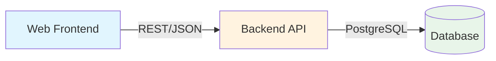

# [ADR-001] Use REST API for Client-Server Communication

## Status {#adr-001-status}
<!--
Current status of this decision.
-->

**Accepted** - 2025-01-21

## Problem/Requirement {#adr-001-problem}
<!--
Starting point - what user asked for, why change is needed.
-->

TaskFlow needs a communication protocol between the web frontend and backend API. The application is a task management system with standard CRUD operations on tasks, users, and related entities.

**Requirements:**
- Support web browser clients
- JSON data exchange
- Authentication via tokens
- Moderate scale (1000s of concurrent users initially)
- Team familiarity with chosen technology
- Tooling and debugging support

**Current Team Skills:**
- Strong experience with REST APIs
- Some experience with GraphQL
- Limited experience with gRPC

## Exploration Journey {#adr-001-exploration}
<!--
How understanding developed through scoping.
-->

**Initial hypothesis:** This is a Context-level decision affecting system-wide communication patterns between Frontend (CON-002) and Backend (CON-001).

**Explored:**
- **Isolated**: What communication protocol best fits our CRUD-based task management domain
- **Upstream**: External client requirements (browsers), team skills, industry standards
- **Adjacent**: Authentication mechanism (JWT), error handling patterns, API versioning
- **Downstream**: Impact on Backend container API design, Frontend API client implementation

**Discovered:**
- REST's resource-oriented model maps naturally to our domain (tasks, users, tags)
- Team has immediate productivity with REST vs learning curve with GraphQL/gRPC
- Browser native support eliminates additional client library dependencies
- Standard HTTP caching can be leveraged for performance

**Confirmed:**
- Stakeholders prioritize developer velocity over API flexibility
- No complex nested data fetching requirements that would benefit from GraphQL
- No high-performance requirements that would justify gRPC complexity

## Solution {#adr-001-solution}
<!--
Formed through exploration above.
-->

We will use **REST API with JSON** as the communication protocol between frontend and backend.

### High-Level Approach



The REST API provides:
- Clear resource-based URL structure
- Standard HTTP methods (GET, POST, PUT, DELETE)
- Stateless request/response pattern
- Native browser support without additional libraries

### API Design Principles

- Resource-oriented URLs (`/api/v1/tasks`, `/api/v1/users`)
- HTTP methods indicate operations
- JSON request and response bodies
- HTTP status codes for error handling
- Versioning via URL prefix

**URL Structure:**
```
/api/v1/tasks          GET (list), POST (create)
/api/v1/tasks/:id      GET (read), PUT (update), DELETE (delete)
/api/v1/tasks/:id/complete   POST (action)
```

### Alternatives Considered {#adr-001-alternatives}

#### GraphQL

**Pros:**
- Single endpoint
- Client specifies exact data needed
- Strong typing with schema
- Built-in documentation

**Cons:**
- Added complexity for simple CRUD
- Learning curve for team
- Caching more complex
- Overfetching not a significant problem for our use case

**Why rejected:** Overhead not justified for straightforward CRUD operations. Team would need significant upskilling.

#### gRPC

**Pros:**
- High performance (binary protocol)
- Strong typing with Protocol Buffers
- Bidirectional streaming
- Code generation

**Cons:**
- Not natively supported in browsers
- Requires gRPC-Web proxy
- Less human-readable for debugging
- Team has limited experience

**Why rejected:** Browser support requires additional infrastructure. Performance benefits not needed at current scale.

#### Comparison Matrix

| Factor | REST | GraphQL | gRPC |
|--------|------|---------|------|
| Team Experience | High | Medium | Low |
| Browser Support | Native | Library needed | Proxy needed |
| Debugging | Easy | Medium | Hard |
| Performance | Good | Good | Excellent |
| Flexibility | Medium | High | Medium |
| Tooling | Excellent | Good | Good |

## Changes Across Layers {#adr-001-changes}
<!--
Specific changes to each affected document.
-->

### Context Level
- [CTX-001-system-overview]: Define REST as the protocol in Protocols & Communication section

### Container Level
- [CON-001-backend]: Implement Express.js REST routing with versioned prefixes
- [CON-002-frontend]: Implement Axios-based API client for REST consumption

### Component Level
- [COM-003-task-service]: Services receive validated request data, return domain objects
- [COM-004-api-client]: Configure REST endpoints, handle JSON serialization

### Cross-Cutting Concerns

**Authentication:**
- Access token in `Authorization` header
- Refresh token in httpOnly cookie
- Standard 401 Unauthorized for auth failures

**Error Handling:**
Consistent error response format across all endpoints:

```json
{
  "error": {
    "code": "VALIDATION_ERROR",
    "message": "Task title is required",
    "details": [
      { "field": "title", "message": "Required" }
    ],
    "correlationId": "abc-123"
  }
}
```

**Rate Limiting:**
- `X-RateLimit-Limit` header
- `X-RateLimit-Remaining` header
- `429 Too Many Requests` response

## Verification {#adr-001-verification}
<!--
Checklist derived from scoping - what to inspect when implementing.
-->

- [ ] Is REST the appropriate abstraction for all current endpoints?
- [ ] Are URL patterns consistent and resource-oriented?
- [ ] Is API versioning correctly implemented?
- [ ] Do all endpoints return consistent JSON structure?
- [ ] Is error handling uniform across endpoints?
- [ ] Are HTTP status codes correctly applied?
- [ ] Does the frontend API client handle all response patterns?

### Revisit Triggers

Consider revisiting this decision if:
- API becomes complex with many nested relationships
- Mobile clients need optimized data fetching
- Performance becomes critical (10,000+ concurrent users)
- Real-time features become core (not just notifications)
- Team gains significant GraphQL experience

## Related {#adr-001-related}

- [CTX-001: System Overview](../CTX-001-system-overview.md#ctx-001-protocols)
- [CON-001: Backend Container](../containers/CON-001-backend.md#con-001-api-endpoints)
- [COM-003: Task Service](../components/backend/COM-003-task-service.md)
- [COM-004: API Client](../components/frontend/COM-004-api-client.md)
